# ARPIE CASE

Unpack the parts. Your ARPIE case kit should contain the following parts

- Six 3mm acrylic case panels (black)
- Two 5mm acrylic end cheeks (white/other)
- Four 3mm nylon spacers
- Six M3 x 10mm bolts
- Two M3 flanged nuts
- Acrylic switch toggle (T-shaped piece)
- Four self adhesive rubber feet

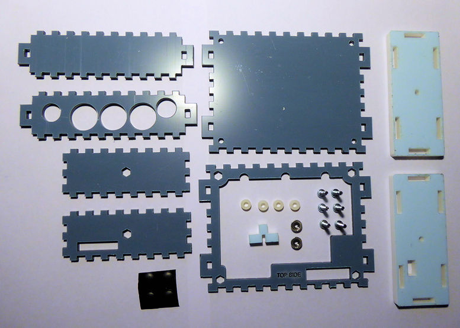

Remove the screws and metal pillars which hold the top and bottom parts of the ARPIE together and pull the connector out of the socket to separate the boards. Retain four of the screws (we'll use them later)

Remove and discard the rubber feet from the underside of the bottom board (if fitted)

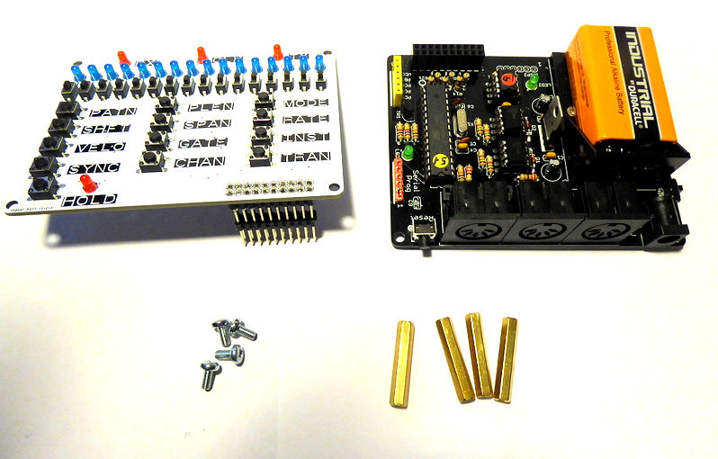

Remove the protective film from front and back of the base plate

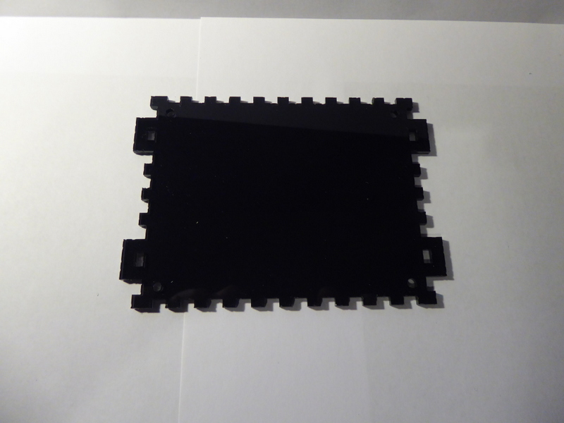

Push a 10mm bolt though a corner hole and place a nylon spacer on the bolt

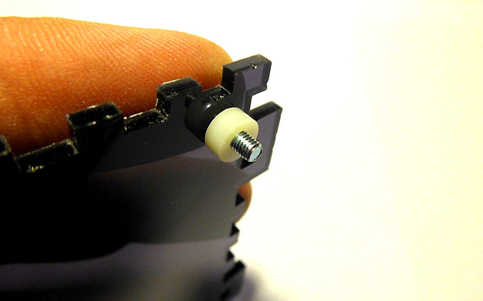

Place the lower ARPIE board on the bolt, threading it through one of the corner holes and hold it in place by screwing one of the metal stand off pillars on to the end of the bolt

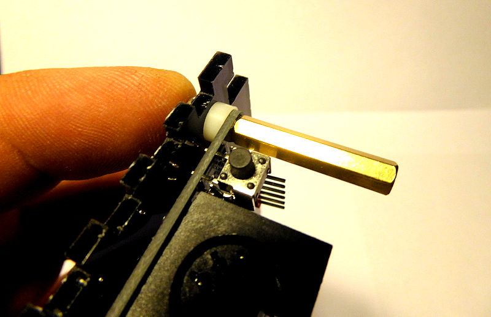

Repeat for all four corners 

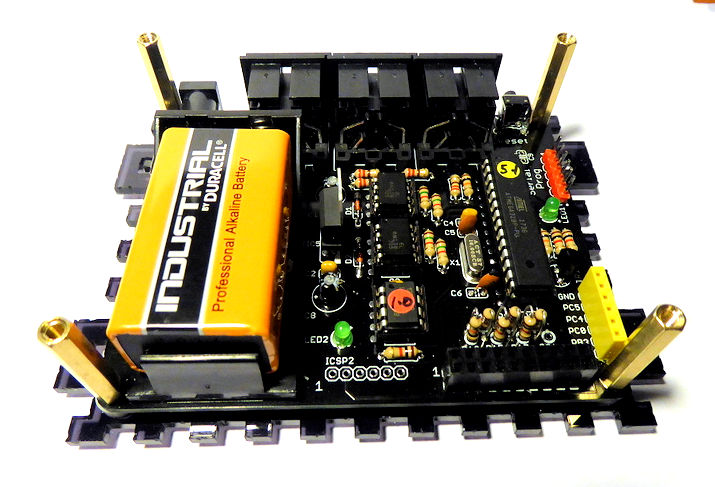

Remove protective films and push the flanged nuts into the hexagonal holes on the two side panels. Just use light pressure with a thumb - do not hammer or use pressure from a tool like a vice as you may crack the pastic. 

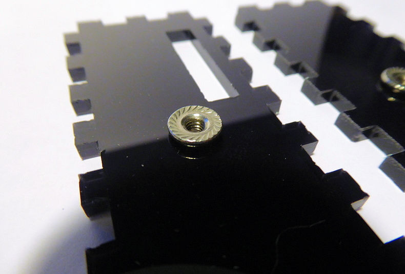

For the side panel  with the slot, ensure that you insert the nut into the correct side, as shown below

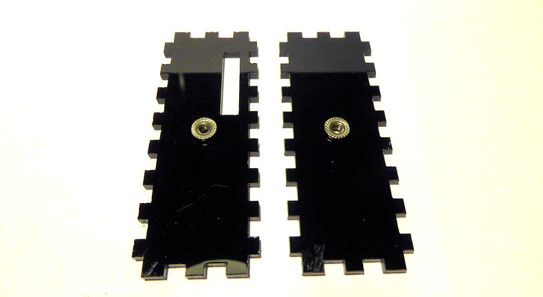

Carefully fit the panels into the holes in the tabs potruding either side of the base board. Ensure that the flanged nuts are on the inside of the case as shown.
You may need to apply some firm pressure if the fit is tight, but be careful not to bend and crack the plastic.

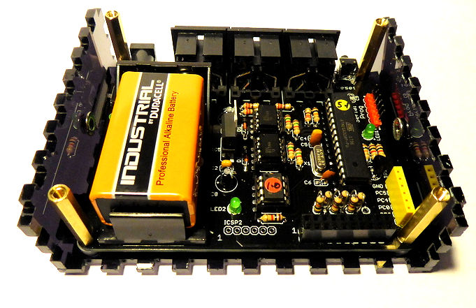

Carefully remove the film from both sides of the upper panel 

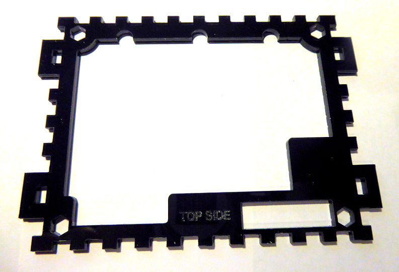

Place the upper panel on top of the case. The metal pillars should pass through the hexagonal corner holes and the "TOP SIDE" marking should be located in middle of the lower edge as shown above.

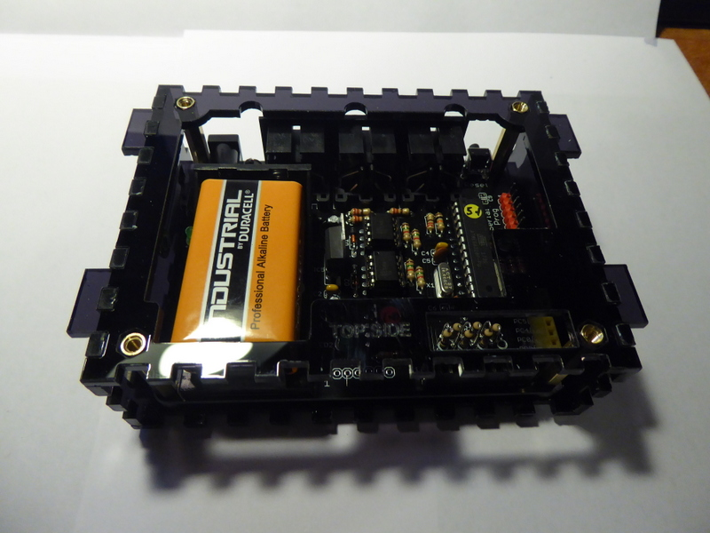

Place the ARPIE top panel on top of the upper panel ensuring the connector pins pass through the slot to the right side of the "TOP SIDE" marking. Fit the pins into the socket on the lower board.

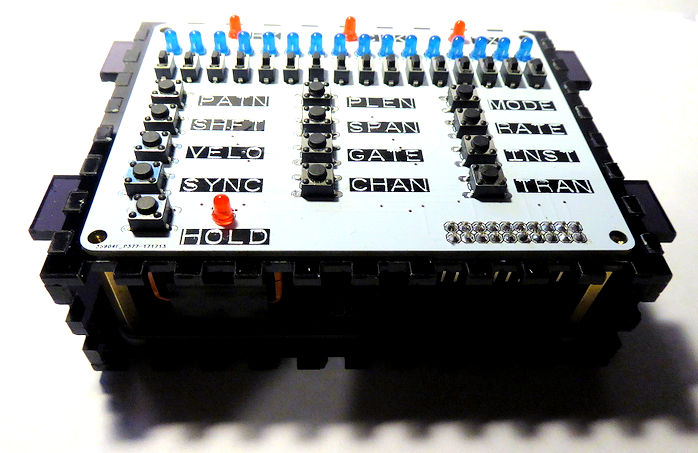

Peel the protective film and fit the front side panel 

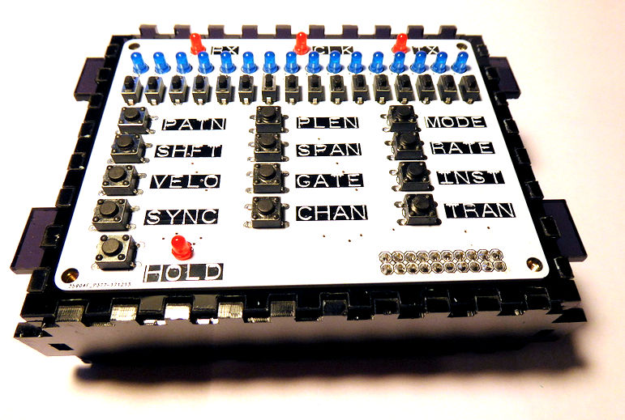

Peel the protective film and fit the rear panel, ensuring it is the right way around to align with the sockets

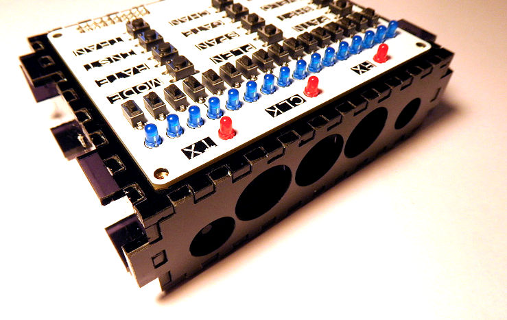

Peel film from the T-shaped switch toggle

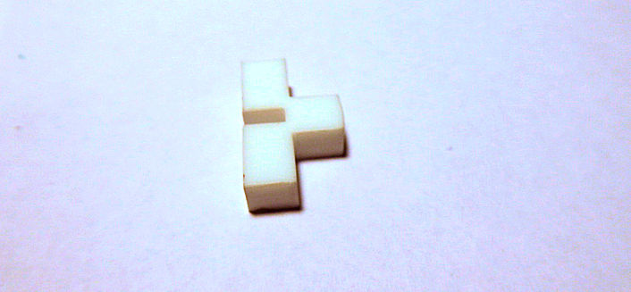

Place the toggle in the slot in the side panel, making sure it fits over the power switch on the lower ARPIE board

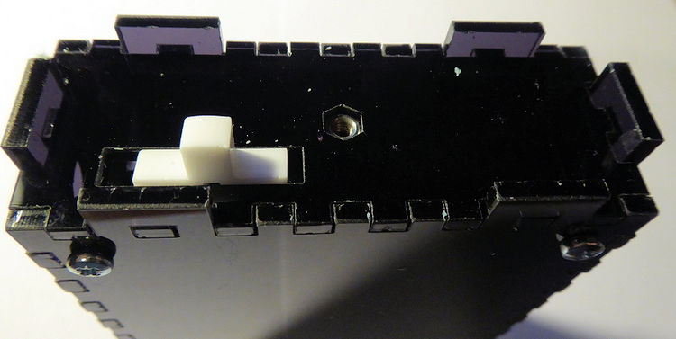

Peel film from the 5mm end cheeks and find the one with the switch hole. Carefully fit this over the end with the switch. The switch toggle needs to pass through the hole and also the six tabs on the other panels must pass through the corresponding holes. This may take a while to get correct and you may need firm pressure to push the tabs through the holes but be careful not to bend and crack the plastic.

Once fitted, use a 10mm screw to secure it. Do not push down on the screw when first engaging it as the flange nut may be pushed out of the other side of the panel. Do not over tighten the screw as you may crack the plastic, just enough tightness to prevent it working loose.

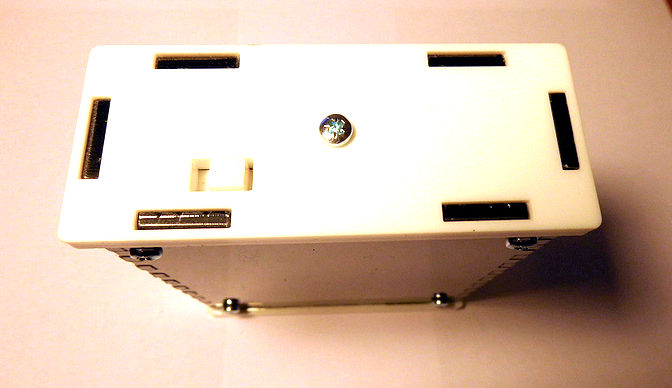

Do the same for the other end cheek. Now use four of the original ARPIE kit bolts to secure the top board to the tops of the metal pillars.

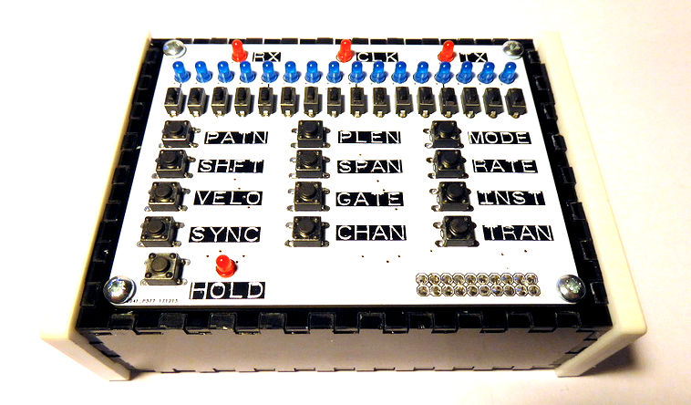

Peel backing from the self-adhesive feet

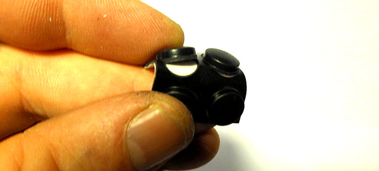

Ensuring the base of the case is clean, dry and free of finger grease, attach the four feet - and we're done!

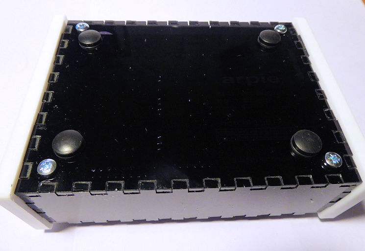
