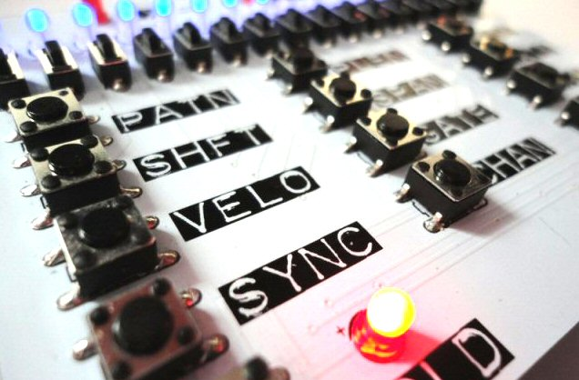

# ARPIE Central

ARPIE is a MIDI Arpeggiator. Typically you connect it between a MIDI keyboard controller and a synthesizer and it converts the chords you play on the keyboard into rapid runs of notes (arpeggios) which are played on the synth. However as you’ll see there is a lot more to it than that: ARPIE - and arpeggiators in general - are great composing and performance tools.

ARPIE is an open-source project, based on the popular Arduino platform and is designed to be customisable, hackable and extendable. I hope you like it!
 
 

<table>

<tr>
<td width="200">View the manual for operating your ARPIE</td>
<td width="200">Check out the contents of the ARPIE kit</td>
<td width="200">Instructions for building the ARPIE kit</td>
</tr>

<tr><td>&nbsp;</td></tr>

<tr>
<td>Troubleshooting steps if it doesn't work first time</td>
<td>Common questions about using ARPIE</td>
<td>A description of ARPIE's hardware</td>
</tr>

<tr><td>&nbsp;</td></tr>

<tr>
<td>How to upload new firmware using a USB-TTL programmer</td>
<td>A gallery of user hacks and mods to ARPIE</td>
<td>Add-ons for ARPIE's hack header</td>
</tr>

<tr><td>&nbsp;</td></tr>

<tr>
<td>Peruse the source code on GitHub</td>
<td>Visit our Tindie shop to buy your own ARPIE!</td>
<td><a href="http://six4pix.com/">Back to home page</a></td>
</tr>

</table>

 
<table>
<tr>
<td width="88"></td>
<td>This work is licensed under CC-BY-NC-SA terms. If you would like a commercial license please contact us.</td>
<tr>
</table>

