# Quick Start

I know you just want to get started... So connect up your MIDI keyboard to MIDI in, and a sound module to MIDI out. Switch on the ARPIE.. after a short delay (1-2 seconds) the 16 blue data display LEDs should light and the CLK LED should start blinking. 

Hold down a chord on the MIDI keyboard. The RX LED should blink as notes are received, and the TX LED should blink rapidly as notes are sent. Press the HOLD button once, the HOLD LED should illuminate. Now when you play a chord, the Arpeggiator continues to play after you have released the keys.

If you don't have a keyboard handy, turn on HOLD, press INST and then press the small button below the right-most blue LED. This should start playing a C major chord arpeggio.

OK, now we've broken the tension lets move on :o)

# Introducing ARPIE

## What Is It?

ARPIE is a MIDI arpeggiator based around open-source software and hardware. The Arduino-based firmware allows maximum hackability and the hardware is designed for easy DIY assembly and customisation.

Despite its simple construction and appearance, ARPIE is full featured with various chord arpeggiation, tempo synchronisation and standalone features to enable ARPIE to be used creatively without an attached MIDI keyboard.

A distinctive feature of ARPIE is the minimal control surface. While this has only simple LEDs for visual feedback, it is simple to use once you get familiar with it.

## Basic Operations

When you play a chord into ARPIE, it takes the notes of that chord and builds them into an "arpeggio" based on the selected arpeggio mode (MODE button). 

The argeggio is extended over multiple octaves, based on the selected octave span (SPAN), and transposed up or down by whole numbers of octaves selected by the octave shift (SHFT) setting, and by a number of notes based on the note transpose (TRAN) setting.

This argeggio is then extended based on the selected note insertion (INST) mode, for example by inserting the lowest note of the sequence between all other notes.

ARPIE plays the arpeggio sequence through the MIDI out port at a rate based on the tempo and synch settings (SYNCH) and the playback rate (RATE) setting. 

The output channel, volume and duration of the note are controlled by the MIDI channel (CHAN), note velocity (VELO) and gate length (GATE) settings.

Notes in the arpeggio sequence can be selectively muted using the rhythmic pattern (PATN) which loops, independently of the arpeggio sequence, at a selectable rhythmic pattern length (PLEN). The interplay between the arpeggio and the pattern can create interesting variations and grooves.

ARPIE has loads more features up it's sleeve such as accent and glide patterns,  polyphonic chord gating and force-to-scale. Read on to find out more!

# Know Your ARPIE

## Control Surface

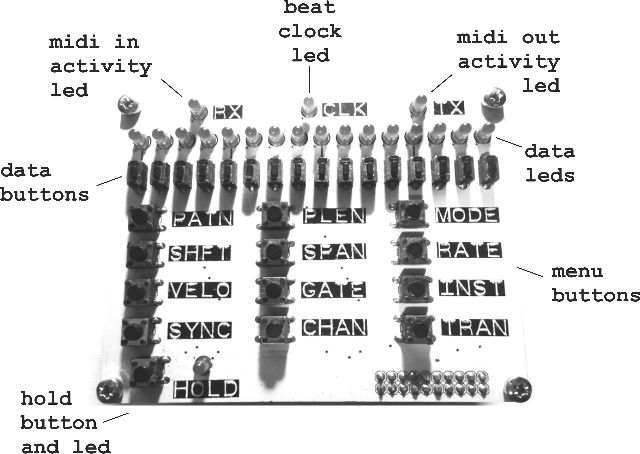

- Twelve **menu buttons** select different functions. Most buttons have different functions depending on whether you press and release the button, or hold it down for a number of seconds.

- Sixteen **data leds** and adjacent **data buttons** have functions that depend on the selected menu function. These are described in the following seconds.

- An additional **hold button** at the lower left controls how ARPIE responds when you release all keys on the controller keyboard. The button has additional functions that can be accessed by holding it for several seconds. The **hold led** indicates the selected function (off, steady or blinking)

## Rear Panel Connections

The rear panel of ARPIE is shown below:

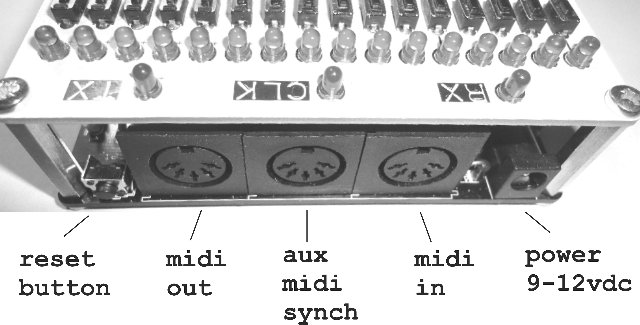

- The **power** connector accepts a 2.1mm barrel connector of a 9-12V DC supply. The supply can be either polarity (centre positive or centre negative). When a plug is inserted, the internal battery is disconnected.

- The **midi in** connector accepts MIDI input from a standard 5-pin DIN connector, generally from a controller keyboard. This input is opto-isolated.

- The **aux midi synch** connector accepts MIDI clock messages (only) via a standard 5-pin DIN connector. This input can be used to synchronise ARPIE to a drum machine etc. when the MIDI in connector is in use. This input is opto-isolated.

- The **midi out** connector accepts a standard 5-pin DIN connector and is generally connected to a synth or sound module.

- The **reset button** performs a hard reset of ARPIE, equivalent to a power off/on cycle. This is typically most useful when loading new firmware.

## Left Side

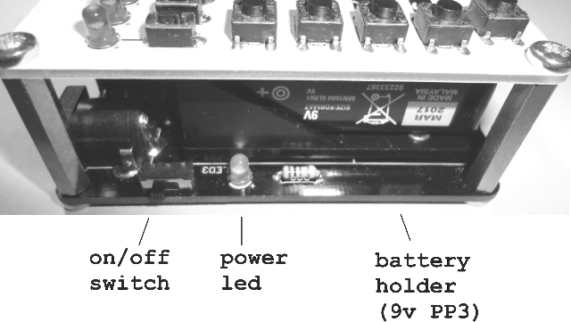

- The **on/off switch**... turns the power on and off (battery or external DC), leading us to the **power led** !

- The **battery holder** accepts a 9V PP3 battery. Alkaline batteries recommended. To replace the battery you need to remove the four screws that secure the control surface and pull the control surface connector pins from their socket.

## Right Side

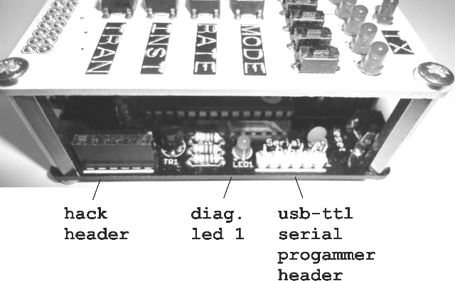

- The **hack header** breaks out 5V power and four spare I/O lines from ARPIE's microcontroller. It allows DIY add-ons and offers a lot of fun for those brave enough to experiment with it... more about this later!

- **Diagnostic LED 1** is connected to the main ATMEGA328 microcontroller - ARPIE's "brain". When the brain is alive, this LED should blink about once per second.

- **Serial Programmer Header** allows new program code to be loaded into ARPIE's brain using a suitable programmer (a 6-pin USB-TLL serial programmer). 

## Front Side

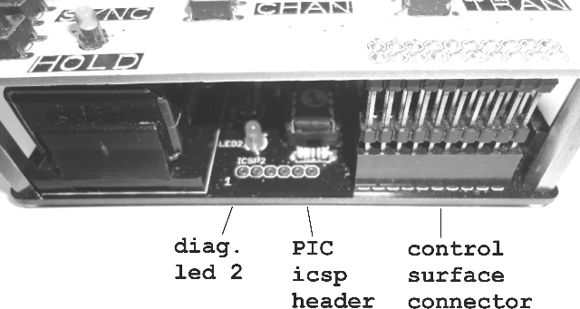

- **Diagnostic LED 2** is connected to the PIC16F1825 microcontroller that manages the aux midi synch port. This LED should blink every second or two.

- **PIC icsp header** can be used to update firmware on the PIC chip, using a PICKit2 type programmer. Usually it would be rare to need to do this, and typically there is no need to solder a header here

- **Control Surface Connector** electrically joins the control surface to the main board. When inserting the connector in the socket be careful to make sure all the pins are aligned correctly.

#Using Arpie

## General Points

- When you press one of the twelve main menu buttons, the function of the sixteen data entry buttons is changed according to the selected function.

- Most menu buttons have dual functions: press and release the button to access the primary function, press and hold the button for a few seconds to select the secondary function.

- To exit from a secondary menu function, press the same (or a different) menu button. There is no need to exit from primary menu function (you can just press another button)

- By default ARPIE returns to the pattern edit mode (PATN function) after a few seconds of inactivity. You can turn this off if you want.

- Sections in the manual describe how the 16 data buttons are assigned in each mode. A yellow colour is used for primary menu function and a purple colour for secondary.

## Keypad Buttons

Click a menu button in the table below for more information on the menu functions available via that button.

<table style="border:1px solid black; font-size:24pt; font-weight:bold" width="100%">
<tr><td width="33%"></td><td width="33%"></td><td width="33%"></td></tr>
<tr>
<td>*&nbsp;<a href="#patn">PATN</a></td>
<td>*&nbsp;<a href="#plen">PLEN</a></td>
<td>*&nbsp;<a href="#mode">MODE</a></td>
</tr>
<tr>
<td>*&nbsp;<a href="#shft">SHFT</a></td>
<td>*&nbsp;<a href="#span">SPAN</a></td>
<td>*&nbsp;<a href="#rate">RATE</a></td>
</tr>
<tr>
<td>*&nbsp;<a href="#velo">VELO</a></td>
<td>*&nbsp;<a href="#gate">GATE</a></td>
<td>*&nbsp;<a href="#inst">INST</a></td>
</tr>
<tr>
<td>*&nbsp;<a href="#sync">SYNC</a></td>
<td>*&nbsp;<a href="#chan">CHAN</a></td>
<td>*&nbsp;<a href="#tran">TRAN</a></td>
</tr>
<tr>
<td>*&nbsp;<a href="#hold">HOLD</a></td>
<td></td><td></td></tr>
</table>

## By Description
- Edit Rhythmic Pattern
- Edit Length of Rhythmic Pattern
- Fill Rhythmic Pattern
- Clear Rhythmic Pattern
- Randomize Rhythmic Pattern
- Arpeggiate a chord without a keyboard
- Select arpeggio type
- Select polyphonic gate mode
- Select arpeggiator not insertion
- Transpose arpeggio by whole octaves
- Transpose arpeggio by semitones
- Force arpeggio output to a musical scale
- Change octave span of arpeggio
- Change musical note division/rate
- Change MIDI output note velocity
- Change MIDI output note gate length
- Change MIDI input channel
- Change MIDI output channel
- Change how MIDI input is passed to output
- Select arpeggio to continue to play after releasing a chord
- 

# PATN 
<a name="patn">
##Rhythmic Pattern Edit

ARPIE's rhythmic pattern acts allows you to mute or play selected steps of the arpeggiated sequence. Press the data buttons to toggle the LEDs on and off. When the LED is on, the corresponding note of the arpeggio plays. When the LED is off the corresponding note is muted. 

PATN allows you to groove up your arpeggios, rather than having to have a note at every step. This can be especially effective with the tied GATE mode.

The pattern has up to 16 steps (you can use PLEN to select the pattern length), but the arpeggiate sequence may have more or less notes than this. While the arpeggio is playing, both the arpeggiated sequence and the pattern will restart when they reach their last step. The interplay of these two cycles can create interesting loops that reapeat less frequently than the basic arpeggio would.

PATN is the default function, and ARPIE returns to it when you don't press anything for a while (you can turn this off via the preferences menum)

You can also return by pressing the PATN button at any time. 

##Accent Edit

Accent is a feature that plays specific steps of the arpeggio sequence at full MIDI velocity, regardless of the VELO setting. This is most effective when the basic VELO velocity setting is reduced.

Just like the rhythmic pattern, the accent pattern length is controlled by the PLEN setting and can loop with a different cycle length to the arpeggio sequence.

To edit accent you need to do two things:

- You need to select Accent as the PATN secondary function in the performance options menu

- You need to press and hold PATN to access its "long press" function. You can then edit accent just like rhythmic pattern. 

If you do not press any key for a while ARPIE will revert back to the normal rhythmic pattern mode.

##Glide Edit

Glide is a feature that plays specific steps of the arpeggio sequence at whole step length or tied to the next note, regardless of the GATE setting. This obviously works best if the basic GATE setting is reduced, so the "glide" notes contrast better.

Just like the rhythmic pattern, the accent pattern length is controlled by the PLEN setting and can loop with a different cycle length to the arpeggio sequence.

To edit glide you need to:

- Select Glide as the PATN secondary function in the performance options menu

- Select either Whole Note or Tied as the Glide mode in the performace options menu.

- You need to press and hold PATN to access its "long press" function. You can then edit glide just like rhythmic pattern. 

If you do not press any key for a while ARPIE will revert back to the normal rhythmic pattern mode.

Note that accent, glide and rhythmic pattern are all active together - even though only either accent or glide can be edited at a time.

# PLEN
<a name="plen">
## Rhythmic Pattern Length

Press the PLEN button to view and change the length of the rhythmic pattern (from 1-16 steps). The current pattern length is indicated with a brighter LED and can be changed by pressing the corresponding data button.

The pattern restarts when it reaches the point defined by PLEN. This also defines the cycle point of the accent and glide patterns, if you have defined them. Setting a shorter PLEN does not clear the later steps in these patterns, so you can bring them back later.

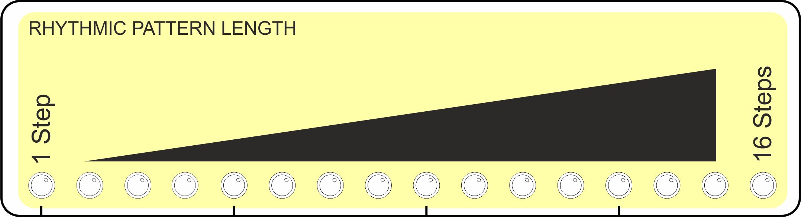

## Preferences

Press and hold PLEN to access the configuration preferences

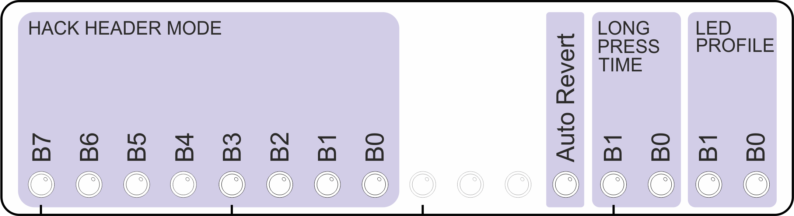

The first eight LEDs control built-in functionality for the "hack header" (the small expansion header on the ARPIE base board). This is quite a big subject and has it's own section later in the manual!

- **Auto Revert** controls whether ARPIE will time out to the PATN menu when no buttons are pressed for a about 10 seconds. Turn this off if you prefer - you can always press the PATN button to get back!

- **Auto Revert** controls whether ARPIE will time out to the PATN menu when no buttons are pressed for a about 10 seconds. Turn this off if you prefer - you can always press the PATN button to get back!

- **Long Press Time** controls how long you need to hold one of ARPIE's menu buttons to access the second function of a menu button.

<table class="data">
<tr style="font-weight:bold"><td width="50">B1</td><td width="50">B0</td><td  width="150">Long Press Time</td></tr>
<tr><td>OFF</td><td>OFF</td><td>1.5 seconds</td></tr>
<tr><td>OFF</td><td>ON</td><td>1 second</td></tr>
<tr><td>ON</td><td>OFF</td><td>0.5 seconds</td></tr>
<tr><td>ON</td><td>ON</td><td>0.25 seconds</td></tr>
</table>

- **LED Profile** sets the how the 16 data LEDs are controlled. Different types of LEDs have different characteristics; some are much brighter than others and need to be driven at shorter "duty cycles" to get decent contrast between ARPIE's three different LED brightnesses (bright, medium, dim). The LED profile shown below are recommendations but your may prefer to use a different ones (don't worry, it won't damage the LEDs to use the "wrong" profile!)

<table class="data">
<tr style="font-weight:bold"><td width="50">B1</td><td width="50">B0</td><td  width="300">Recommended for LED type</td></tr>
<tr><td>OFF</td><td>OFF</td><td>Very high intensity (e.g. bright white)</td></tr>
<tr><td>OFF</td><td>ON</td><td>High intensity (e.g. bright blue/green)</td></tr>
<tr><td>ON</td><td>OFF</td><td>Medium intensity (e.g bright red)</td></tr>
<tr><td>ON</td><td>ON</td><td>Low intensity (e.g standard red/green)</td></tr>
</table>

All of these settings are saved in EEPROM. This means they are remembered when ARPIE is switched off.

# MODE
<a name="mode">
## Arpeggio Mode

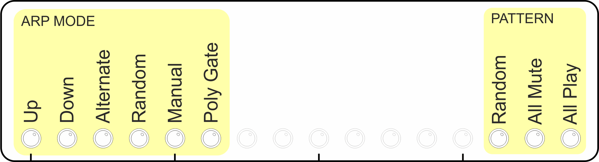

This option allows you to select between ARPIE's basic arp modes

- **Up** mode plays notes of the chord in ascending order 
- **Down** mode plays notes of the chord in descending order
- **Alternate** plays notes of the chord in ascending then descending order. If the sequence spans multiple octaves, all octaves are spanned on the way "up" before returning "down". The highest note is not repeated.
- **Random** plays the notes in a random order. 
- **Manual** plays the notes of the chord in the order they were played on a controller keyboard.
- **Poly Gate** plays all the notes of the chord at the same time. Thicken up with SPAN and Use with the rhythmic pattern editor to get dancey chord stabs!

## Pattern Fill

The far right data entry buttons can be used to reset the rhythmic pattern information.

- **Random** sets steps to a randomised combination of play and mute steps and sets PLEN to a random value.
- **All Mute** sets all steps to mute (LED off) and sets PLEN to 16 steps
- **All Play** sets all steps to play (LED on) and sets PLEN to 16 steps

Accent and Glide patterns are not affected.

## Performance Options
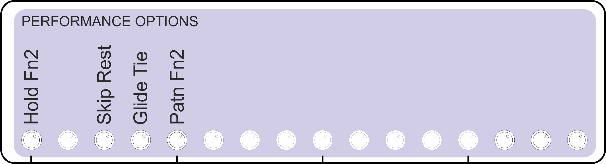

#SHFT 
<a name="shft">
## Octave shift
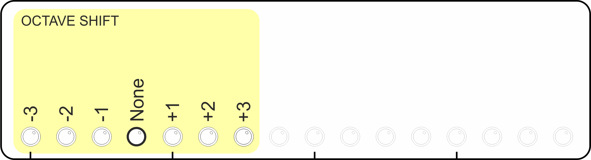
Transposes the arpeggiated sequence by whole octaves. 
The default ?o shift?position is indicated by a slightly brighter LED.

## Force To Scale: Type

# SPAN 
<a name="span">
## Octave Span
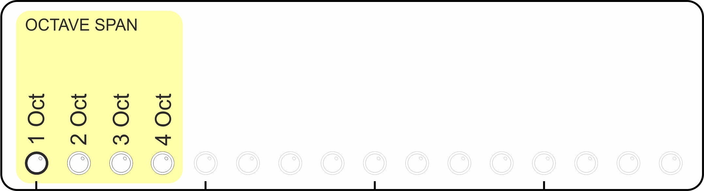
Determine the number of octaves the arpeggiated sequence will be extended over. 

## Force To Scale: Root Note
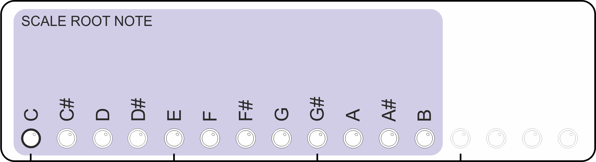

#RATE
<a name="rate">
## Time Division
Determines the length of notes in the arpeggiated sequence, as a fraction of a beat (It does not alter the tempo/BPM)
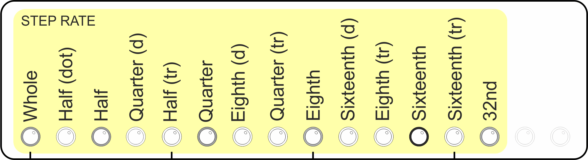

The above labels can be interpreted as follows:
NOTE TIME DIVISION
1 full note
2 half note
4 quarter note (1 beat)
8 eighth notec
16 sixteenth note 
32 thirty-second note
SUFFIX
D dotted time (one and a half times normal note duration)
T triplet time (two thirds normal note duration)
Whole time divisions (Without suffix) are shown on the display with brighter LEDs to assist interpreting the display.

#VELO
<a name="velo">
## MIDI Velocity Override
Controls the MIDI velocity of the notes output by the sequencer. 
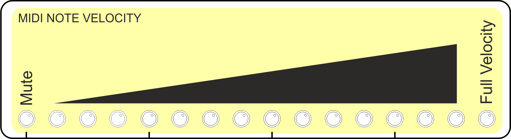

There are two velocity modes and you can toggle between them by pressing and holding the VELO button.
Adjustable velocity mode allows you to override the velocity of all arpeggiated notes to one of 16 levels (including muted and full velocity) as indicated below

## Original MIDI Velocity
Original velocity mode plays each arpeggiated note using the velocity of the note as it was played in the chord on the input device. This mode can be identified by the right-most LED being on and all the others off. In this mode the data entry buttons have no function.

#GATE
<a name="gate">
## MIDI Note Gate Length
Controls the gate length of the notes output by the sequencer - as proportion of the current note length. The highest setting means that one note is "tied" to the next (The note is not stopped until the next note is started, with the MIDI note off message being sent after the next MIDI note on)
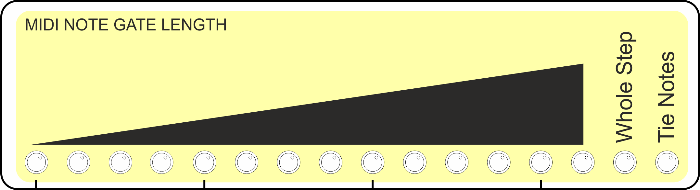

#INST
<a name="inst">
## Arpeggiator Sequence Insert
Extends the length of the arp sequence by repeating notes from the chord according to specific modes as defined below. This screen also has some options for inserting chords without a keyboard for demo purposes. The "Hold" switch must be enabled for this to work.
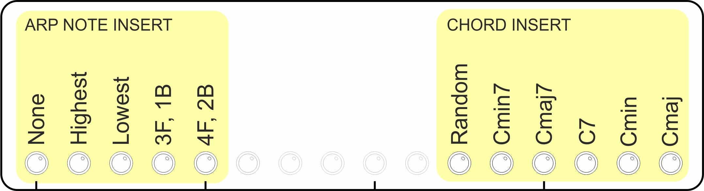

#SYNC
<a name="sync">
## Clock Source And Tempo Set
This screen controls the arp MIDI SYNCH mode and internal metronome (BPM). When ARPIE is running on its internal clock, the data display LED's indicate the approximate BPM. Pressing one of the nine BPM buttons sets the tempo to a specific value.  
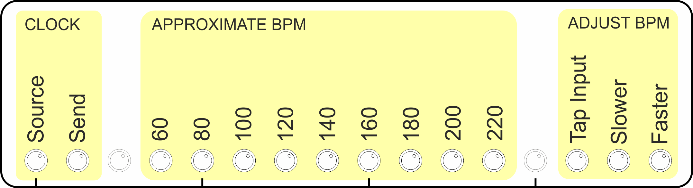
The SOURCE button controls the SYNCH clock source:
ON Internal clock source 
OFF External clock source via the MIDI IN or SYNCH IN sockets
The SEND button controls whether ARPIE sends a MIDI beat clock to the MIDI OUT port. This button can also be used to start/stop and synchronise MIDI slave devices. More late rin the manual
ON Send MIDI synch messages out of MIDI OUT port
OFF Don't send MIDI synch messages 
The BPM+ and BPM- buttons can be used to adjust the BPM by steps of 1. 
Pressing the TAP button two or more times allows you to set the tempo interactively. 
BPM defaults to 120 when ARPIE is switched on.
The internally generated BPM is approximate (but good enough for  most stuff). However, an external clock source is recommended if a precise BPM is needed.

## MIDI Slave Synch And Thru Options
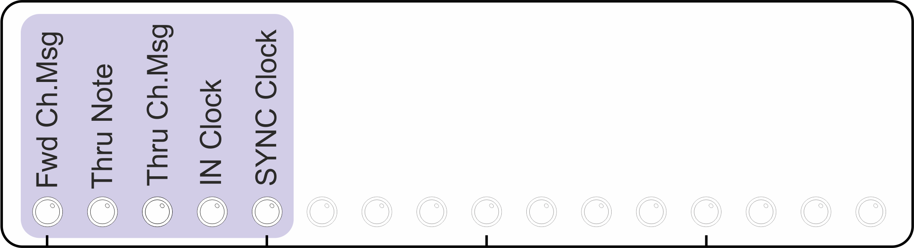

#CHAN
<a name="chan">

## MIDI Output Channel

When pressed, selects and displays the MIDI channel for output
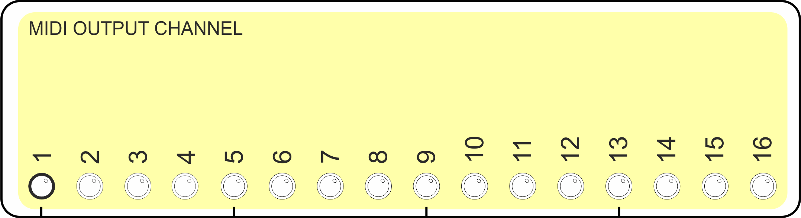
If the CHAN button is pressed and held for a couple of seconds, you can Select The MIDI Input Channel. By default ARPIE will accept input from any MIDI channel (OMNI mode) but you can also select a specific channel, which affects MIDI Thru behaviour (see below)
OMNI mode is indicated by all the Data Display LEDs showing brightly. Pressing any single button will select an individual input channel. Pressing the same button again will restore OMNI mode.

## MIDI Input Channel
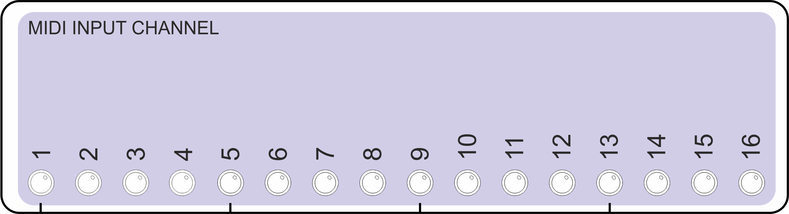

#TRAN
<a name="tran">
## Chromatic Transpose
Transpose the MIDI output. Buttons represent -3. -2, -1, 0, +1, +2 through to +12 semitones. The default (no shift) position is indicated with a brighter LED.

#HOLD
<a name="hold">

## Normal Operation

Before we look at the HOLD function, lets look at how things happen when when the HOLD function is switched off:

- ARPIE does not produce any output unless notes are currently active on the MIDI input (i.e. held down on the controller keyboard)

- When the first note of a chord is played on the input, ARPIE starts to play immediately (there is no delay until the next beat). The rhythmic pattern also restarts from the first step.

- Notes in a chord can be released, causing the arpeggio sequence to change. As long as at least one note remains held, playback will continue without interruption.

- When the last key of the chord is released, playback stops.

## Hold Function

The HOLD function can be activated by pressing the HOLD button, lighting the HOLD LED. When the HOLD function is enabled:

- Playback of the arpeggio will continue after the last note of the chord is released

- When the first key of a new chord is pressed, the held chord is cleared, but playback continues without any change to beat timing or position within the rhythmic pattern.

- Stop playback by turning HOLD off by pressing the button again.

HOLD can be activated or deactivated while notes are already held.

## Hold Button Secondary Function

When the HOLD button is held for a few seconds, the HOLD LED starts to blink, indicating that the hold button secondary function is active. 

There are two functions available and you can select between them from the performance options menu (long press <a href="mode">MODE</a>). These are described below.

## MIDI Lock function

This function can be used to "lock" the arpeggiator engine and start passing MIDI notes from input to output. This allows you to hold an arpeggio and then play over it. 

MIDI lock can also be useful if you chain together multiple ARPIEs and want to play into a single one at a time while the others are playing sequences in hold mode. 

Exit MIDI lock by pressing HOLD again. ARPIE will return to the previous hold mode.

## MIDI Transpose function

This function works a bit like MIDI lock, except that instead of passing input notes through to the output, a held arpeggio is transposed according to the interval between the note you play on the input and the lowest note in the arpeggiated chord.

This function is designed to work with the HOLD feature. You can have great fun when using this with force-to-scale options.

#More about synch
SOURCE
SEND

INTERNAL
(LED is ON)

OFF
STANDALONE 
Running on internal beat clock
Internal beat clock is not sent to MIDI output 
Incoming synch messages are ignored

ON
MASTER 
Running on internal beat clock
Incoming synch messages are ignored
Internal beat clock is sent to MIDI output 
When SEND goes from OFF-ON the beat clock is restarted and MIDI restart message is sent to downstream devices
When SEND goes from ON-OFF the beat clock is stopped and a MIDI stop message is sent to downstream devices
EXTERNAL
(LED is OFF)
OFF
SLAVE 
Requires external synch
Both MIDI IN and SYNCH IN are active (but only one should be used to receive synch messages at any time)
Incoming synch messages are not passed to output

ON
SLAVE + THRU
Requires external synch
Both MIDI IN and SYNCH IN are active (but only one should be used to receive synch messages at any time)
Incoming synch messages are not passed to output

#More About MIDI Thru 
Input Channel Mode
Behaviours
OMNI mode (default)
MIDI note on/note off messages from any input channel are passed to the arpeggiator engine and are not passed to the output

Other MIDI channel messages (such as pitch-bend and mod-wheel) are passed through to output but the channel is always changed to equal ARPIEs selected output channel

Incoming MIDI beat clock message are only passed to output if SYNCH SOURCE is EXTERNAL and SYNCH SEND is ON

Other Realtime/SysEx are passed through
Specific Input Channel 
MIDI note on/note off messages from the specific input channel are passed to the arpeggiator engine and are not passed to the output

MIDI note on/note off messages for other channels are passed are passed through to output on their original channels

Other MIDI channel messages (such as pitch-bend and mod-wheel) are passed through to output on their original channels

Incoming MIDI beat clock messages are only passed to output if SYNCH SOURCE is EXTERNAL and SYNCH SEND is ON

Other Realtime/SysEx are passed through

MIDI thru is handed in ARPIEs firmware (there is no hardware thru) which can cause latency if the arpeggiator engine is busy - and possibly even dropped messages in situations of very high thru volume.
Stored settings
ARPIE stores the following settings in EEPROM, which means that they are remembered when the device is switched off, and used as defaults next time it is switched on
Synch SOURCE setting
Synch SEND setting
MIDI input channel (or OMNI) setting
MIDI output channel setting

#Clock/Message Routing 
<a target="_new" href="img/schematic.png">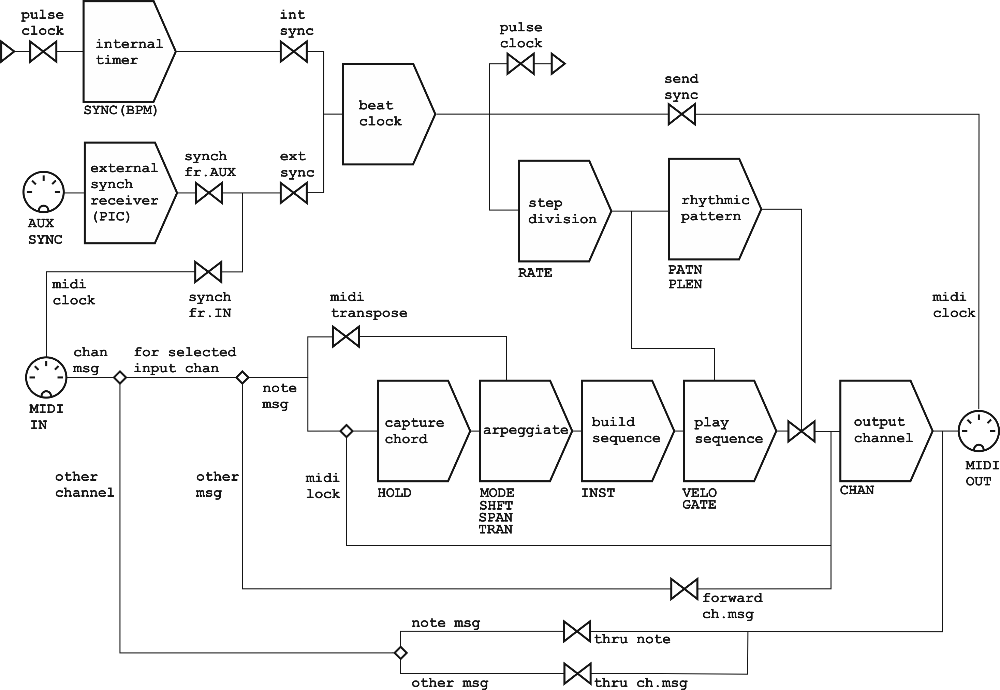</a>