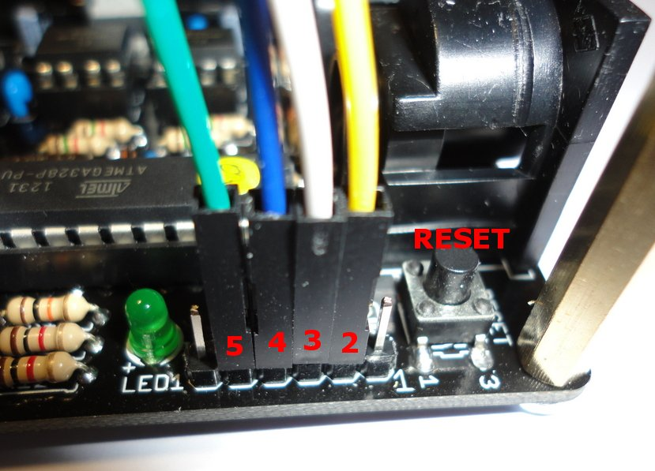
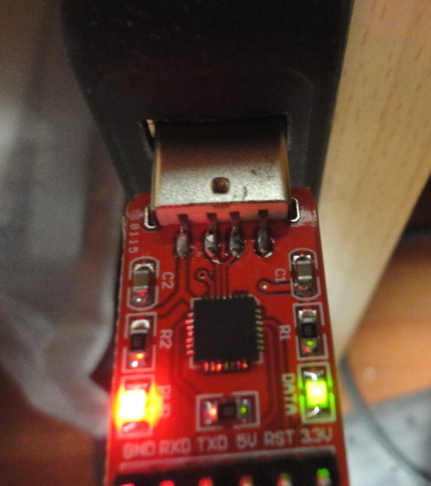
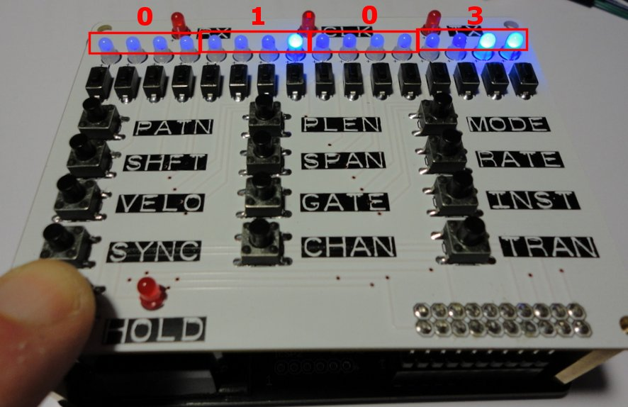

# Firmware Update

**Please Note: The ARPIE kit comes with the current firmware already loaded on the microcontrollers** The information here is only needed if you want to reprogram it later with new firmware, or experiment with the firmware yourself!

Click here to see available [firmware versions](firmwares.html) 

The information on this page relates to the Silicon Labs CP2102 adaptor which I am selling on Tindie, however similar steps apply to other programmers (e.g. FTDI 5V USB2TTL Programming Cable). The information assumes you are already familiar with using the Arduino environment. If not please check [http://arduino.cc](http://arduino.cc) to download the free Arduino development environment and to view the setup instructions 
 

 
Before connecting CP2102 programmer you will need to download the drivers from the following URL
[http://www.silabs.com/products/mcu/Pages/USBtoUARTBridgeVCPDrivers.aspx](http://www.silabs.com/products/mcu/Pages/USBtoUARTBridgeVCPDrivers.aspx) 
 
Connect the programmer to a free USB socket on your computer and let the drivers install. 
 
The programmer connects to the 6 pin programming header (ICSP1) on the ARPIE main board. The CP2102 adaptor 
uses a four pin lead (made up of individual 1 pin cables). These connect to pins 2,3,4,5 on the  header (pin 1 is marked on the board and is the one nearest the back edge of the device. On the photos below I used the wires  as follows 
 
* GREEN WIRE - Ground (GND on programmer, pin 5 on board header)
* YELLOW WIRE - Serial Receive (RXD on programmer, pin 2 on board header)
* WHITE WIRE - Serial Transmit (TXD on programmer, pin 3 on board header)
* BLUE WIRE - Power (5V on programmer, pin 4 on board header)
 
 
If your wires have different colours, use any convention you like. If your lead has a single 6 pin plug then connect this to the header. It might be neccessary to remove the control surface PCB to access the header and reset button. The control surface does not need to be attached during programming. 
 

 
Before programming ensure that
* All MIDI leads are disconnected
* The ARPIE is powered by DC supply or battery
* The ARPIE is switched ON
 
 
Use the Arduino environment with Board Type "Arduino Duemilanova w/ATMega 328" to upload to the board. As soon as the status bar in the Arduino environment shows "Uploading" press the reset button on the main  board. Within a second or two the green "data" light on the programmer should illuminate and within a few more seconds you should have a "Done" message in the Arduino environment status bar. 

 
 
If you have an FTDI cable or other than supports automatic reset, you do not need to press the RESET button to start an upload. However you will need to have optional capacitor C9 in place on the main ARPIE board.
 
 
Please refer to the troubleshooting page for additional information.
 
 
You can check the firmware version installed on an ARPIE by holding the HOLD button while the device boots up (i.e. switch off/on or press reset). The version number is displayed as 4 binary coded decimal digits in a 99.99 format. The example below shows how version 1.03 is displayed 
