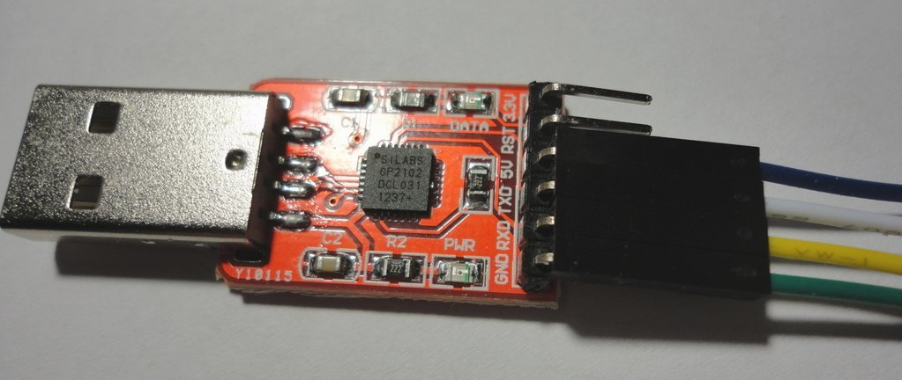

# Firmware Update

**Please Note: The ARPIE kit comes with the current firmware already loaded on the microcontrollers** The information here is only needed if you want to reprogram it later with new firmware, or experiment with the firmware yourself!

Click here to see available [firmware versions](firmwares.html) 

The information on this page relates to the Silicon Labs CP2102 adaptor which I sell on Tindie, however similar steps apply to other programmers (e.g. FTDI 5V USB2TTL Programming Cable). 
 
 
You will need to download and install the free Arduino environment from [http://arduino.cc](http://arduino.cc) 
 

 
Before connecting CP2102 programmer you will also need to download the drivers from the following URL
[http://www.silabs.com/products/mcu/Pages/USBtoUARTBridgeVCPDrivers.aspx](http://www.silabs.com/products/mcu/Pages/USBtoUARTBridgeVCPDrivers.aspx) 
 
Connect the programmer to a free USB socket on your computer and let the drivers install. 
 
The programmer connects to the 6 pin programming header (ICSP1) on the ARPIE main board. The CP2102 adaptor 
uses a four pin lead (made up of individual 1 pin cables). These connect to pins 2,3,4,5 on the  header (pin 1 is marked on the board and is the one nearest the back edge of the device 
 
You need to make the following connections
<table>
<tr><td>Pin on ARPIE</td><td></td><td>Pin on Programmer</td></tr>
<tr><td>[1 RESET]</td><td></td><td></td></tr>
<tr><td>[2 TX]</td><td>..........</td><td>[RX] Note that RX and TX connections swap over!</td></tr>
<tr><td>[3 RX]</td><td>..........</td><td>[TX]</td></tr>
<tr><td>[4 +5V]</td><td>..........</td><td>[+5V]</td></tr>
<tr><td>[5 GND]</td><td>..........</td><td>[GND]</td></tr>
<tr><td>[6 GND]</td><td></td><td></td></tr>
</table>
 
It might be neccessary to take out the screws and remove the top ARPIE PCB to access the programming header. The control surface does not need to be attached during programming. 
 

 
Before programming ensure that
* All MIDI leads are disconnected
* The ARPIE is powered by DC supply or battery and is switched on (it might look powered up as soon as USB is connected but you MUST power ARPIE normally and make sure it is switched on)

 
When you download the [firmware source code](firmwares.html) from Github, make sure you save the "Raw" file, not the HTML page where the code is viewed. Click on the "Raw button in GitHub and make sure the code is saved with a .INO extension.
  
Open the file in Arduino (you will get prompted that the code has been placed automatically in an "arpie" folder)
  
In the Arduino environment, select the COM port for the programmer (which is usually the highest numbered port and appears only when the programmer is attached) and select Board Type "Arduino Duemilanova" and processor type "ATMega 328" 
  
Press Ctrl-U to compile the code and upload to the ARPIE. Compilation takes a few seconds - get ready to press the reset button on the ARPIE... as soon as the message on the Arduino status bar changes from "Compiling" to "Uploading", press the reset button on the ARPIE board. Within 10-15  seconds you should have a "Done" message in the Arduino environment status bar and the ARPIE has been updated. 

 
 
You can check the firmware version installed on an ARPIE by holding the HOLD button while the device boots up (i.e. switch off/on or press reset). The version number is displayed as 4 binary coded decimal digits in a 99.99 format. The example below shows how version 1.03 is displayed 

 
Please refer to the troubleshooting page for additional information.
 
