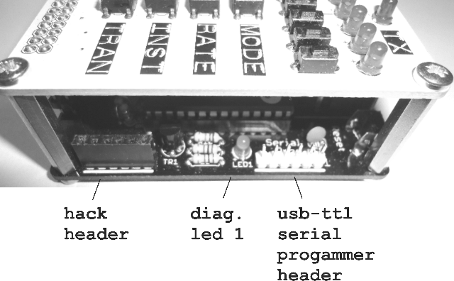
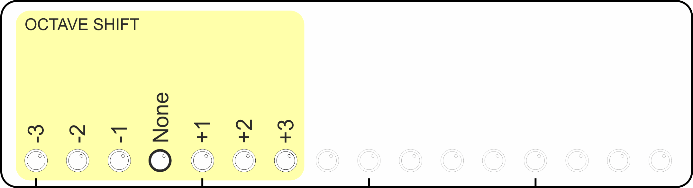

# ARPIE V5 BETA USER GUIDE

## Quick Function Index

Click a menu button in the table below for more information on the menu functions available via that button.

<table style="border:1px solid black; font-size:24pt; font-weight:bold" width="100%">
<tr><td width="33%"></td><td width="33%"></td><td width="33%"></td></tr>
<tr>
<td>*&nbsp;<a href="#patn">PATN</a></td>
<td>*&nbsp;<a href="#plen">PLEN</a></td>
<td>*&nbsp;<a href="#mode">MODE</a></td>
</tr>
<tr>
<td>*&nbsp;<a href="#shft">SHFT</a></td>
<td>*&nbsp;<a href="#span">SPAN</a></td>
<td>*&nbsp;<a href="#rate">RATE</a></td>
</tr>
<tr>
<td>*&nbsp;<a href="#velo">VELO</a></td>
<td>*&nbsp;<a href="#gate">GATE</a></td>
<td>*&nbsp;<a href="#inst">INST</a></td>
</tr>
<tr>
<td>*&nbsp;<a href="#sync">SYNC</a></td>
<td>*&nbsp;<a href="#chan">CHAN</a></td>
<td>*&nbsp;<a href="#tran">TRAN</a></td>
</tr>
<tr>
<td>*&nbsp;<a href="#hold">HOLD</a></td>
<td></td><td></td></tr>
</table>

## Quick Start

OK so I know you just want to get started... So connect up your MIDI keyboard to MIDI in, and a sound module to MIDI out. Switch on the ARPIE.. after a short delay (1-2 seconds) the 16 blue data display LEDs should light and the CLK LED should start blinking. 

Hold down a chord on the MIDI keyboard. The RX LED should blink as notes are received, and the TX LED should blink rapidly as notes are sent. Press the HOLD button once, the HOLD LED should illuminate. Now when you play a chord, the Arpeggiator continues to play after you have released the keys.

If you don't have a keyboard handy, turn on HOLD, press INST and then press the small button below the right-most blue LED. This should start playing a C major chord arpeggio.

OK, now we've broken the tension lets move on!

## Introducing ARPIE

ARPIE is a MIDI arpeggiator based around open-source software and hardware. The Arduino-based firmware allows maximum hackability and the hardware is designed for easy DIY assembly and customisation.

Despite its simple construction and appearance, ARPIE is full featured with various chord arpeggiation, tempo synchronisation and standalone features to enable ARPIE to be used creatively with or without an attached MIDI keyboard.

A distinctive feature of ARPIE is the minimal control surface. While this has only simple LEDs for visual feedback, it is easy to use once you get familiar with it.

## Basic Operations

When you play a chord into ARPIE, it takes the notes of that chord and builds them into an "arpeggio" based on the selected arpeggio mode (MODE button). 

The argeggio is extended over multiple octaves, based on the selected octave span (SPAN), and transposed up or down by whole numbers of octaves selected by the octave shift (SHFT) setting, and by a number of notes based on the note transpose (TRAN) setting.

This argeggio is then extended based on the selected note insertion (INST) mode, for example by inserting the lowest note of the sequence between all other notes.

ARPIE plays the arpeggio sequence through the MIDI out port at a rate based on the tempo and synch settings (SYNCH) and the playback rate (RATE) setting. 

The output channel, volume and duration of the note are controlled by the MIDI channel (CHAN), note velocity (VELO) and gate length (GATE) settings.

Notes in the arpeggio sequence can be selectively muted using the rhythmic pattern (PATN) which loops, independently of the arpeggio sequence, at a selectable rhythmic pattern length (PLEN). The interplay between the arpeggio and the pattern can create interesting variations and grooves.

ARPIE has loads more features up it's sleeve such as accent and glide patterns,  polyphonic chord gating and force-to-scale. Read on to find out more!

# Know Your ARPIE

## Control Surface

- Twelve **menu buttons** select different functions. Most buttons have different functions depending on whether you press and release the button, or hold it down for a number of seconds.

- Sixteen **data leds** and adjacent **data buttons** have functions that depend on the selected menu function. These are described in the following seconds.

- An additional **hold button** at the lower left controls how ARPIE responds when you release all keys on the controller keyboard. The button has additional functions that can be accessed by holding it for several seconds. The **hold led** indicates the selected function (off, steady or blinking)

## Rear Panel Connections

The rear panel of ARPIE is shown below:

- The **power** connector accepts a 2.1mm barrel connector of a 9-12V DC supply. The supply can be either polarity (centre positive or centre negative). When a plug is inserted, the internal battery is disconnected.

- The **midi in** connector accepts MIDI input from a standard 5-pin DIN connector, generally from a controller keyboard. This input is opto-isolated.

- The **aux midi synch** connector accepts MIDI clock messages (only) via a standard 5-pin DIN connector. This input can be used to synchronise ARPIE to a drum machine etc. when the MIDI in connector is in use. This input is opto-isolated.

- The **midi out** connector accepts a standard 5-pin DIN connector and is generally connected to a synth or sound module.

- The **reset button** performs a hard reset of ARPIE, equivalent to a power off/on cycle. This is typically most useful when loading new firmware.

## Left Side

- The **on/off switch**... turns the power on and off (battery or external DC), leading us to the **power led** !

- The **battery holder** accepts a 9V PP3 battery. Alkaline batteries recommended. To replace the battery you need to remove the four screws that secure the control surface and pull the control surface connector pins from their socket.

## Right Side

- The **hack header** breaks out 5V power and four spare I/O lines from ARPIE's microcontroller. It allows DIY add-ons and offers a lot of fun for those brave enough to experiment with it... more about this later!

- **Diagnostic LED 1** is connected to the main ATMEGA328 microcontroller - ARPIE's "brain". When the brain is alive, this LED should blink about once per second.

- **Serial Programmer Header** allows new program code to be loaded into ARPIE's brain using a suitable programmer (a 6-pin USB-TLL serial programmer). 

## Front Side

- **Diagnostic LED 2** is connected to the PIC16F1825 microcontroller that manages the aux midi synch port. This LED should blink every second or two.

- **PIC icsp header** can be used to update firmware on the PIC chip, using a PICKit2 type programmer. Usually it would be rare to need to do this, and typically there is no need to solder a header here

- **Control Surface Connector** electrically joins the control surface to the main board. When inserting the connector in the socket be careful to make sure all the pins are aligned correctly.

## General Use 

- When you press one of the twelve main menu buttons, the function of the sixteen data entry buttons is changed according to the selected function.

- Most menu buttons have dual functions: press and release the button to access the primary function, press and hold the button for a few seconds to select the secondary function.

- To exit from a secondary menu function, press the same (or a different) menu button. There is no need to exit from primary menu function (you can just press another button)

- By default ARPIE returns to the pattern edit mode (PATN function) after a few seconds of inactivity. You can turn this off if you want.

- Sections in the manual describe how the 16 data buttons are assigned in each mode. A yellow colour is used for primary menu function and a purple colour for secondary.

# PATN 
<a name="patn">

## Rhythmic Pattern 

ARPIE's **rhythmic pattern** is a sequence of up to sixteen steps that can each be set to **play** or **rest**. This pattern loops alongside the arpeggio and plays an arpeggio note or rests for a step, adding a rhythmic groove to the argeggio.

Depending on the arpeggiator settings and the <a href="#plen">PLEN</a> setting, the rhythmic pattern can be longer or shorter than the arpeggio sequence, resulting in interesting rhythmic effects and shifting interactions as the two patterns repeat at different points.

To edit the rhythmic pattern, press PLEN. Press the data buttons to toggle the LEDs on and off. When the LED is on, the corresponding note of the arpeggio plays. When the LED is off a rest is inserted. 

The **skip on rest** option in in <a href="#mode2">performance options<a> allows you to decide whether to mute a given arpeggio step and skip over it, or just to insert a rest without missing any notes from the arpeggio sequence.

PATN allows you to groove up your arpeggio with rests, rather than having to play a note at every step. This can be especially effective when used with the tied <a href="#gate">GATE</a> mode.

PATN is the default function, and ARPIE returns to it when you don't press anything for a while (you can turn this off via the <a href="#plen2">preferences</a> menu). You can also return by pressing the PATN button at any time.

<a name="patn2">

## Accent And Glide

If you hold the PATN button for a few seconds, you will go to the **accent** or **glide** pattern edit mode (according to the setting of PATN secondary function in <a href="#mode2">performance options<a>)

Accent and glide are  are edited rather like the usual pattern of notes and rests and have a length determined by the <a href="#plen">PLEN</a> setting. The patterns start out blank and you press data buttons to enter accent or glide steps.

- **Accent** is a feature that plays specific steps of the arpeggio sequence at full MIDI velocity, regardless of the VELO setting. This is most effective when the basic VELO velocity setting is reduced.

- **Glide** is a feature that plays specified active steps of the arpeggio sequence at whole step length or tied to the next note (As determined by the **glide tie** option in the <a href="#mode2">performance options<a> menu) regardless of the GATE setting. This feature works best if the basic GATE setting is reduced, so the "glide" notes contrast better.

If you do not press any key for a while ARPIE will revert back to the normal PATN mode.

Note that the rhythmic, accent and glide patterns are all active together - even though only either accent or glide can be edited at a given time.

# PLEN
<a name="plen">

## Rhythmic Pattern Length

Press the PLEN button to view and change the loop length of the rhythmic pattern (from 1-16 steps). The current pattern length is indicated with a brighter LED and can be changed by pressing the corresponding data button.

The rhythmic pattern (and accent/glide) loops for the number of steps defined by PLEN. Setting a shorter PLEN does not clear the later steps in these patterns, so you can bring them back later.

<a name="plen2">

## Preferences

Press and hold PLEN to access the configuration preferences

The first eight LEDs control built-in functionality for the <a href="#hh">hack header</a> (the small expansion header on the ARPIE base board). This is quite a big subject and has it's own section later in the manual!

- **Auto Revert** controls whether ARPIE will time out to the PATN menu when no buttons are pressed for a about 10 seconds. Turn this off if you prefer - you can always press the <a href="#patn">PATN</a> button to get back!

- **Long Press Time** controls how long you need to hold down one of ARPIE's menu buttons to access it's second function.

<table class="data">
<tr style="font-weight:bold"><td width="50">B1</td><td width="50">B0</td><td  width="150">Long Press Time</td></tr>
<tr><td>ON</td><td>ON</td><td>1.5 seconds</td></tr>
<tr><td>OFF</td><td>ON</td><td>1 second</td></tr>
<tr><td>ON</td><td>OFF</td><td>0.5 seconds</td></tr>
<tr><td>OFF</td><td>OFF</td><td>0.25 seconds</td></tr>
</table>

- **LED Profile** sets the how the 16 data LEDs are controlled. Different types of LEDs have different characteristics; some are much brighter than others and need to be driven at shorter "duty cycles" to get decent contrast between ARPIE's three different LED brightnesses (bright, medium, dim). The LED profile shown below are recommendations but your may prefer to use a different ones (don't worry, it won't damage the LEDs to use the "wrong" profile!)

<table class="data">
<tr style="font-weight:bold"><td width="50">B1</td><td width="50">B0</td><td  width="300">Recommended for LED type</td></tr>
<tr><td>OFF</td><td>OFF</td><td>Very high intensity (e.g. bright white)</td></tr>
<tr><td>OFF</td><td>ON</td><td>High intensity (e.g. bright blue/green)</td></tr>
<tr><td>ON</td><td>OFF</td><td>Medium intensity (e.g bright red)</td></tr>
<tr><td>ON</td><td>ON</td><td>Low intensity (e.g standard red/green)</td></tr>
</table>

All of these settings are saved in EEPROM. This means they are remembered when ARPIE is switched off.

# MODE
<a name="mode">

## Arpeggio Mode

This option allows you to select between ARPIE's basic arpeggiation modes:

- **Up** mode plays notes of the chord in ascending order 

- **Down** mode plays notes of the chord in descending order

- **Alternate** plays notes of the chord in ascending then descending order. If the sequence spans multiple octaves, all octaves are spanned on the way "up" before returning "down". The highest note is not repeated.

- **Random** plays the notes of a chord in a random order. This randomised order is determined when the arpeggio is built and is repeated until the arpeggio is rebuilt (e.g. press the Random Mode button again)

- **Manual** plays the notes of the chord in the order they were received on the MIDI input.

<a name="polygate">
- **Poly Gate** plays all the notes of the chord at the same time. Thicken up with <a href="#span">SPAN</a> and add some groove with <a href="#patn">PATN</a> to get dancey chord stabs!

## Pattern Fill

The far right data entry buttons can be used to reset the <a href="#patn">PATN</a> and <a href="#plen">PLEN</a> information.

- **Random** sets steps to a randomised combination of play and mute steps and sets PLEN to a random value.

- **All Mute** sets all steps to mute (LED off) and sets PLEN to 16 steps

- **All Play** sets all steps to play (LED on) and sets PLEN to 16 steps

Accent and Glide patterns are not affected.

<a name="mode2">

## Performance Options

Press and hold MODE to access the Performance Options. This menu contains settings that control other ARPIE functions, changing ARPIE's musical performance.

- **Hold Fn2** controls the long-press function of the <a href="#hold">HOLD</a> button. When this option in OFF, the second function of HOLD is **MIDI lock**. When the option is ON the second function is **transpose by MIDI input**. See <a href="#hold2">here</a> for more information.

- **Skip Rest** controls what happens when there is a rest (LED off) at the current position in the <a href="#patn">PATN<a> sequence. If the option is OFF, the arpeggiator note at that position is skipped over and does not play. If the option is ON, the arpeggiator inserts a rest and plays the note at the next step.

- **Glide Tie** controls the operation of the <a href="#patn2">glide</a> function. If the option is OFF, the arpeggiator note coinciding with a glide point is played for one whole step. If the option is ON, then the note is "tied" to the next playing note.

- **Patn Fn2**  controls the long-press function of the <a href="#patn2">PATN</a> button. When this option in ON, the second function of PATN is **accent**. When the option is OFF the function is **glide**

# SHFT 
<a name="shft">

## Octave shift

This function transposes the arpeggiated sequence up or down by up to three whole octaves. The default, no shift, position is indicated by a slightly brighter LED.

<a name="shft2">

## Force To Scale: Root Note

Hold the SHFT button to access the Force to Scale Root note option.

This option works with <a href="span2">force to scale mode</a> to set the root note of the musical scale to which notes are being forced. For example if force to scale root note is set to D# and force to scale mode is Locrian, notes will be forced into a D# Locrian mode. See <a href="span2">force to scale mode</a> for more information.

# SPAN 
<a name="span">

## Octave Span

This option determines the number of octaves the arpeggiated sequence will be extended over. This also works in <a href="#polygate">polyphonic gate mode</a> to layer additional octaves worth of notes on the chord.

<a name="span2">

## Force To Scale: Mode

The force to scale function is accessed with a long press to the SHFT button. When enabled, this feature makes sure that all notes output from ARPIE fits within a specific musical scale (or "key"). This can sound especially good when transposing held arpeggios, as the note intervals within the chord change to keep it in key.

A musical key is made up of a root note (for example "C") and a set of note intervals which together give us a scale (e.g. "C minor"). 

These sets of note intervals have wierd names derived from ancient Greek tribes! Don't let that put you off though - they are just the sequences of note intervals you get when you play along the white notes of a piano starting at different points

For example if you play white notes C through C you play a Major scale, which happens to be the same as the "Ionian" mode. If you play white notes A through A you are playing a Minor scale, or "Aeolian" mode. The other modes are just the sets of intervals you get by playing sequences of white notes with different start points... simple! but each mode has a different "feel" and we can have fun playing with them!

- The **chromatic** scale includes all notes. Selecting this option effectively turns off force-to-scale. This is the default setting.

- The **Ionian** mode is equivalent to the intervals between all the white notes on a piano keyboard from C to C. It is the same as the normal major scale.

- The **Aeolian** mode is equivalent to the intervals between all the white notes on a piano keyboard from A to A. It is the same as the natural minor scale.

- The other modes follow the same pattern of white notes from D to D (Dorian), E (Phrygian), F (Lydian), G (Mixolydian) and B (Locrian). Each is a different way of dividing up the 12 semitones of an octave into 8 notes and has a different feel.

As well as changing  musical mode, force-to-scale lets us select the <a href="#shft2">root note</a> (we need both a musical mode and a starting note to define a scale) and control how out of scale notes are corrected.

## Force To Scale: Note Correction

So - if you want to make an omelette you need to break a few eggs - and if you want to force a sequence of notes into a musical scale some of them just might not fit!

This option is accessed by a long press to the SPAN menu. It lets you decide what to do with these outlying notes. Each option has a different musical feel, so have a play!

- **Skip** out-of-scale notes are simply ignored and the next valid note is played. There is no rest introduced.

- **Mute** out-of-scale notes are not played, but a rest of a single step is added instead.

- **Flatten** out-of-scale notes are played, flattened by 1 semitone to bring them back into key.

- **Sharpen** out-of-scale notes are played, sharpened by 1 semitone to bring them back into key.

- **Alternate** out-of-scale notes are alternately sharpened and flattened. Each time the sequence is rebuilt, the action taken with the first corrected note toggles. You can hear the effect of this by pressing the Alternate button again when you have a sequence which is forced to scale.

# RATE
<a name="rate">

## Time Division

This option sets the length of notes in the arpeggiated sequence, as a fraction of a beat. While the BPM stays the same, the arpeggio will play faster or slower as the beats are divided up differently. 

The default "normal" note time (at least in 4/4 time) is one sixteenth of a beat, so for example selecting eigths will play notes half the speed for a given BPM.

- **(dot)** or **(d)** represent "dotted time" (one and a half times normal note duration)

- **(tr)** represents triplet time (two thirds normal note duration)

# VELO
<a name="velo">

## MIDI Velocity

This menu controls the MIDI velocity of the notes output by ARPIE. There are two velocity modes, described as follows:

## Select MIDI Velocity

This mode allows you to override the velocity of all arpeggiated notes to one of 16 specific levels (0,9,17,26,34,43,51,60,68,77,85,94,102,111,119,127). In this mode the original velocity information from the controller keyboard is ignored.

To switch to original velocity mode, press the first data button (zero velocity) two times.

## Original MIDI Velocity

Original velocity mode plays each arpeggiated note using the velocity of the note as it was played on the controller keyabord. This mode can be identified by the left and right-most LEDs being on and all the others off. 

To switch back to selected velocity mode, press any velocity button, including zero.

# GATE
<a name="gate">

## MIDI Note Gate Length

Controls the gate length of the MIDI notes played by ARPIE. You can select a proportion of a "full step" or you can "tie" notes together.

- **Tie Notes** means that a note is not stopped until the next note is started, with the MIDI note off message being sent after the next MIDI note on. This allows notes to play right across rests in the rhythmic pattern allowing for some nice grooves!

# INST
<a name="inst">

## Arp Note Insert

Extends the length of the arpeggiated sequence by repeating notes from the chord according to specific modes:

- **None** just plays the arpeggio sequence without adding any extra notes to it. This is the default.
 
- **Highest** inserts the highest note of the arpeggio sequence in between all the other notes

- **Lowest** inserts the lowest note of the arpeggio sequence in between all the other notes

- **3F, 1B** staggers the arpeggio sequence and introduces repetation of notes by playing forward three places then moving back one place and continuing.

- **4F, 2B** staggers the arpeggio sequence by moving forward four places then back two.

## Chord Insert

To the right of the screen are some options for inserting chords without a keyboard. **The HOLD function must be on for this to work!**

- **Random** creates a chord from randomised notes. 

- The other buttons insert minor, minor seventh, major seventh, seventh. minor, major chords. The root note is C but you can use the TRAN function to change this.

# SYNC
<a name="sync">

## Clock Source And BPM

This screen controls the ARPIE's MIDI synch mode and it's internal metronome (BPM). 

- The **Source** button controls the clock source. When the LED in OFF, ARPIE runs off its own internal clock source. When the LED is ON, ARPIE runs on external MIDI clock  via the MIDI IN or AUX SYNCH IN sockets

- The **Send** button controls whether ARPIE sends a MIDI beat clock to the MIDI OUT port. The clock is sent when the option is ON. When this option is switched from OFF to ON, ARPIE also sends a "start" command to the OUT port, which can be used to synchronise MIDI slave devices. Conversely a MIDI "stop" command is sent when the Send function is switched off.

- When ARPIE is running from it's internal clock source, the  **BPM** buttons can be used to set the tempo to a specific value. BPM defaults to 120 when ARPIE is switched on. The data display LED's indicate the approximate BPM. 

- Pressing the **Tap Input** button two or more times allows you to set the tempo interactively. 

- The **Slower** and **Faster** buttons can be used to adjust the BPM by steps of 1. 

The internally generated BPM is approximate (but good enough for  most stuff). However, an external clock source is recommended if a precise BPM is needed or if you need to sync to other gear as a slave.

## MIDI Routing Options

These options give you control over how ARPIE internally routes MIDI information.

- **Forward Channel Message** can be switched ON so that non-note channel messages (CC change, pitch bend etc) which are received on ARPIE's configured input channel, can be sent through to ARPIE's output channel. This lets these performance parameters be sent from your controller keyboard to your synth.

- **Thru Note** - If you have ARPIE listening on a specific input channel (not omni mode) then this option controls whether note messages for other channels will be passed directly through to ARPIEs MIDI output.

- **Thru Channel Message** - This option controls whether non-note channel messages (CC, bend etc) for other channels will be passed  through to ARPIEs MIDI output.

- **IN Clock** - determines whether ARPIE will listen for external MIDI clock ticks on the MIDI IN port. Source must also be set to external for these to be used.

- **SYNC Clock** - determines whether ARPIE will listen for external MIDI clock ticks on the AUX MIDI SYNC port. Source must also be set to external for these to be used.

- **Flt.Ch.Mode** - When ON, ARPIE will remove MIDI "Channel Mode Messages" (CC numbers 120 thru 127) from the data thru'd from input to output. Some controllers might send unwanted channel mode messages such as "all notes off" when releasing keys. ARPIE can filter these out if desired.

Note that MIDI thru is handed in ARPIEs firmware (there is no hardware thru) which can cause latency if the arpeggiator engine is busy - and possibly even dropped messages in situations of very high thru volume.

# CHAN
<a name="chan">

## MIDI Output Channel

When pressed, selects and displays the MIDI channel for output

## MIDI Input Channel

If the CHAN button is pressed and held for a couple of seconds, you can Select The MIDI Input Channel. By default ARPIE will accept input from any MIDI channel (OMNI mode) but you can also select a specific channel, which affects MIDI Thru behaviour (see below)

OMNI mode is indicated by all the LEDs being ON. Pressing any single button will select an individual input channel. Pressing the same button again will restore OMNI mode.

# TRAN
<a name="tran">

## Chromatic Transpose

Transpose the MIDI output. Buttons represent -3. -2, -1, 0, +1, +2 through to +12 semitones. The default (no shift) position is indicated with a brighter LED.

# HOLD
<a name="hold">

## Normal Operation

Before we look at the HOLD function, lets look at how things happen when when the HOLD function is switched off:

- ARPIE does not produce any output unless notes are currently active on the MIDI input (i.e. held down on the controller keyboard)

- When the first note of a chord is played on the input, ARPIE starts to play immediately (there is no delay until the next beat). The rhythmic pattern also restarts from the first step.

- Notes in a chord can be released, causing the arpeggio sequence to change. As long as at least one note remains held, playback will continue without interruption.

- When the last key of the chord is released, playback stops.

## Hold Function

The HOLD function can be activated by pressing the HOLD button, lighting the HOLD LED. When the HOLD function is enabled:

- Playback of the arpeggio will continue after the last note of the chord is released

- When the first key of a new chord is pressed, the held chord is cleared, but playback continues without any change to beat timing or position within the rhythmic pattern.

- You can stop playback by turning HOLD off by pressing the button again.

HOLD can be activated or deactivated while notes are already held.

<a name="hold2">

## Hold Button Secondary Function

When the HOLD button is held for a few seconds, the HOLD LED starts to blink, indicating that the hold button secondary function is active. 

There are two functions available and you can select between them from the performance options menu (long press <a href="#mode">MODE</a>). These are described below.

## MIDI Lock function

This function can be used to "lock" the arpeggiator engine and start passing MIDI notes from input to output. This allows you to hold an arpeggio and then play over it. 

MIDI lock can also be useful if you chain together multiple ARPIEs and want to play into a single one at a time while the others are playing sequences in hold mode. 

Exit MIDI lock by pressing HOLD again. ARPIE will return to the previous HOLD mode.

## MIDI Transpose function

This function works a bit like MIDI lock, except that instead of passing input notes through to the output, a held arpeggio is transposed according to the interval between the note you play on the input and the lowest note in the arpeggiated chord.

This function is designed to work with the HOLD feature. You can have great fun when using this with force-to-scale options.

# Clock/Message Routing

This block diagram shows how data is routed around ARPIE

# Hack Header Modes
<a name="hh">

## Control Pots / Switch

You can connect up to three potentiometers (100kOhm - 1Mohm recommended) to ARPIE's hack header, configured as voltage dividers between 0 and 5V, and have them control various internal or MIDI parameters. You can also connect an active low switch to PB3 and have it trigger some predefined specific actions.

The following table shows how to configure hack header LEDs B7 - B0 on the system preference menu. 1 indicated LED is ON and 0 indicates OFF. A dot means this LED is not relevant to this setting.

<table class="data">
<tr style="font-weight:bold"><td width="50"></td><td  width="250"></td></tr>

<tr><td>00......</td><td>PB3 Switch MUTE MIDI output</td></tr>
<tr><td>01......</td><td>PB3 Switch Restart Bar</td></tr>

<tr><td>0.00....</td><td>PC0 Pot Disabled</td></tr>
<tr><td>0.01....</td><td>PC0 Pot ARPIE BPM</td></tr>
<tr><td>0.10....</td><td>PC0 Pot ARPIE Gate Length</td></tr>
<tr><td>0.11....</td><td>PC0 Pot MIDI CC#</td></tr>

<tr><td>0...00..</td><td>PC4 Pot Disabled</td></tr>
<tr><td>0...01..</td><td>PC4 Pot ARPIE Velocity</td></tr>
<tr><td>0...10..</td><td>PC4 Pot MIDI Pitch Bend</td></tr>
<tr><td>0...11..</td><td>PC4 Pot MIDI CC#</td></tr>

<tr><td>0.....00</td><td>PC5 Pot Disabled</td></tr>
<tr><td>0.....01</td><td>PC5 Pot MIDI Mod wheel</td></tr>
<tr><td>0.....10</td><td>PC5 Pot ARPIE Transpose</td></tr>
<tr><td>0.....11</td><td>PC5 Pot MIDI CC#</td></tr>
</table>

The default MIDI CC numbers assigned to the three pots when in MIDI CC# mode are as follows

<table class="data">
<tr><td>PC0 Pot</td><td>CC#16</td><td>General purpose</td></tr>
<tr><td>PC4 Pot</td><td>CC#17</td><td>General purpose</td></tr>
<tr><td>PC5 Pot</td><td>CC#18</td><td>General purpose</td></tr>
</table>

Of course if you are prepared to dirty your hands in the code, you can make it do anything you like!

## Turning it off

The hack header should always be disabled, unless you specifically want to connect something to it. Otherwise you may get random things happening if pots are not connected ... or maybe you want that!

<table class="data">
<tr style="font-weight:bold"><td width="50"></td><td  width="250"></td></tr>
<tr><td>00000000</td><td>Hack header disabled</td></tr>
</table>

## Pulse clock

Alternatively you can connect a 5V pulse clock to the header. To use pulse clock you need to set the hack header mode LEDs to the following

<table class="data">
<tr style="font-weight:bold"><td width="50"></td><td  width="250"></td></tr>
<tr><td>10000000</td><td>Pulse Clock</td></tr>
</table>

The default settings are designed to work with 15ms high-pulse-per-step (e.g. Korg Volca) but you can edit and recompile the ARPIE source code to support other time formats.

The pin assignments on the header in this mode are

<table class="data">
<tr style="font-weight:bold"><td width="50"></td><td  width="250"></td></tr>
<tr><td valign="top">PC5</td><td>Enable pulse clock (active low)</td></tr>
<tr><td valign="top">PC4</td><td>Pulse clock OUT</td></tr>
<tr><td valign="top">PC0</td><td>Pulse clock IN</td></tr>
<tr><td valign="top">PB3</td><td>Not used</td></tr>
</table>

You'll need to restart ARPIE after changing the pulse clock settings

## Other Possibilities

The hack header brings out 4 of the ATMEGA328 I/O pins. These pins can support some interesting functions that open up other possibilities for experimentation (as long as you are able to get your hands dirty in the code!). In future some of these might be implemented in the main firmware releases.

- **PC5** this is Arduino analog input 5. It is also the clock line for I2C and is a general purpose digital input or output (Arduino digital pin 19) which can support interrupt on pin change (PCINT13)

- **PC4** this is Arduino analog input 4. It is also the data line for I2C and is a general purpose digital input or output (Arduino digital pin 18) which can support interrupt on pin change (PCINT12)

- **PC0** this is Arduino analog input 0. It is also a general purpose digital input or output (Arduino digital pin 14) which can support interrupt on pin change (PCINT8)

- **PB3** this is Arduino digital pin 11, supporting a PWM (Arduino analogWrite) output and interrupt on pin change (PCINT3)

- **VCC** and **GND** regulated +5V supply from internal LDO regulator. Do not draw more than a few tens of milliamps from this supply!

Since the header breaks out the I2C bus, peripherals such as DACs, EEPROMs, Accelerometers etc could be supported with additional firmware code. 

The presence of a PWM output allows generation of a control voltage that could be used to drive external equipment(although only 8 bit resolution is supported by Arduino analogOut)

