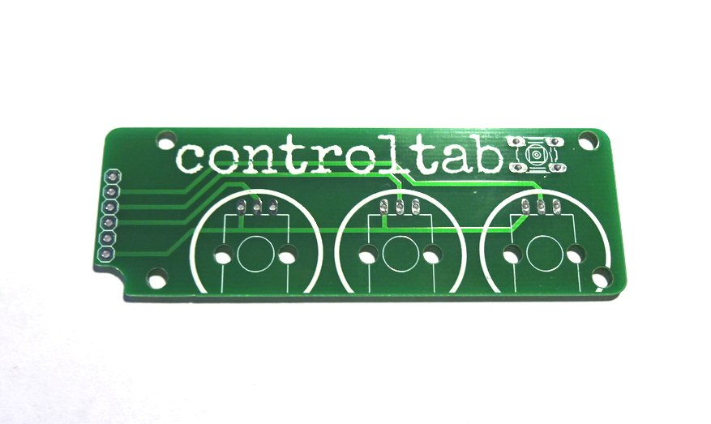
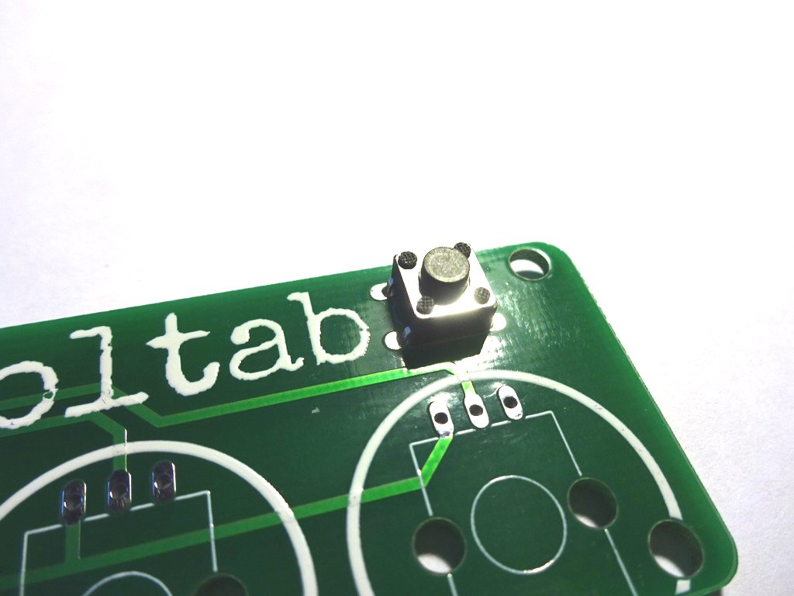
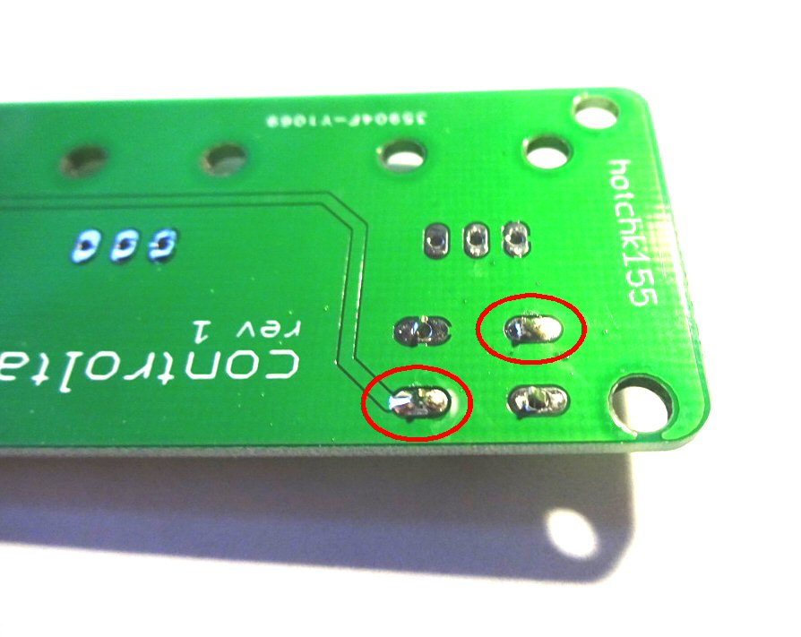
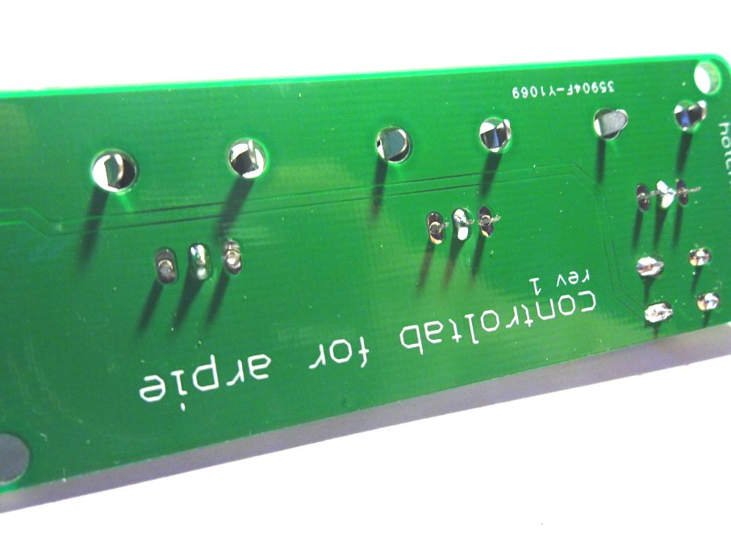
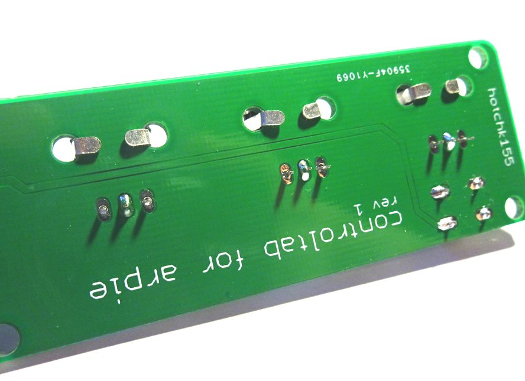
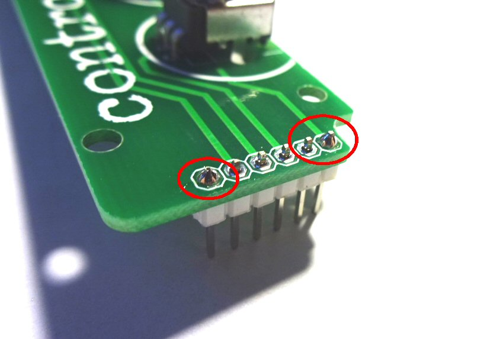
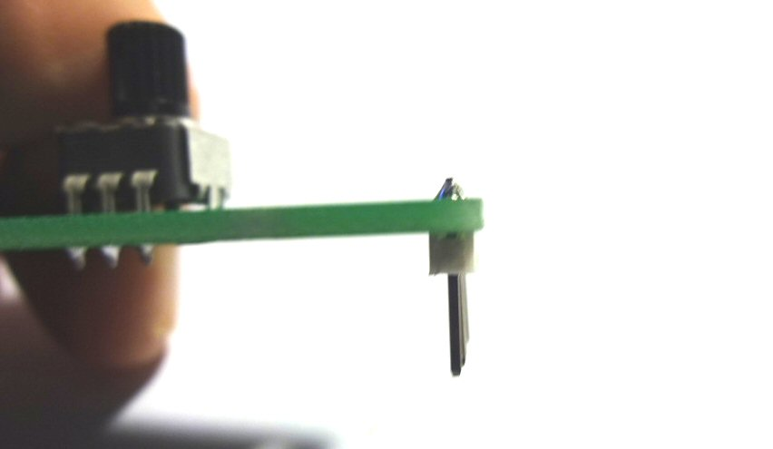
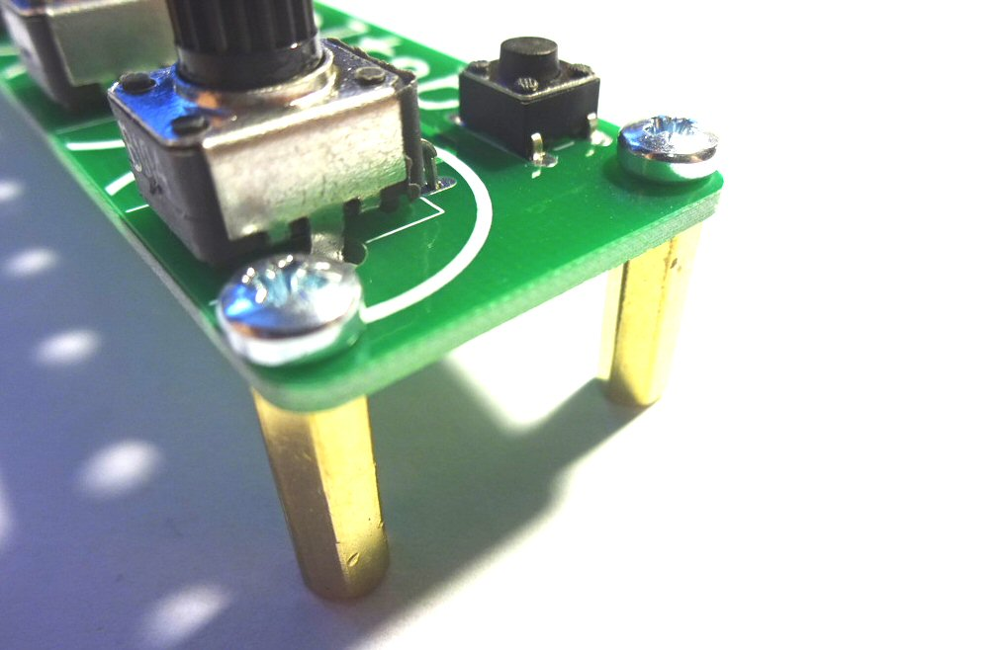
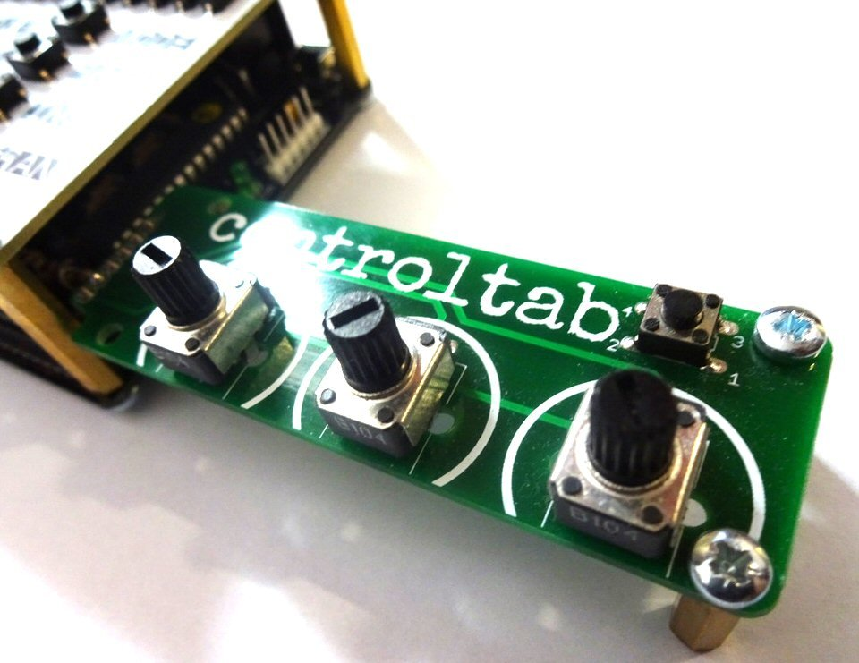

# Build Instructions

ControlTab is a simple build, but there are a couple of opportunities to make mistakes, so please follow these instructions carefully!

Start with the PCB...

Place the small 4 pin tactile switch on the top of the board...

Solder two corner pins and check that the switch is flush to the board before soldering the remaining two pins

Place the three potentiometers in their holes and solder just the middle pins

Ensuring the potentiometers are pressed fully flat to the board, bend the metal tabs tightly against the board then solder the remaining pins

Place the short end of the header strip pins through the holes in the board, so that the header strip is on the UNDERSIDE of the board as shown. Solder just the two end pins 

Make sure the pins are vetical and double check the header is soldered to the correct side of the board

Solder the remaining pins on the header and fit the brass stand-off "legs" using the screws.

The tab can now be fitted into the 6 pin hack header on the side of the ARPIE. Before the controls will work you will need to change some settings on the ARPIE. See <a href="manual.html">here</a> for more information. Enjoy!

