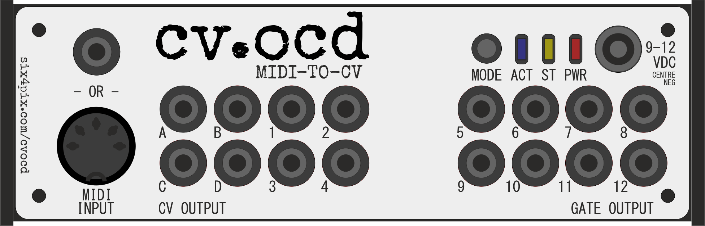

# CV.OCD

 

 

* [The Quick Overview](about.html)
* [The User Guide](https://github.com/hotchk155/cvocd.a/raw/master/docs/CV.OCD%20user%20guide%20v1.pdf)
* [The Configuration Page](http://six4pix.com/cvocd/patch.asp)
* [Troubleshooting and FAQ](http://six4pix.com/cvocd/faq.html)
* [Firmwares](http://six4pix.com/cvocd/firmwares.html)
* [Source Code and EAGLE PCB Files](https://github.com/hotchk155/cvocd.a)

<table>
<tr>
<td width="88"></td>
</tr>
<tr>
<td>This work is licensed under CC-BY-NC-SA terms</td>
</tr>
</table>
 
 
