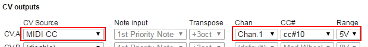
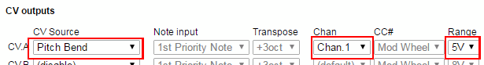
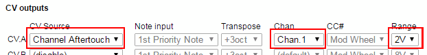

# CV.OCD

## Introduction

CV.OCD is a device which converts MIDI signals to the Control Voltage (CV) and Trigger/Gate signals which are to control traditional analog synthesizers.

As well as doing this useful bit of "plumbing", CV.OCD is designed to open up some creative options that go beyond what a MIDI-CV converter can do. If you get a bit OCD about your CV this could be the box for you!

CV.OCD has four assignable "continuous" analog CV outputs and twelve assignable gate/trigger outputs.

There are many ways to assign MIDI notes and events to these outputs as shown in this diagram.

Here, all the sources of signals are shown on the left hand side, and CV.OCDs outputs are shown on the right.

The little round coloured "flags" indicate an input or an output and the colour indicate the type of information. Provided that the colour of an output flag matches one of the colours on a source flag, we can "map" the signal from the source to the output. 

Text in brackets beside an output flag tells us what additional configuration parameters (such as a note number) can be provided when we set up this mapping.

For example we can see that a midi note (blue flag) can be directly mapped to a gate output, and that MIDI pitch bend (cyan flag) can be mapped to a CV output. A MIDI continuous controller (CC#) can be mapped to either a CV output as a general controller (cyan flag) or to a gate output (magenta flag)

## The LEDs

CV.OCD has three LED indicators:

* The **BLUE** LED indicates MIDI activity
* The **YELLOW** LED usually indicates presence of a MIDI clock and blinks on each beat. Some other actions use this LED to show special statuses. These will be described in this text.

## Connections

CV.OCD has the following connections

* A socket for a 2.1mm barrel connector with a negative pin (as commonly used for guitar effect pedals). This socket accepts a DC voltage of between 9 and 12V. The device will not power up if a plug of the wrong polarity is inserted (although it will not be damaged)
* A standard 5-pin MIDI input socket
* A 3.5mm stereo jack socket for MIDI input. Using a stereo jack cable you can connect a device which uses a 3.5mm jack MIDI output (such as Novation Circuit or Arturia Beatstep Pro). This is an alternative to using the 5-pin socket. You **should not** try to use both inputs at the same time. They are parallel connections and will not merge MIDI data. Trying to use both at the same time may even damage your sending device.
* Four 3.5mm jack sockets, labelled A through D, which output analog control voltage signals
* Twelve 3.5mm jack sockets, labelled 1 through 12, which output digital gate signals

## The Button

CV.OCD is very configurable, but all configuration changes must be made over MIDI. In fact there is only one button on the box, and it has the following functions:

If you press and release the button, this will cause a reset, which will

* clear all held MIDI notes
* turn off all gates (see note)
* set all CV outputs to zero (see note)
* reset note cycle modes
* reset clock dividers

The yellow LED blinks once when the reset is registered.

If you press and hold the button for about 2 second, this will save the current configuration. The configuration will be restored next time CV.OCD is switched on. The yellow LED blinks a second time once the save takes place.

The saved configuration can be overwritten by an incoming SYSEX patch depending on the Auto Save setting. If this is Off then you must use the button to save the configuration (so it is is stored when power is off).

Note: a CV mapped to a pitch bend will go to it half-voltage position (no bend) on reset. A CV mapped to a fixed voltage will not reset. An "all notes off" gate will be triggered.

## The Configuration Page

You'll notice examples below that show screen shots of a web page containing lots of drop down lists and the like. This is the CV.OCD SYSEX configurator. You can find it at
<a href="patch.asp">six4pix.com/cvocd/patch.asp</a>

This page lets you create a CV.OCD patch by makng selecitons in the drop-down lists. You can then press the submit button at the bottom of the page and download a SYSEX file containing your settings. 

You can use a SYSEX tool (such as MIDI-OX on Windows or ??? on Mac) to send this file to your CV.OCD and patch it with your new settings.

Save the files with descriptive names and build up a library of them for different setups. You can edit an existing file by browsing for it, then uploading it (the controls for this are at the top of the configuration page)

If you are brave you can build your own SYSEX files directly. The structure is documented near the end of this manual!

## Note Inputs

In the diagram above you can see that a musical note (green flag) can only be mapped to a CV output if it has come through a "Note Input". So we can't simply map a MIDI note to a CV output... what is this note input and why is in needed?

OK, let's imagine that we want to play a monosynth over MIDI. If we play notes one at a time this works just fine - the synth plays the note we press. However what if we press more than one note at a time? 

A monosynth must decide to play just one of the notes you are holding, and when you release that note it may (depending on what synth you have) start playing one of the other notes that is held. This "prioritisation" of the notes is a useful feature and can be used to get some nice fluid playing like trills or alternating lead and bass notes.

CV.OCD must make the same decision, so something needs to "listen" for the MIDI notes and decide which note to send to the CV output. This is where "Note Inputs" come into play... basically they prioritise the notes and decide which is the "top" priority note that can be mapped to a CV out. 

OK, now CV.OCD has 4 CV outputs, and these might be connected up to play a note on a different synth, and we might want to control each synth with different MIDI channel (and each MIDI channel needs to track its own "highest priority note"). In this case we need a Note Input for each CV output, which is why CV.OCD has four independent Note Inputs available.

## Basic Note Mapping

As a simple example, lets say we have a monosynth that we want to control with MIDI notes on MIDI channel #1, using highest pitch note priority. We want to accept any notes at any velocity and we want the notes to control CV output A, and when a note plays we want to generate a 15ms trigger pulse on gate output #1.

Based on our diagram, we'd have a situation like the following

We need to set up two mappings - firstly to get the first priority note from note input #1 and output it on CV A, and secondly to trigger gate #1 when the note is played. 

To actually do this we would  configure the CV.OCD using the configuration tool to make a SysEx file that we can then load into it. For example

## Polyphonic Note Mapping

You may have noticed on the diagram that each of CV.OCD's Note Inputs has little "flags" for the first priority note, but also for the second priority, third priority and fourth priority notes. 

First off, what are these extra notes? Lets say we set up the basic note mapping shown above, but now we play several notes at the same time via MIDI (i.e. a chord). Only the highest pitch note will actually play, since we are using highest pitch note priority.

However we can, if we like, output the next three lower priority notes (i.e. next 3 highest in pitch) to the remaining CV outputs. This lets us use four monosynths together to play a chord! The mapping might look like this

in the configuration tool it would look like this

## Pitch Bend

MIDI pitch bend is applied automatically to notes that are mapped via a Note Input. You can use the configurator to specify the pitch bend range used by a given note input, for example

If applying pitch bend would take a note outside of the range of a CV output, the output will "plateau" at the highest or lowest allowable value.

You can also use pitch bend directly to control a CV output. This is explained further below.

## Note Priority Modes

Making a big polysynth out of all your monosynths is fun, but there is a lot more we can do here! 

We talked about note prioritisation above. CV.OCDs note inputs support the following basic prioritisation options

* **Most recently played** - we track which notes are held down (up to *five* of them), and select the four most recent held notes in order from newest to oldest.
* **Highest pitch** - held notes are sorted in descending order of pitch
* **Lowest pitch** - held notes are sorted in ascending order of pitch
* **Single Note** - In this mode CV.OCD does not remember any held notes, other than the most recent one. Use this if you don't want to return to a previous note when the current note is released.

The first three modes allow "polyphonic" output as described in the previous section. However, depending on the number of notes held, the CV outputs used for each note will change, which could be inconvenient if you want to predictably assign the highest and lowest notes to a lead and bass voice, with up to two other notes playing accompaniment voices (if enough notes are held). This situation needs something like a combination of highest and lowest pitch priority, which is the purpose of the following

* **Highest pitch (spread)** - The highest note is always is first priority position. If two or more notes are played then the lowest note is always in fourth priority position. Additional notes fill out positions 2 and 3 in descending pitch order.
* **Lowest pitch (spread)** - The lowest note is always is first priority position. If two or more notes are played then the highest note is always in fourth priority position. Additional notes fill out positions 2 and 3 in ascending pitch order.

You might notice there are some other options in the note priority list:

* **2 note cycle** - There is no sorting of notes. Incoming notes are assigned to the "first priority note" and "second priority note" alternately
* **3 note cycle** - There is no sorting of notes. Incoming notes are assigned to the "first priority note",  "second priority note" and "third priority note" in a cycle.
* **4 note cycle** - You got it.. Incoming notes assigned in a cycle to all four priority positions.

So these modes don't really have anything to do with priority but rather with assigning notes to CV outputs in a round-robin fashion. This can actually be pretty good fun to play with, try it!

**Note** Sometimes you might want to reset the cycle back to the start. This can be done with a short press to the button on the front panel of CV.OCD (which also resets other settings) or it can be done with a special MIDI message.

## Multiple MIDI Channels

CV.OCD allows you to control each of the four CV outputs (and associated gates) using different MIDI channels. This allows you to run four monosynths on their own channels.

To do this you'll need to use a Note Input for each MIDI channel. The following image shows how this can be configured

Every note input has its own note priority setting, so you can have different note prioritisation used on each channel.

## Keyboard Splits

CV.OCD allows more than one Note Input to be assigned to the same MIDI input channel. This allows you to set up keyboard splits. For example lets say we want notes below C3 to play a bass synth and notes above to play a lead synth, and both synths should play with highest note priority.

Here is a patch which could do this

The key ranges assigned to Note Inputs can also overlap if you like - this enables some interesting patching and playing styles - for example you could have a bass synth mirror the lowest note of a chord played across three lead synths. Loads of fun to be had!

## More On Note CV

When CV.OCD is sending out a musical pitch CV, it uses a 1 Volt/Octave standard and has a range of 8 Octaves.
Middle C (MIDI note 60) is set at 3 volts, so the output range is from MIDI note 24 (C1) to 120 (C9)

* C1 (MIDI 24) = 0V
* C2 (MIDI 36) = 1V
* C3 (MIDI 48) = 2V
* C4 (MIDI 60) = 3V
* C5 (MIDI 72) = 4V
* C6 (MIDI 84) = 5V
* C7 (MIDI 96) = 6V
* C8 (MIDI 108) = 7V
* C9 (MIDI 120) = 8V

Notes which lie outside of this range will be transposed up or down by whole octaves to bring them into the playable range. 

If you really want out of range notes to be muted (rather than transposed into range), you can restrict the note range of the Note Input that is playing the CV output.

If you want to use a different octave mapping you can use the transpose function of the Note Input. For example if you want MIDI note 0 (C-1) to map to 0 volts, you can set a CV transpose of +2 octaves.

## Other CV Outputs

CV.OCD's four analog CV outputs can output signals other than musical note pitches.. you can use them to output

* Note velocity
* Continuous controller (CC#) value
* Pitch bend 
* Channel aftertouch
* A CV which is linked to MIDI clock BPM!
* Fixed voltages for calibration etc.

Some of these modes require additional parameters to be specified:

To output a **MIDI CC Value** on CV output, we need to tell CV.OCD which CC we are interested in, and what the maximum voltage range of the resulting CV output should be.

To output **Pitch Bend** or **Channel Aftertouch** on a CV output, we need to tell CV.OCD which MIDI channel to watch, and provide the voltage range.

**BPM To CV** just requires a voltage range. A BPM of approx 0-250 BPM is mapped over the full voltage range. The output is updated once per beat, so updates are slow at low BPM and rapid changes in BPM will result in a "stepping" of the CV. If the MIDI clock stops, this does not reset the CV.

A **Fixed Voltage** can be output by selecting the required voltage in the Range drop-down. The ability to output a fixed voltage can be useful for calibrating the pitch CV input of a synth.

## All About Gates

CV.OCD has twelve assignable gate outputs. Each of these outputs can be switched ON and OFF in response to information coming in from MIDI.

When the output is ON, it outputs a voltage which is selectable between

* **5 Volts** - This is a typical gate level used by analog gear. All gate outputs can use a 5V ON level 
* **Supply Level** - Some older gear might need higher voltage levels to trigger reliably. The ON voltage level of gates 5-12 can be set to use the power supply voltage directly. Depending on the supply you are using, this allows a gate level of 9-12V. Make sure that your gear is safe to use with such a level.

The voltage selection for gate outputs 5-12 is made by a switch on the rear of the device. The ON voltage level of gates 1-4 is fixed at 5 Volts.

Depending how a gate output is mapped, it will switch ON and OFF when a corresponding even happens on the MIDI input. The following table shows what conditions will activate (switch ON) and deactivate (switch OFF) a given gate output.

<table class="data">
<tr><td><b>Gate Source</b></td><td><b>Activate When</b></td><td><b>Deactivate When</b></td></tr>
<tr><td>Note input</td><td>New note present/Same note retriggered</td><td>No note present</td></tr>
<tr><td>Any Note On</td><td>Any note pressed</td><td>All notes released</td></tr>
<tr><td>All Notes Off</td><td>All notes released</td><td>Any note pressed</td></tr>
<tr><td>CC above threshold</td><td>CC value goes from below to at/above threshold</td><td>CC value goes from at/above to below threshold</td></tr>
<tr><td>CC below threshold</td><td>CC value goes from at/above to below threshold</td><td>CC value goes from below to at/above threshold</td></tr>
<tr><td>Transport Restart</td><td>Start received</td><td>Stop received</td></tr>
<tr><td>Transport Running</td><td>Start or continue received (i.e. clock is running)</td><td>Stop received</td></tr>
<tr><td>Transport Stop</td><td>Stop received</td><td>Start or continue received</td></tr>
<tr><td>Clock Tick</td><td>Tick received</td><td>Indefinite</td></tr>
<tr><td>Clock Tick AND Running</td><td>Tick received when running</td><td>Stop received</td></tr>
</table>

Rather than waiting for a "deactivate" event, a gate output can be automatically switched off after a short period of time, resulting in a timed pulse or "trigger" signal. Trigger pulses can be set with a pulse duration between approx 1ms to approx 0.1 second

A third mode is "retrig". This is similar to gate mode, but when an additional gate event occurs, the gate is turned OFF for a very short time and then back ON again. This is typically useful when you are triggering an envelope which needs a "rising edge" (e.g. OFF to ON) to trigger the attack slope, but you also want control over the sustain time.

These three modes are summarised with the picture below, which shows how three incomning note events would trigger the gate output in each case.

## Note Based Triggers

Often it is useful to tie a gate output to a specific MIDI note. One obvious example is for triggering drum sounds, however there are many other ways in which being able to MIDI-sequence a general gate/trigger input to a synthesizer.

In these cases, where we are not worried about creating a pitch-based CV but rather just listening for a specific MIDI note, we can bypass the Note Inputs completely and simply tie the gate output to the MIDI note. We can do this like so...

We can assign a single note or a range of notes to a gate output. We can also specify a velocity threshold so that the gate fires only when the MIDI note is above that velocity. This can be useful for bringing in additional gates for harder hits, or maybe for adding an accent trigger which fires when any individual drum trigger is above a certain velocity threshold. For example

## Legato Playing

"Legato" playing means that you play a run of notes where each note flows smoothly into the next. In MIDI terms it means that the next note starts before the previous one ends, so the notes overlap. In CV terms it would mean that the gate signal remains HIGH without going back to LOW between notes.

CV.OCD plays legato when a gate output is in Gate Mode. If you want to retrigger the gate output with every new note, you should can use Retrig or Trigger mode. 

You can of course assign multiple gate outputs to the same note if you want to have both gate and trigger signals for it. The example below shows how to get gate and trigger for the same note.

## CC Based Gates

A gate output can be tied to a specific MIDI continuous controller (CC) value such that the gate is activated when the CC value goes above or below the threshold

For example we can set a gate to activate when CC#10 is above the value 64

We can also set a gate to trigger when a CC is below a threshold.

In all cases the gate will be untriggered until we receive the current value of the CC from MIDI.

## Transport Based Gates

MIDI has the concept of a "play" mode (or "transport"). When the transport is running, this means that pattern based devices and sequencers would be playing notes in time with the MIDI clock. The transport can also be stopped.

MIDI controls playback with three messages:

* **START** - This message is usually sent by a master controller device when a slave device should reset its play position to the beginning of a sequence and should start playing in time with MIDI clock ticks. When this message is received, CV.OCV triggers any gate with a "Transport restart" or "Transport running" condition.
* **CONTINUE** - This message is usually sent by a master controller device when a slave sequencer pick up playing from its current position. When this message is received, CV.OCV triggers any gate with a "Transport running" condition.
* **STOP** - This message stops playback at the current position. When this message is received, CV.OCV triggers any gate with a "Transport stop" condition.

It should be noted that the MIDI clock tick messages (which define the BPM) continue to be sent by the master device even when the transport is stopped.

## Clock Outputs

A very useful application of CV.OCD is to output clock pulses when MIDI clock tick messages are received.

A MIDI clock master defines the BPM by sending out 24 of these tick messages for every "beat" (quarter note) so at 120bpm, 48 ticks are received every second.

CV.OCD can trigger it's gate outputs in response to these tick messages. The outputs can then be used to synchronise external gear with MIDI. 

Most usefully, you can specify the rate at which the gate output will fire, as a division of the tempo. CV.OCD can output a clock at the following rates:

* **1/32nd note** - 3 ticks
* **1/16 note triplet** - 4 ticks
* **1/16 note** - 6 ticks
* **1/8 note triplet** - 8 ticks
* **1/16 dotted note** - 9 ticks
* **1/8 note** - 12 ticks
* **1/4 note triplet** - 16 ticks
* **1/8 dotted note** - 18 ticks
* **1/4 note (beat)** - 24 ticks
* **1/2 note triplet** - 32 ticks
* **1/4 dotted note** - 36 ticks
* **1/2 note** - 48 ticks
* **1/2 dotted note** - 72 ticks
* **whole note** - 96 ticks

When you output the clock, you need to use a trigger duration that is short enough so that there is an OFF time between the clock pulses, but long enough to register on the device being controlled. A good choice is 10-15 milliseconds.

Here is an example of how a beat clock (1/16th) can be output to gate 1, with gates 2,3,4 outputting divided clocks at half, quartet and eighth speeds.

Another option is to "offset" the clock. This means to add a lag to the timing of the clock so it triggers later than it should (by a number of ticks that you specify). Remember that each tick is 1/24th of a beat (use the list above to know how many ticks there are in each clock division)

For example lets create four clocks that trigger once per beat but are each staggered by a quarter of a beat. 1 beat is 24 ticks, so each output should be offset from the previous one by a quarter of this (i.e 6 ticks)

## Global Defaults

CV.OCD has special "global" settings for MIDI channel and gate duration. 

* The global MIDI channel is convenient if you want to have several outputs linked to the same MIDI channel and need to be able to change that MIDI channel easily.

* The global gate duration setting is convenient if you want to have several gates using a standard duration and  need to be able tweak that duration easily.

Of course you can always give a specific MIDI channel or gate duration for a setting.

## Configuration

<table class="full">
<tr>
<td><b>Param# High</b></td>
<td><b>Param# Low</b></td>
<td><b>Value High</b></td>
<td><b>Value Low</b></td>
</tr>

<tr><td>[1] Global</td><td>[2] Midi Channel</td><td>[0] Specific</td><td>[1...16]</td></tr>
<tr><td></td><td>[9] Gate Duration</td><td>[1] Milliseconds</td><td>[0...127]</td></tr>
<tr><td></td><td>[100] Auto Save</td><td>[0]</td><td>[0...1]</td></tr>

<tr><td>&nbsp;</td><td></td><td></td><td></td></tr>

<tr><td>[11..14]</td><td>[1] Source</td><td>[0] None (disable)</td><td>x</td></tr>
<tr><td>Note Input</td><td></td><td>[1] Enable</td><td>x</td></tr>
<tr><td></td><td>[2] MIDI Channel</td><td>[0] Specific</td><td>[1..16] Channel</td></tr>
<tr><td></td><td></td><td>[1] OMNI</td><td>x</td></tr>
<tr><td></td><td></td><td>[2] Use Global</td><td>x</td></tr>

<tr><td></td><td>[3] Note Range From</td><td>[0..127]</td><td>x</td></tr>
<tr><td></td><td>[4] Note Range To</td><td>[0..127]</td><td>x</td></tr>
<tr><td></td><td>[5] Min Velocity</td><td>[0..127]</td><td>x</td></tr>
<tr><td></td><td>[7] Pitch Bend Range</td><td>[0..127] semitones +/-</td><td>x</td></tr>

<tr><td></td><td></td><td>[8] Note priority</td><td>[0] Most recent</td></tr>
<tr><td></td><td></td><td></td><td>[1] Lowest pitch</td></tr>
<tr><td></td><td></td><td></td><td>[2] Lowest pitch (spread)</td></tr>
<tr><td></td><td></td><td></td><td>[3] Highest pitch</td></tr>
<tr><td></td><td></td><td></td><td>[4] Highest pitch (spread)</td></tr>
<tr><td></td><td></td><td></td><td>[5] Single note only</td></tr>
<tr><td></td><td></td><td></td><td>[6] Two note cycle</td></tr>
<tr><td></td><td></td><td></td><td>[7] Three note cycle</td></tr>
<tr><td></td><td></td><td></td><td>[8] Four note cycle</td></tr>

<tr><td>&nbsp;</td><td></td><td></td><td></td></tr>

<tr><td>[21..24]</td><td>[1] Source</td><td>[0] None (disable)</td><td>x</td></tr>
<tr><td>CV Output</td><td></td><td>[11..14] Note In</td><td>[1] first priority note</td></tr>
<tr><td></td><td></td><td></td><td>[2] second priority note</td></tr>
<tr><td></td><td></td><td></td><td>[3] third priority note</td></tr>
<tr><td></td><td></td><td></td><td>[4] fourth priority note</td></tr>
<tr><td></td><td></td><td></td><td>[20] note velocity</td></tr>
<tr><td></td><td></td><td>[2] Map MIDI CC</td><td>[0..127]</td></tr>
<tr><td></td><td></td><td>[20] Map BPM</td><td>x</td></tr>
<tr><td></td><td></td><td>[119..127] Test Voltage</td><td>x</td></tr>

<tr><td></td><td>[2] MIDI Channel</td><td>[0] Specific</td><td>[1..16]</td></tr>
<tr><td></td><td></td><td>[1] OMNI</td><td>x</td></tr>
<tr><td></td><td></td><td>[2] Use Global</td><td>x</td></tr>

<tr><td></td><td>[12] Transpose</td><td>x</td><td>[0..64..127]</td></tr>
<tr><td></td><td>[15] Voltage Range</td><td>x</td><td>[1..8]</td></tr>

<tr><td>&nbsp;</td><td></td><td></td><td></td></tr>

<tr><td>[31..42]</td><td>[1] Source</td><td>[0] None (disable)</td><td>x</td></tr>
<tr><td>Gate</td><td></td><td>[11..14] Note In</td><td>[0] all notes off</td></tr>
<tr><td></td><td></td><td></td><td>[1] first priority note</td></tr>
<tr><td></td><td></td><td></td><td>[2] second priority note</td></tr>
<tr><td></td><td></td><td></td><td>[3] third priority note</td></tr>
<tr><td></td><td></td><td></td><td>[4] fourth priority note</td></tr>
<tr><td></td><td></td><td></td><td>[5] any note</td></tr>

<tr><td></td><td></td><td>[1] Note Trig</td><td>[0..127] Note</td></tr>
<tr><td></td><td></td><td>[2] CC above threshold</td><td>[0..127] CC</td></tr>
<tr><td></td><td></td><td>[3] CC below threshold</td><td>[0..127] CC</td></tr>

<tr><td></td><td></td><td>[20] Clock tick</td><td>[1..127] divider</td></tr>
<tr><td></td><td></td><td>[21] Clock tick AND Running</td><td>[1..127] divider</td></tr>
<tr><td></td><td></td><td>[22] Transport running</td><td>x</td></tr>
<tr><td></td><td></td><td>[23] Transport restart</td><td>x</td></tr>
<tr><td></td><td></td><td>[25] Transport stop</td><td>x</td></tr>

<tr><td></td><td>[2] MIDI Channel</td><td>[0] Specific</td><td>[1..16] Channel</td></tr>
<tr><td></td><td></td><td>[1] OMNI</td><td>x</td></tr>
<tr><td></td><td></td><td>[2] Use Global</td><td>x</td></tr>

<tr><td></td><td>[3] Note Range From</td><td>[0..127]</td><td>x</td></tr>
<tr><td></td><td>[4] Note Range To</td><td>[0..127]</td><td>x</td></tr>
<tr><td></td><td>[5] Min Velocity</td><td>[0..127]</td><td>x</td></tr>
<tr><td></td><td>[9] Trigger duration</td><td>[0] Gate</td><td>x</td></tr>
<tr><td></td><td></td><td>[1] Trig Dur</td><td>[1..127] ms</td></tr>
<tr><td></td><td></td><td>[2] Trig Global Dur</td><td>x</td></tr>
<tr><td></td><td></td><td>[3] Retrig</td><td>x</td></tr>
<tr><td></td><td>[11] CC threshold</td><td>[1..127] CC Value</td><td>x</td></tr>

</table>

The CV.OCD can be configured my sending NRPN messages using the above values. 

x means that a value is not important, however it still needs to be sent (send a zero), since CV.OCD updates the parameter only when the low byte of the value is received.

A SYSEX file can also be generated which collates a list of these messages. The format of the patch SYSEX is as follows

<table>
<tr>
<td class="grid">#F0</td>
<td class="grid">#00</td>
<td class="grid">#7F</td>
<td class="grid">#12</td>
<td class="grid">(Param# High)</td>
<td class="grid">(Param# Low)</td>
<td class="grid">(Value High)</td>
<td class="grid">(Value Low)</td>
<td>..repeat..</td>
<td class="grid">#F7</td>
</tr>
</table>

 
 
 
End