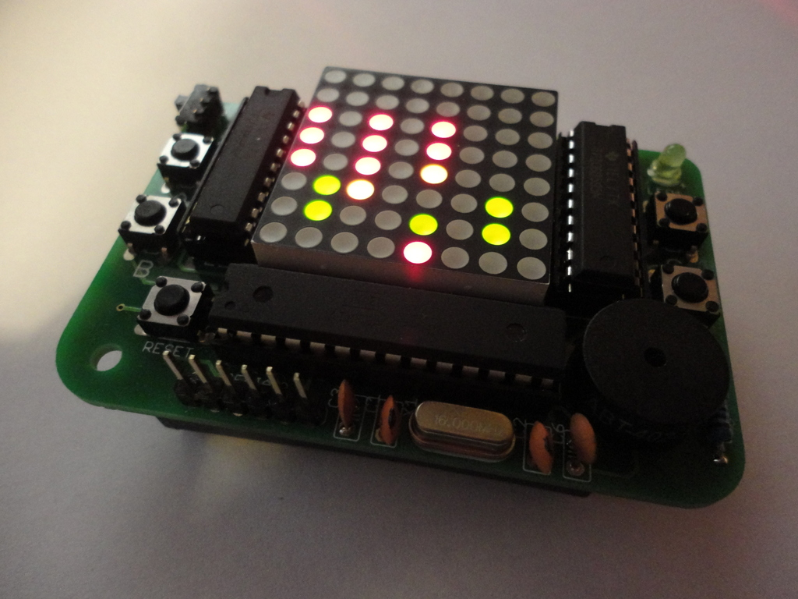

# AVR GAME WIKI
**If you want to work on the code for the game please go to the https://github.com/SixtyFourPixels/SixtyFourPixels project instead. Message me to join the SixtyFourPixels Github "organisation" to get write access to the repo. Also please fork that repo rather than this one since this one is for my own dabblings before I submit them to the main 64P repo**
# [Building the Kit](build.html)
# [Parts List](kit.html)
# [PCB information](hardware.html)
# [Playing the Default Games](games.html)
# [Using the USB Programmer](update.html)
# [Programming Your Own Games](programming.html)
# [Troubleshooting](troubleshoot.html)

 This work is licensed under a <a rel="license" href="http://creativecommons.org/licenses/by-nc/3.0/deed.en_US">Creative Commons Attribution-NonCommercial 3.0 Unported License</a>.

