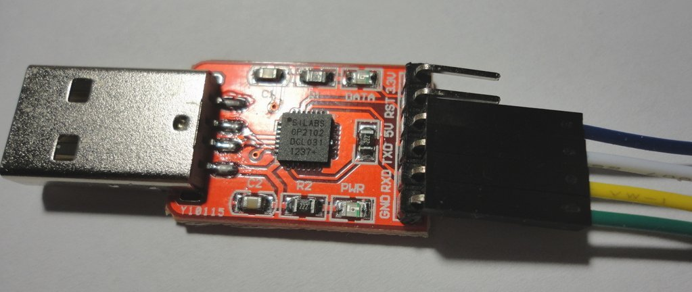
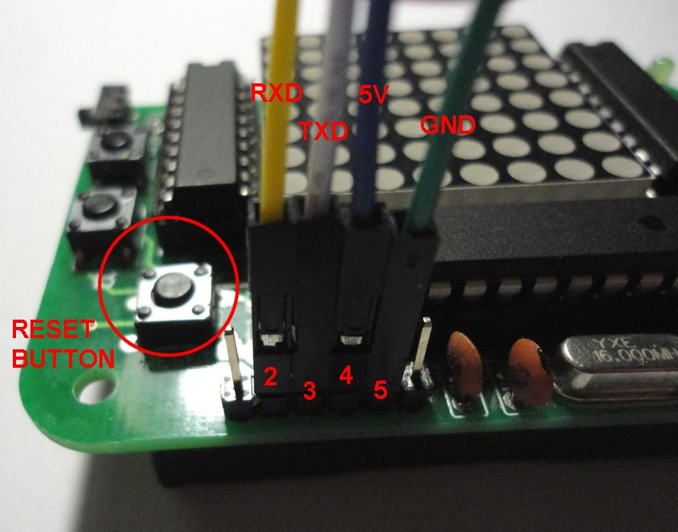

* The information on this page relates to the Silicon Labs CP2102 adaptor supplied in the "game kit + USB programmer" bundle.

This information could also be useful for other similar programmers. The information assumes you are already familiar with using the Arduino environment. If not please check [http://arduino.cc](http://arduino.cc) to download the free Arduino development environment and to view the setup instructions 
 
Before connecting the programmer you will need to download the drivers from the following URL
[http://www.silabs.com/products/mcu/Pages/USBtoUARTBridgeVCPDrivers.aspx](http://www.silabs.com/products/mcu/Pages/USBtoUARTBridgeVCPDrivers.aspx) 
 
Connect the programmer to a free USB socket on your computer and let the drivers install. 
 
The programmer connects to the 6 pin programming header on the game board using a four pin lead (made up of individual 1 pin cables). These connect to pins 2,3,4,5 on the game board header (pin 1 is marked on the board and is the leftmost one if board is oriented with header at the bottom). On the photos below I used the wires  as follows 
 
* GREEN WIRE - Ground (GND on programmer, pin 5 on game board header)
* YELLOW WIRE - Serial Receive (RXD on programmer, pin 2 on game board header)
* WHITE WIRE - Serial Transmit (TXD on programmer, pin 3 on game board header)
* BLUE WIRE - Power (5V on programmer, pin 4 on game board header)
 
If your wires have different colours, use any convention you like :) 

 

 
Once the wires are connected, use the Arduino environment with Board Type "Arduino Duemilanova w/ATMega 328" to upload to the board. As soon as the status bar in the Arduino environment shows "Uploading" press the reset button on the game board.  
Within 10 seconds or so you should have a "Done" message in the Arduino environment status bar. 
 
If you receive an error message, please refer to the Troubleshooting page