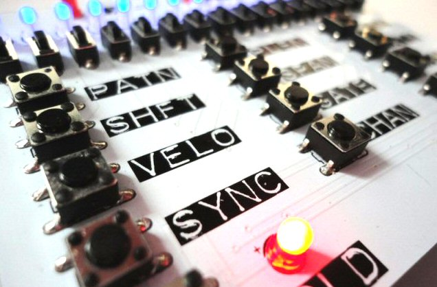

 
Sixty-Four Pixels Ltd is a computer software and electronic hardware consultancy based in Brighton, United Kingdom.
 
 
With over 25 years industrial coding experience in C/C++ on Windows platforms, Sixty Four Pixels offer software development consultancy services. We have specific expert knowledge of travel distribution automation (GDS facing robotic) as well as experience in engineering, digital security and financial data processing applications.

<table>

<tr>
<td>
<table>
<tr><td></td>
<td valign="top">Since 2013, we have designed, manufactured and marketed a growing series of <a href="products.html">electronic products and kits</a>. These include a popular range of open-source kits for hobbyists and musicians</td>
</tr></table>
</td>
</tr>

<tr>
<td>
<table>
<tr>
<td valign="top">We offer a consultancy service help you with technical aspects of your project. We've worked with artists, musicians, engineers and inventors, bringing our passion and experience to help get projects off the ground</td>
<td></td>
</tr></table>
</td>
</tr>

<tr>
<td>
<table>
<tr>
<td></td>
<td valign="top">We build on our coding expertise with solid experience of embedded coding, electronic circuit design and manufacturing. If you need some advice on where to get started with your project or product, we can help! 
 
Contact:

 
</td>
</tr></table>
</td>
</tr>

</table>

