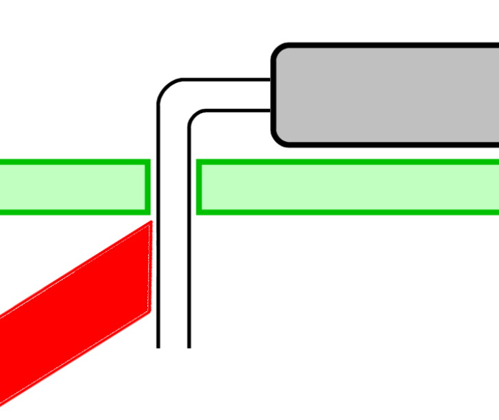
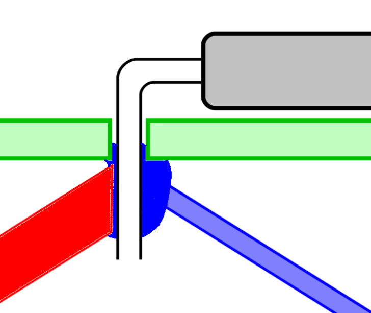
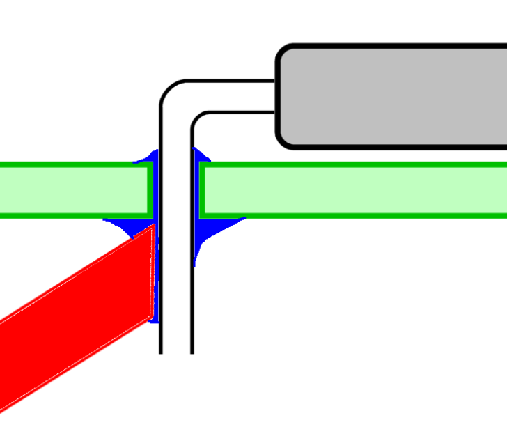
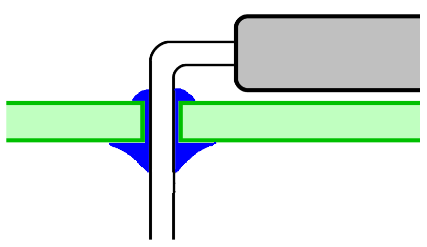
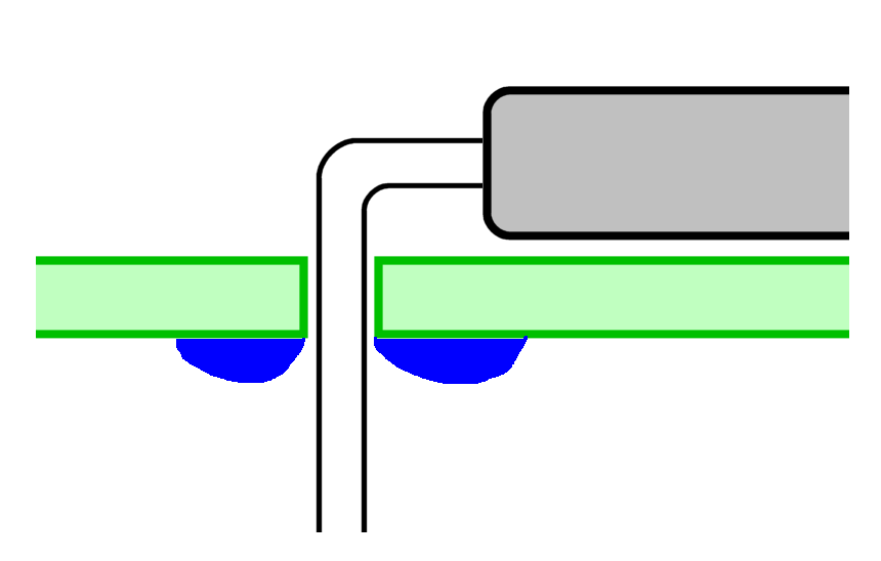
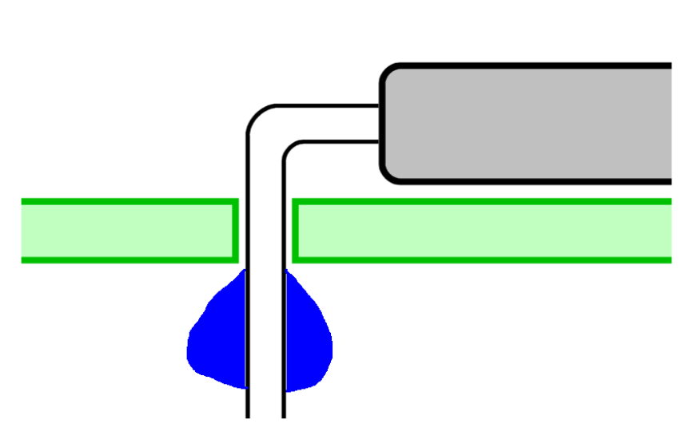
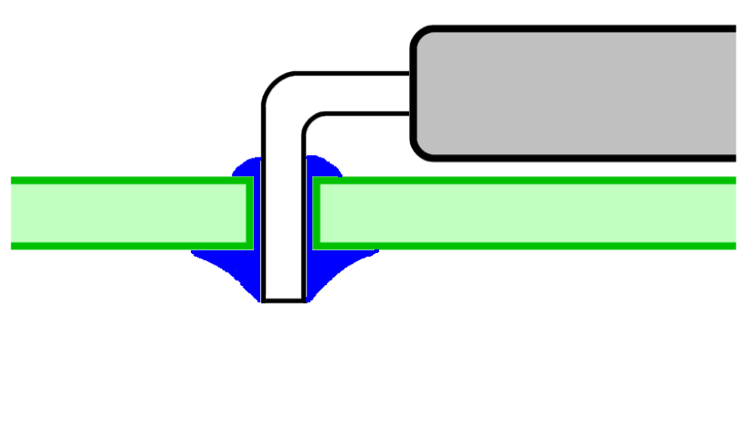
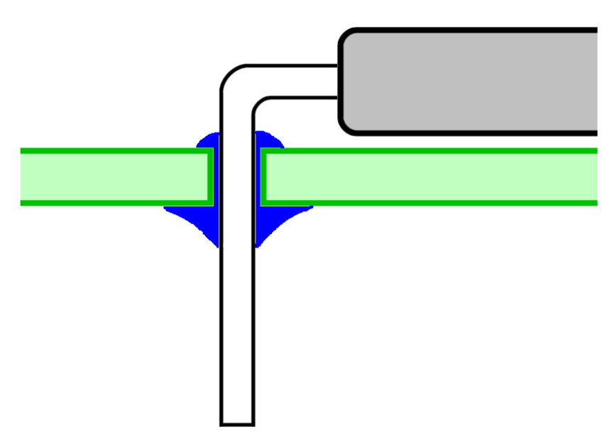
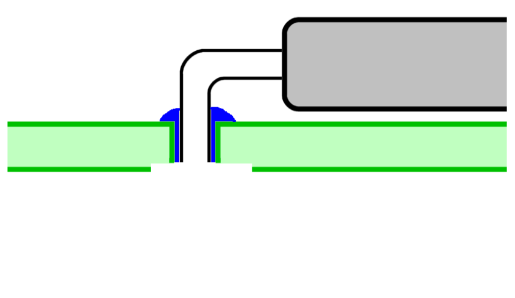

# Soldering Is Easy!

Before you start soldering, make sure the tip of your iron is clean and up to temperature. Melt a little solder on to the tip to "tin" it. Use a soldering sponge or wire wool tip cleaner to remove excess solder leaving a thin bright silvery coating on the tip.

When soldering a component, bring the tip of the iron to where the leg of the component emerges from the hole and, at the same time, bring the end of your solder wire to where the iron tip,  leg, and PCB hole all meet each other. 

Don't melt the solder directly on to the tip of the iron but rather melt it at the point where the iron tip touches the component leg. This should not longer than about 2-3 seconds. After applying the solder, remove the solder wire and continue to apply heat to the joint for about 1 second. 

You should see that the molten solder gets "sucked" into the plated PCB hole, forming a good connection. Now remove heat and allow the joint to cool naturally for a few seconds (don't blow on it). The final joint should be bright and shiny, not dull or grey.

Use your wire wool tip cleaner or sponge to keep the tip of the iron clean. Clean excess solder from the tip every time you make a solder joint and re-tin it frequently. A clean, well tinned tip is the key to making good consistent solder joints. 

<table width="100%">
<tr>
<td valign="top" width="33%">
<b>Step 1</b> 
 
Press the tip of the soldering iron as close as possible between the leg of the component and the pad on the printed circuit board. Heat for 2-3 seconds.
</td>
<td valign="top" width="33%">
<b>Step 2</b> 
 
While still heating the joint with the iron, feed in the solder wire at the point where the iron tip and the component lead touch. Use a little less than 1cm length of solder wire for each joint. This process should take 2-3 seconds.
</td>
<td valign="top" width="33%">
<b>Step 3</b> 
 
Remove the solder wire and keep heating the joint for another 2-3 seconds. This allows the solder to spread and be drawn through the hole, making a good connection.
</td>
</tr>
</table>
 
 

## What To Aim For

<table width="100%">
<tr>
<td valign="top" width="33%">
<b>GOOD</b> 
 This is what  we're aiming for.  A good solder joint with solder being drawn right through the hole. The solder joint should be bright and silvery.
</td>
<td valign="top" width="33%">
<b>BAD!</b> 
 The iron was only heating the pad, not the component lead, so the solder has not adhered to the lead but has formed a ring around it on the pad. The two are not properly connected - sad face!
</td>
<td valign="top" width="33%">
<b>BAD!</b> 
 
The solder is only on the lead, but has not joined it to the pad - a very common mistake. These are not the joints you are looking for... try again!
</td>
</tr>
</table>
 
 

## Trimming Excess Leads

After the joint has cooled, trim excess leads with side cutters. Try to push down on the joint with the cutters rather then tug at it. What we are aiming for is shown below.

<table width="100%">
<tr>
<td valign="top" width="33%">
<b>GOOD</b> 
 Nice neat cut just above the solder joint. No excess component lead and no damage to the joint
</td>
<td valign="top" width="33%">
<b>NOT SO GOOD</b> 
 Excess leads could touch together causing shorts or other problems.
</td>
<td valign="top" width="33%">
<b>BAD!</b> 
 Too close to the board. The bottom part of the solder joint could get damaged or even pulled away from the track.
</td>
</tr>
</table>
 
 

## Do's and Don'ts

<table width="100%">
<tr>
<td width="50%"><b>DO</b></td>
<td width="50%"><b>DON'T</b></td>
</tr>

<tr>
<td valign="top">
Clean the tip of the iron using a brass wool tip cleaner or wet sponge after each solder joint. Happiness is a clean shiny tip!
 
 
 
Wash your hands when you finish, especially before handling food - solder wire contains lead and/or other nasties
</td>

<td valign="top">
Heat components for too long - they can be damaged by heat! Anything more than 5-6 seconds is getting too long. You can alway allow the component to cool and try again
 
 
Inhale the smoke given off when soldering - it is not good for you!
</td>
</tr>

</table>
 
 
