# Hacks du Strum

I love hearing about the amazing ways some people have modded their Le Strum kit or built it into instruments

Jose Javier Castellanos blew me away with this amazing and beautiful "Guitarp" build. Check out the video clip. 

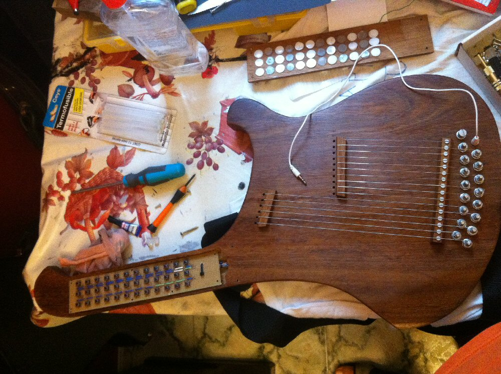
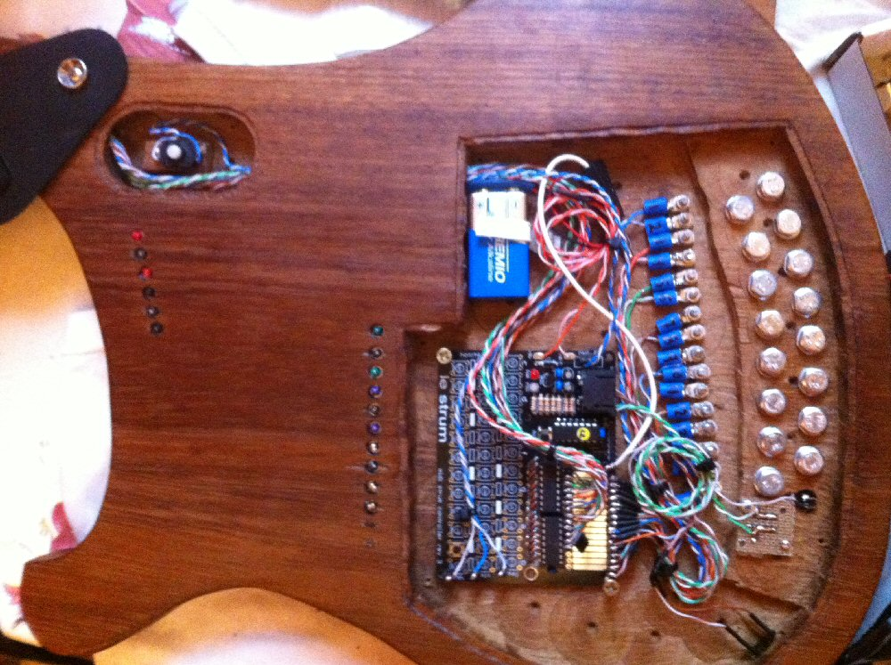

Lincoln Carlin made a nice autoharp enclosure for his Le Strum 
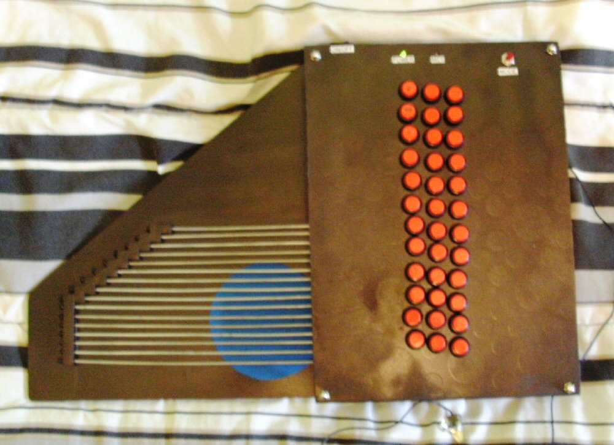

And Martin Sharrard added a custom strum pad and colour coded keycaps to get this smart build
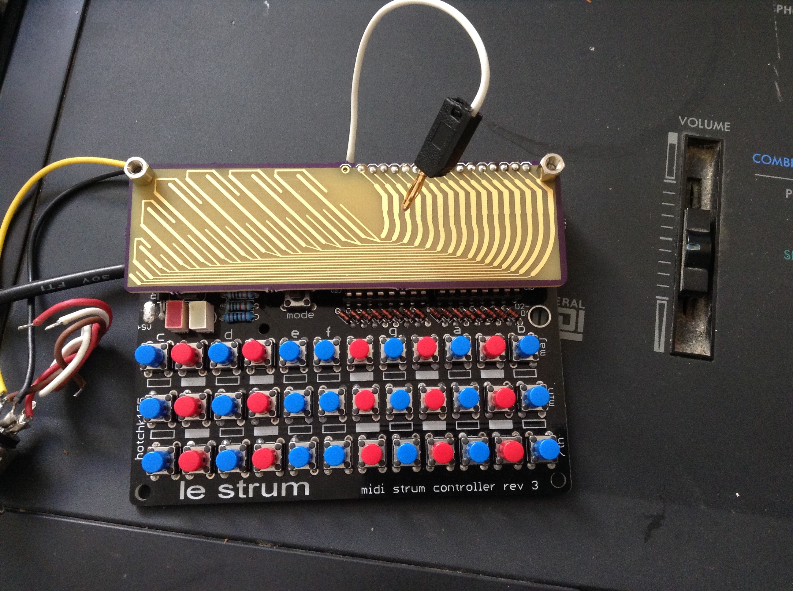

More from Martin... Le Strums fitted inside old SNES game cartridges, Genius!!!
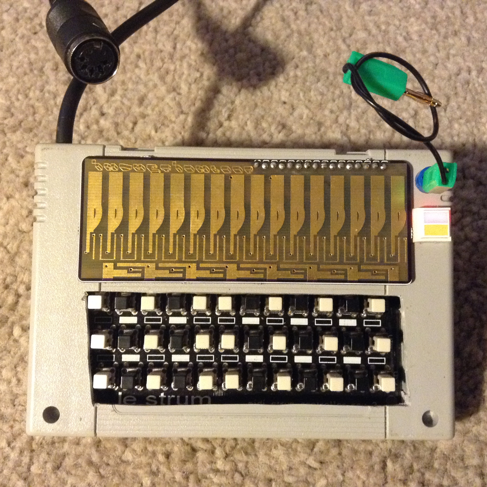
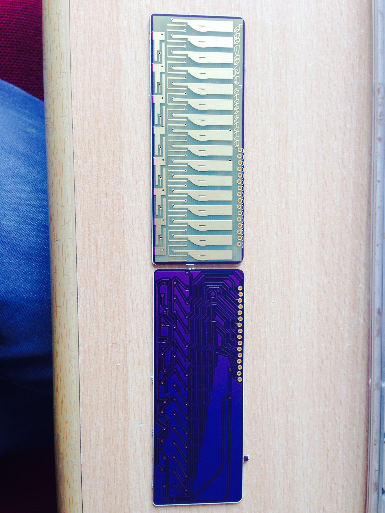
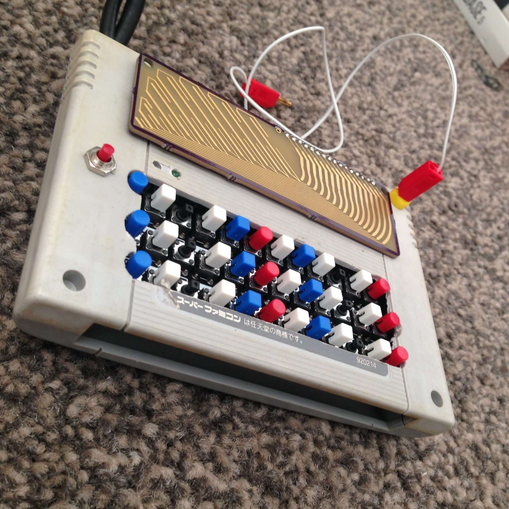

[Meng Qi](http://www.mengqimusic.com/) uses arcade buttons as the triggers in this beauty

A lovely zither style build by [Marie Höreth](http://www.mariemusic.de/le-strum.html)
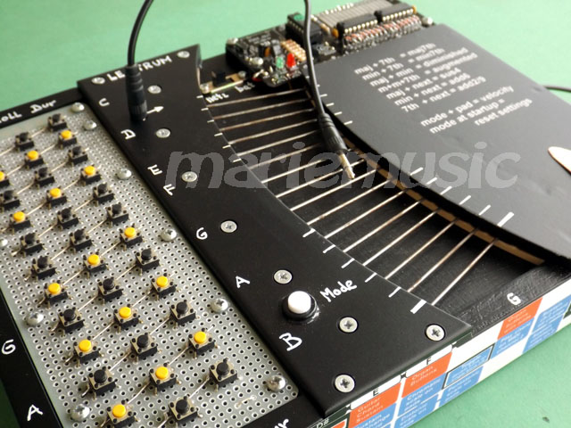

Another guitar style build, from Louis üdvözletét
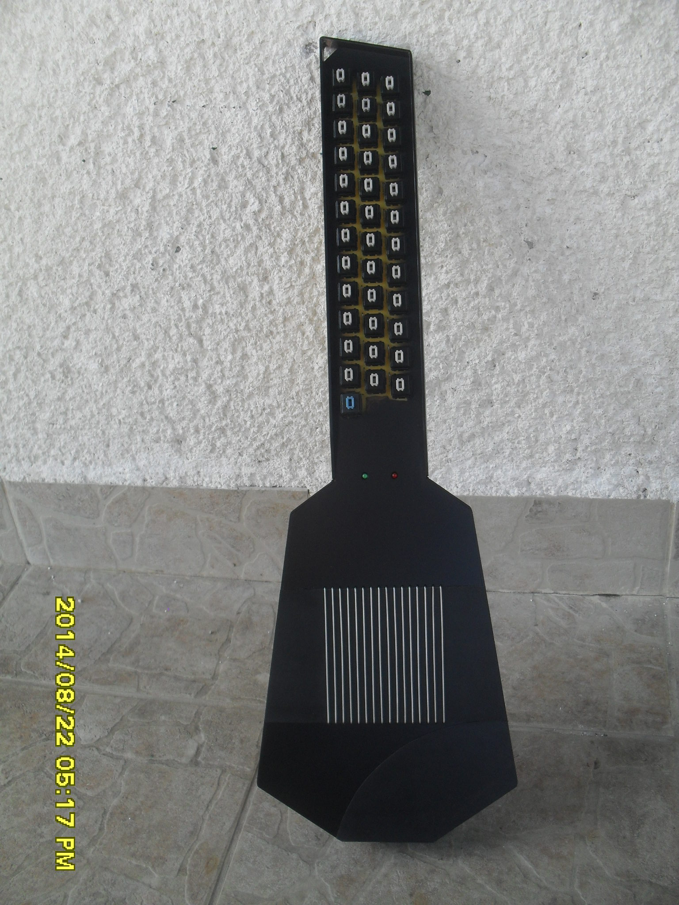

The [Knödelschneider48](https://www.flickr.com/photos/laborant48/sets/72157659406242023/).. A beautiful executed harp design from Jakub (cube48) 
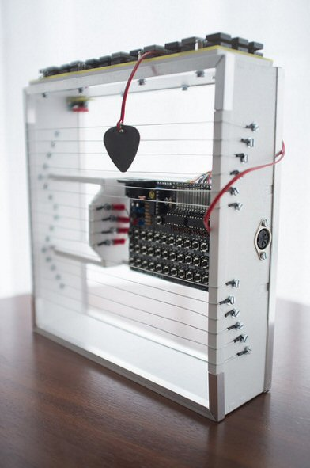

And Darren Hesford's superb (but frankly terrifying) strummable mannequin leg!
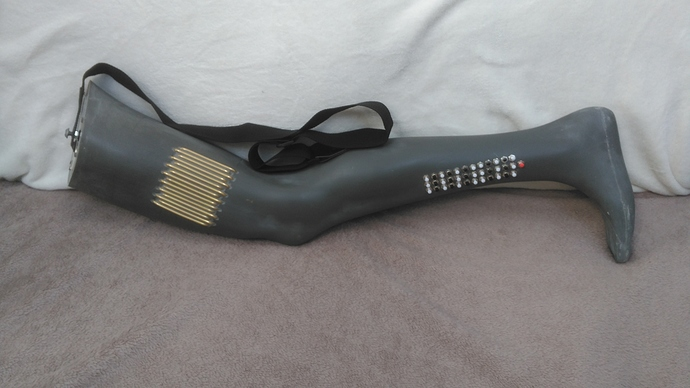

Drop me an email if you'd like me to add your build to the gallery!

