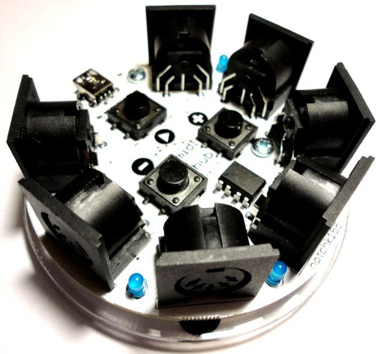

# MIDIHUB

midihub++ is a compact and versatile 6-way MIDI splitter and MIDI beat clock generator. 

It was designed to be "hands on" and was developed with MIDI jam sessions in mind, but is a versatile tool in any MIDI setup. 

midihub++ is open hardware, with open source firmware code. 

* [User Documentation](https://github.com/hotchk155/MIDI-Hub/blob/master/docs/midihub.pdf?raw=true)
* [Parts List](https://github.com/hotchk155/MIDI-Hub/blob/master/hardware/parts.txt)
* [Source Code and EAGLE PCB Files](https://github.com/hotchk155/MIDI-Hub)

<table>
<tr>
<td width="88"></td>
<td>This work is licensed under CC-BY-NC-SA terms. If you would like a commercial license please contact us.</td>
<tr>
</table>
 
 

