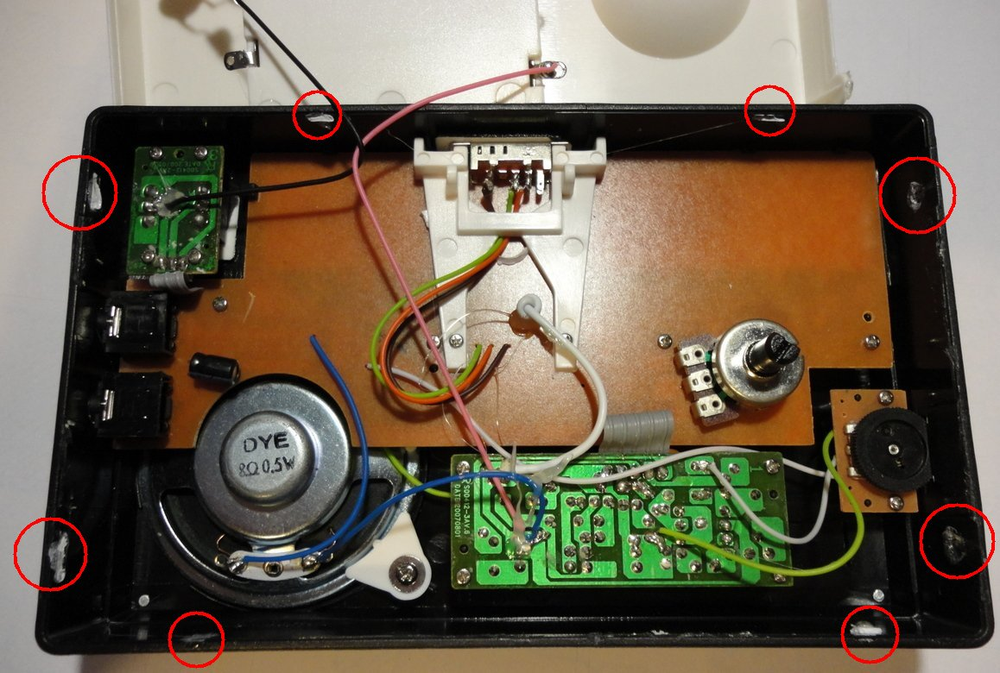

The kit works with the reissue stylophone, that came out in the mid 2000's. This conversion kit is not intended to work with the old 1970s/80s analog stylophone (there is a different approach you can use with that). One advantage of converting a reissue stylophone is that it can still be played in the original manner in parallel with the MIDI output. 
 
Below is the packaging for the stylophone that I converted while photographing these instructions 

 
The first step is actually one of the most difficult parts of this build.. we need to open up the stylophone while damaging it as little as we can. This is made a little bit difficult because these things have been **glued shut** in the factory! However fore-warned is fore-armed and I'm sure you can get through this bit just fine 
 
The top and the bottom parts clip together via a pair of tabs attached to the base (white plastic) which have bumps that fit into indentations in the top part (circled on the right side below). On the opposite edge are two slots that pair up with lugs on the base. These four clip points are glued in the factory and glue is also applied at the front and back edges 
 
Your mission is to separate the top and bottom **without snapping off the tabs**.. the reason is that if we can keep the tabs intact the stylophone will still clip together nicely when we finish. This means we don't need to glue it closed or use screws etc to keep it together. 
 
I did this using the blade of a screwdriver. You need to be quite forceful, but also careful. Get the screwdriver between the top and bottom and slide it along, waggling it slightly. The glue should give way with a "pop" 

 
Before we go further, **take some close up photographs of the boards**. You can refer back to these later when you can't remember which wire was connected where or which way round something went.
 
Now desolder the wires from the battery compartment so that the base can be separated. Also desolder the speaker wires. Try to remove the blobs and strands of hot glue which are usuually littered over the board. 

 
Next we are going use use some small blobs of superglue to strengthen the wire connections. This device is wired with the flimsiest wire imaginable, and it can flake off with the tiniest disturbance. Rewiring the whole thing with decent wire takes a long time (I know, I've done it). My advice is simply to glue the wires in place. Make sure you glue to the wire insulation, not just the conductor. 
**Do not** glue the knotted wire that goes to the stylus (we'll need to get that free during the build) but do glue the short robbon cables between the boards (these are very easy to break off if not secured)
 
I use high viscosity cyanoacrylate superglue (Bondloc HV) together with an aerosol "activator" spray. I simply squirt a little bit of activator onto the glue blobs - not the recommended way to use the spray but it does the job 
As you fit this kit, you will be moving things around a lot. I **really** recommend this glueing step. It will save you a lot of time and frustration 

 Now desolder the stylus wire and undo the knot. Remove all the small screws that hold the boards down and remove them carefully from the case 

 Put all the small parts somewhere safe! 

 Apply superglue to the green wire on the back of the board if present 

 Trim down the potentiometer legs as short as possible 

 Next we are going to apply small blobs of solder to the small exposed pads on the tracks that lead to the stylophone keypads. I don't know why these are included on the board, but our job would be a hell of a lot more difficult without them! 

 Split off a 5 core length of ribbon cable (30cm or so) and solder it to the connector on the bottom of the input shift register board. Examine carefully to make sure all wires are connected and not shorting, then apply some of our old friend Mr. Superglue, to hold it in place. We really don't want any of this falling apart when we build this all together! 

 Cut the Kynar wire into lengths of about 10 cm and strip the insulation from one end (I find this can be done nicely with side cutters and a bit of care). Solder a length of the Kynar wire into each of the input pads marked A through T. Trim the excess wire from the bottom of the board then secure the wires to the board with - you guessed it - more superglue. Make sure the glue fixes the wire insulation not just the core 

 Stick self adhesive foam pads to the rear of the input board. 

 Secure the input board in place at the top right of the stylophone board, but make sure none of the screw holes are covered. This position is quite critical. Please look carefully at the photo below. 

 Wire each Kynar wire to one of the pads we prepared earlier. I recommend working from right to left, wiring connections T through A to each pad in their strict right to left order. We will correct any out of order connections in code later, but you'll have less to do if you try to follow the connections in the correct order. Cut all the wires as short as practical and keep solder joints flat to the board, especially along the top edge of the keypad (where they press against part of the case) 
Leave clearance around the screw holes, as indicated 

 Take another 5-core length of ribbon cable and attach it to the buttons board 

 Solder the buttons and attach the keycaps 

 Use the [template](https://raw.githubusercontent.com/hotchk155/MIDI-Stylo/master/img/template.png) to place the holes for the button board. I used hand tools to drill the case (a 1mm push-drill to make guide holes, then a stripboard track cutter to create the holes and a reamer to widen the holes for the buttons

 Put bolts through the holes at either end of the button board. Put two nuts on the bolt. The nuts will provide spacing between the button board and the rear of the case. A third nut on each bold secures the board. Make sure all buttons move freely 

 Now prepare the MIDI socket - attach wires to pins 4 and 5. I suggest using different coloured wires to help identify them later. Protect the solder joints and insulate all the other pins with heat shrink tubing. Trim the heatshrink and twist the wires together 

Now make the hole for the MIDI socket. This needs to be far into the corner of the rear of the case to put it to the side of the Stylophone amplifier PCB. We also need to have space to fit the screws either side of the socket. I used the same tools as before, widening the hole with a reamer until I could fit the socket into it. Once the socket fits in the hole, use it as a template to make holes for the two bolts that will secure it 

 Now lets fit the Stylophone boards back inside the case and screw them down. Remember to thread the stylus wire back through the board. 

 Tie the knot back on the stylus wire and resolder it. Pull the rest of the wire back through from the front of the Stylophone 

 Now we need to make the hole for LED on the Brain board. Start by placing the board in the case to mark the position for the hole 

 The next step is to route the ribbon cables, give them nice folded corners, trim them and solder them to the connectors on the bottom of the Brain board. Use the markings on the board to ensure you connect the ribbon the correct way around 

 Solder on the MIDI out connections 

 Solder the positive power connection from the Brain board 

 And the negative power connection 

