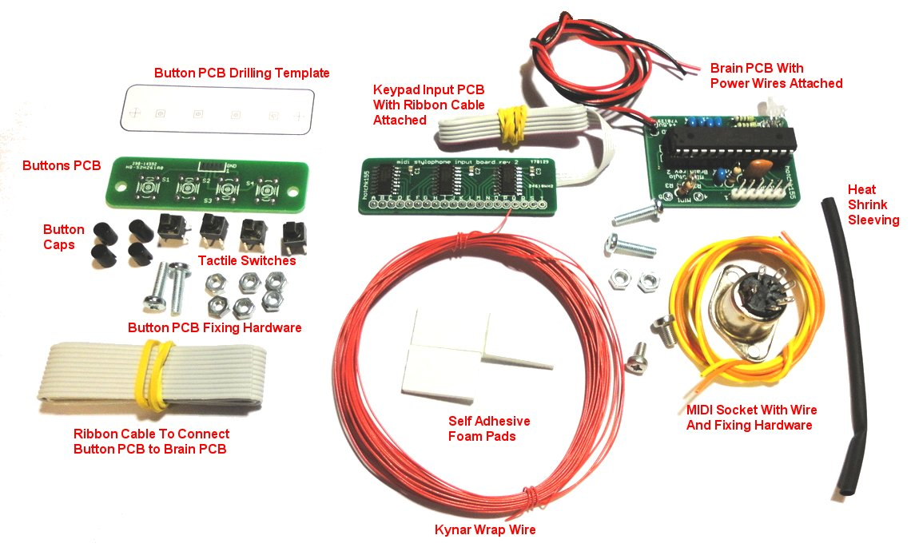
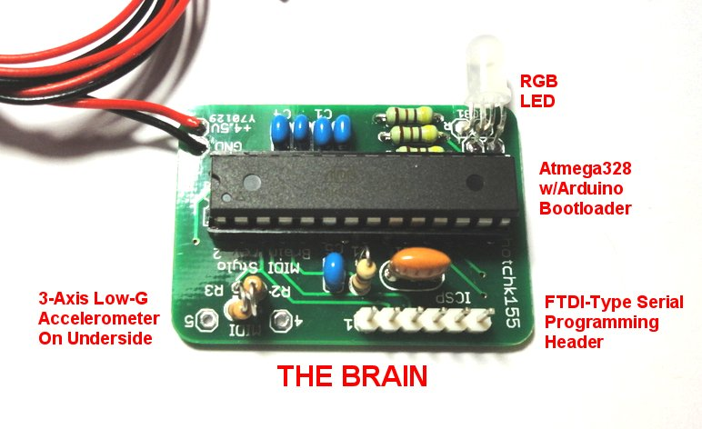
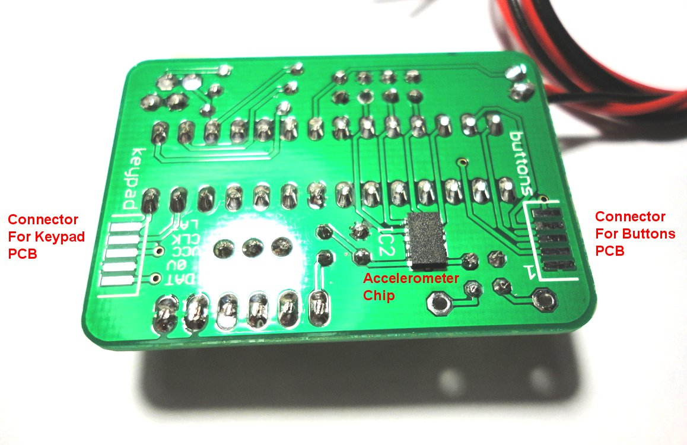

 
 
 

Parts List 
* 1 X "BRAIN" PCB
* 1 X RGB LED 5MM
* 5 X 100NF CERAMIC CAP
* 3 X 1K RESISTOR
* 2 X 220R RESISTOR
* 1 X 10K RESISTOR
* 1 X 16MHZ RESONATOR
* 1 X ATMEGA328 DIP28 
* 1 X DIP28 SOCKET
* 1 X ACCELEROMETER KXP5S LGA14 (PRESOLDERED)
* 1 X 6 PIN SIL HEADER

* 1 X "INPUT" PCB
* 20 X 10K 0805 RESISTOR (PRESOLDERED)
* 3 X 74HC165 SHIFT REGISTER SOIC16 (PRESOLDERED)
* 3 X 100NF CERAMIC CAPACITOR 0805 (PRESOLDERED)

* 1 X "BUTTONS" PCB
* 4 X 6MM TACTILE SWITCH + CAPS

* 1 X 5PIN DIN SOCKET PANEL MOUNT
* KYNAR WIRE-WRAP WIRE
* STRANDED EQUIPMENT WIRE 
* RIBBON CABLE
* M3 NUTS/BOLTS
* SHRINK FIT SLEEVING
* SELF ADHESIVE FOAM BLOCKS