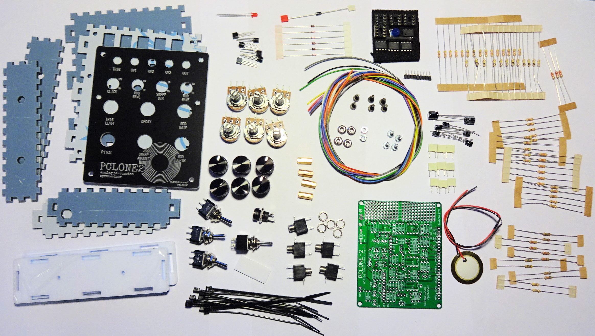

# PCLONE2 PARTS LIST

PCLONE2 ANALOG PERCUSSION SYNTH

## Components

<table>
<tr><td width="100">R37</td><td>330 ohm resistor</td><td>1</td><td>ORANGE-ORANGE-BROWN</td></tr>
<tr><td>R6, R7, R17, R21</td><td>1k resistor</td><td>4</td><td>BROWN-BLACK-RED</td></tr>
<tr><td>R14, R20, R22, R44</td><td>4k7 resistor</td><td>4</td><td>YELLOW-VIOLET-RED</td></tr>
<tr><td>R15</td><td>10k resistor</td><td>2</td><td>BROWN-BLACK-ORANGE</td></tr>
<tr><td>R13, R26, R27, R39, R43</td><td>22k resistor</td><td>5</td><td>RED-RED-ORANGE</td></tr>
<tr><td>R8, R19</td><td>33k resistor</td><td>2</td><td>ORANGE-ORANGE-ORANGE</td></tr>
<tr><td>R1, R2, R4, R5, R23, R28, R29, R33, R34, R38, R41, R42</td><td>47k resistor</td><td>12</td><td>YELLOW-VIOLET-ORANGE</td></tr>
<tr><td>R18</td><td>56k resistor</td><td>1</td><td>GREEN-BLUE-ORANGE</td></tr>
<tr><td>R9, R11, R12, R24, R25, R30, R31, R35, R36, R40</td><td>100k resistor</td><td>10</td><td>BROWN-BLACK-YELLOW</td></tr>
<tr><td>R32</td><td>220k resistor</td><td>1</td><td>RED-RED-YELLOW</td></tr>
<tr><td>R10</td><td>1M resistor</td><td>1</td><td>BROWN-BLACK-GREEN</td></tr>
<tr><td>R16</td><td>4M7 resistor</td><td>1</td><td>YELLOW-VIOLET-GREEN</td></tr>
<tr><td>R3</td><td>NOT POPULATED</td><td></td><td></td></tr>
<tr><td></td><td>470R resistor (for SWEEP option 2)</td><td></td><td></td></tr>
<tr><td>D1</td><td>1N5819 Schottky rectifier diode</td><td></td><td></td></tr>
<tr><td>D2, D3, D4</td><td>1N4148 small signal diode</td><td></td><td></td></tr>
<tr><td>C1, C2, C6</td><td>47nF polyester box capacitor</td><td></td><td></td></tr>
<tr><td>C13</td><td>22nF polyester box capacitor</td><td></td><td></td></tr>
<tr><td>C16</td><td>3.3nF polyester box capacitor</td><td></td><td></td></tr>
<tr><td>C4, C5, C7, C15</td><td>1nF polyester box capacitor</td><td></td><td></td></tr>
<tr><td>C3, C11, C12</td><td>1uF/50V electrolytic capacitor</td><td></td><td></td></tr>
<tr><td>C8</td><td>2.2uF/50V electrolytic capacitor</td><td></td><td></td></tr>
<tr><td>C9</td><td>10uF/16V electrolytic capacitor</td><td></td><td></td></tr>
<tr><td>C10, C14</td><td>100uF/16V electrolytic capacitor</td><td></td><td></td></tr>
<tr><td>PWR</td><td>3mm LED</td><td></td><td></td></tr>
<tr><td>Q1, Q2</td><td>2SC945 transistor NPN</td><td></td><td></td></tr>
<tr><td>Q3, Q4</td><td>2N3906 transistor PNP</td><td></td><td></td></tr>
<tr><td>Q5, Q6</td><td>2N3904 transistor NPN</td><td></td><td></td></tr>
</table>

## IC's

<table>
<tr><td>IC1</td><td>4558 op-amp DIP8  (+socket)</td><td></td><td></td></tr>
<tr><td>IC3, IC4, IC5</td><td>2904 op-amp DIP8  (+socket)</td><td></td><td></td></tr>
<tr><td>IC6</td><td>BA6110 op amp SIL9  (+socket)</td><td></td><td></td></tr>
</table>

## Potentiometers

<table>
<tr><td>SENS</td><td>100K logarithmic</td></tr>
<tr><td>DECAY</td><td>1M logarithmic</td></tr>
<tr><td>PITCH</td><td>100K logarithmic</td></tr>
<tr><td>SWEEP (option A)</td><td>1k linear WITH centre-tap</td></tr>
<tr><td>SWEEP (option B)</td><td>500 ohm linear (see note)</td></tr>
<tr><td>MOD RATE</td><td>100K logarithmic</td></tr>
<tr><td>MOD DEPTH</td><td>100K logarithmic</td></tr>
</table>

## Switches 

<table>
<tr><td>VCO WAVE</td><td>Single-pole double throw (SPDT)</td></tr>
<tr><td>MOD WAVE</td><td>Single-pole single throw (SPST) - SPDT is OK</td></tr>
<tr><td>ATTACK</td><td>Single-pole single throw (SPST) - SPDT is OK</td></tr>
<tr><td>SWEEP (option B)</td><td>Double-pole double throw (DPDT)</td></tr>
</table>

## Sockets 

<table>
<tr><td>VCO WAVE</td><td>Single-pole double throw (SPDT)</td></tr>
<tr><td>MOD WAVE</td><td>Single-pole single throw (SPST) - SPDT is OK</td></tr>
<tr><td>ATTACK</td><td>Single-pole single throw (SPST) - SPDT is OK</td></tr>
<tr><td>SWEEP (option B)</td><td>Double-pole double throw (DPDT)</td></tr>
</table>