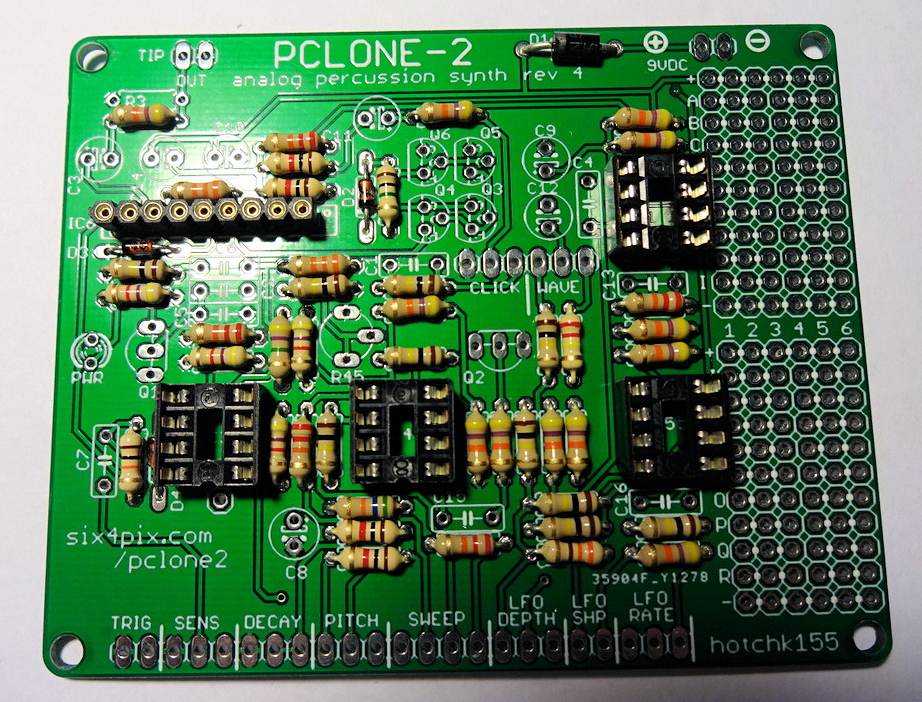
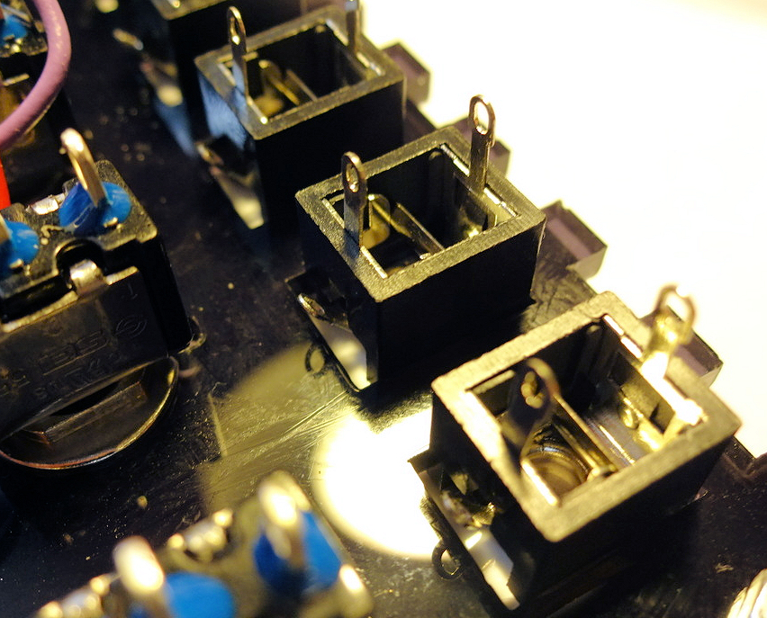
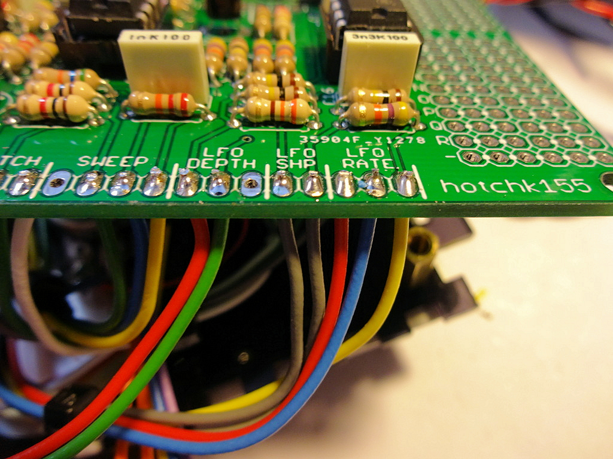

# PCLONE2 Build

Let's begin by soldering  the resistors and diodes

- R37 - 330 Ohm (ORANGE-ORANGE-BROWN)
- R6, R7, R17, R21 - 1k (BROWN-BLACK-RED)
- R14, R20, R22, R44 - 4k7 (YELLOW-VIOLET-RED) 
- R15 - 10k (BROWN-BLACK-ORANGE)
- R13, R26, R27, R39, R43 - 22k (RED-RED-ORANGE)
- R8, R19 - 33k (ORANGE-ORANGE-ORANGE)
- R1, R2, R4, R5, R23, R28, R29, R33, R34, R38, R41, R42 - 47k (YELLOW-VIOLET-ORANGE)
- R18 - 56k (GREEN-BLUE-ORANGE)
- R9, R11, R12, R24, R25, R30, R31, R35, R36, R40 - 100k (BROWN-BLACK-YELLOW)
- R32 - 220k (RED-RED-YELLOW)
- R10 - 1M (BROWN-BLACK-GREEN)
- R16 - 4M7 (YELLOW-VIOLET-GREEN)

Note: R3 is not populated

D2, D3 and D4 are small signal diodes with a small orange glass body with a black stripe. Make sure the black stripe lines up with the stripe marked on the circuit board symbol.

D1 is a larger rectifier diode with a black body and silver stripe.  Make sure the stripe matches up with the one printed on the board.

Your board should now look something like this

Now lets solder the four, 8-pin IC sockets and the 9-pin header strip. 

Take care to align the notch on the end of the 8 pin sockets with the marking on the board. In this layout the notch is towards the bottom of the board for each socket.

With all the sockets in place the board should be looking like this

The next step is to insert the nine polyester box capacitors. 

- C1, C2, C6 - 47nF (Marked "47n")
- C13 - 22nF (Marked "22n")
- C16 - 3.3nF (Marked "3n3")
- C4, C5, C7, C15 - 1nF (Marked "1n")

Now insert the trimmer potentiometer, R45. This is pretty tight to insert into the PCB and may need a bit of waggling - be careful not to damage the legs.

Solder the LED. It is important that this goes the right way round; you'll see that the marking on the board shows a "flat" side next to one of the legs. The LED has a matching "flat" (marking the negative terminal, which also has a shorter leg)

Now for transistors. There are three types of transistor in the kit 

- 2SC945P NPN (Marked "945P")
- 2N3904 NPN 
- 2N3906 PNP 

It is very important not to mix them up (or you might let the magic smoke out of them!). 

When you solder them, make sure the "D" shape of the case lines up with the D shaped marking on the board - you need to bend or splay the legs a little to get them into the holes on the board. When soldered, the transistors should sit above the board by a few millimetres.

Almost there! Now add the electrolytic capacitors. These need to go in the right way round. The symbols on the circuit board show a (+) sign next to one hole. Put the **longer** leg of the capacitor through the hole. 

The capacitor body will also have a white stripe to mark the negative terminal (aligned with the shorter leg)

As with the box capacitors they are easy to mix up, so pay special attention to the markings

- C3, C11, C12 - 1uF/50V electrolytic capacitor
- C8 - 2.2uF/50V electrolytic capacitor
- C9 - 10uF/16V electrolytic capacitor
- C10, C14 - 100uF/16V electrolytic capacitor

Make sure you trim back the excess component legs on the underside of the board, since the back of the board will be mounted close to the metal bodies of the potentiometers.

Now lets insert the ICs. 

- IC1 - 4558 op-amp DIP8
- IC3, IC4, IC5 - 2904 op-amp DIP8
- IC6 BA6110 - op amp SIL9

For IC1, IC3, IC4, IC5, make sure that the notch or dimple on the body of the chip matches the notch shown in the symbol on the board (which should also match the notch on the socket). The location for each notch is toward the bottom edge of the board.

For IC6, there is a notch along the top of the chip. This should be towards the right (There is a dot marked on the board). 

Take special care not to break any legs on IC6 - These are old chips (no longer manufactured) and may have been recovered from other equipment, so the legs can be a bit more fragile than the other ICs.

And so, on to the wiring and assembly of the case. The wiring is actually pretty complicated and easy to get wrong, so if possible I would recommend that you use the same colours for the wires. Also be careful with the length of each wire - you want to keep them short so they take up less space when the case is put together (it is very easy to end up with such a bulk of wires that it wont fit together!) but also you want to make sure you can get the PCB out of the case for troubleshooting and modding, so you don't want the wires too short, and you want them to have the same amount of "slack" so you don't end up with one wire shorter than the others stopping you being able to move the board.

Honestly this is the hardest part of the build, so go carefully and slowly!

Here is a picture showing what we are aiming for (don't worry, the steps are all described below...). Basically we want to be able to access the PCB when the wires are attached, but we also want to keep the wiring as un-bulky as we can.

So lets get started, fetch the acrylic front case panel and remove the protective film from both sides. Get the six potentiometers - I recommend labelling the back of each one with a marker pen or sticker

There are three types of potentiometer, so check the marking on the front of each

- 100KA - Sensitivity
- 100KA - Pitch
- 100KA - Rate
- 100KA - Depth
- 1MA - Decay
- 500B - Sweep

Remove the nut and washer from each one and insert them into the panel as shown below (check the location of the large round hole in the panel matches the photo). Replace the washer and tighten the nut.

DO NOT break off the locating lugs from each potentiometer (as you might have done in other kits). There are holes cut for the lugs in the panel and they will stop the pots moving around when the knobs are turned.

Double check all your pots are in the right place and the panel is the right way round (it will be MUCH harder to correct it later!)

Now add the four switches. Remove the nuts and washer and turn the locating plate around so the tab faces forwards. When the switch is in place the tab should align  with the small hole cut in the panel. I use a single nut to fix the switch in place and discard the grip washer.

One of the switches is a double-pole (DPDT) switch with six terminals. This is placed second from the left as shown in the photo below. All the other switches are identical single pole (SPDT) switches.

Solder a short length of wire between the bottom left and top right pins of the DPDT switch as shown below. Solder one end of a 470 ohm resistor (YELLOW-VIOLET-BROWN) to the same bottom left pin as shown. Solder the resistor close to the switch.

Using red wire, connect the other end of the 470 ohm resistor to the right hand tab of the DEPTH pot. Also connect the same tab to the right hand tab of the SWEEP pot and add another length of wire to extend about 5cm below the bottom edge of the panel.

Using grey wire connect the top left pin of the DPDT switch to the bottom right, then connect these to the left tab of the SWEEP pot.

Using purple wire, connect the right tabs of the DECAY and SENSITIVITY pots together. Add another length of wire to extend about 5cm past the bottom edge of the panel

Strip back enough insulation from a piece of yellow wire to bridge the left and middle tabs of the DECAY pot. Extend the wire about 5cm past bottom edge of the panel. 

Now place the face plate on to the panel

Use the six black M3 allen bolts to attach the face plate. The top two bolts are secured by nuts and the lower four bolts are secured by attaching the brass standoffs. Tighten the bolts carefully so that they are just tight enough to be secure. **Warning : Overtightening the bolts may bend or crack the face plate**

Use the sticky foam pad to attach the piezo transducer to the back of the face plate within the circular space near the DEPTH control. Take care not to break the wires off the transducer.

Make sure the transducer wires can reach the top right of the panel, and tuck them back behind the other wiring

Locate the five 3.5mm sockets and their fixing nuts

Place the sockets into the five spaces along the top of the panel. Make sure that the sleeve tab (on the side of each socket) is on the lower edge, and bend it back slightly along the body of the socket.

Secure the sockets using the fixing nuts. Finger-tight should be fine.

Strip the insulation off about 7cm of wire and twist the strands together. Use this to connect the sleeve tabs of the five sockets as shown.

Trim the wires from the piezo transducer to an appropriate length and connect the black wire to the bare wire we soldered in the previous step. Connect the red wire to the lower tab on the right hand socket.

Use white wire to connect the left tab of the DEPTH control to the left tab of the PITCH control. Add another wire to extend about 5cm below bottom edge of the panel

Connect wires to the RATE control, extending them below the bottom edge of the panel

Connect a blue wire to the middle tab of the SWEEP control, extending it below the bottom edge of the panel

Connect red and grey wires to the left and middle tabs of the SENSITIVITY control, extending them below the bottom edge of the panel

Connect green and grey wires to the middle and right tabs of the PITCH control, extending them below the bottom edge of the panel

Connect orange wires to the top and middle pins of the right hand switch. Extend them about 10cm below edge of panel

Connect blue, yellow and purple wires to top, middle and bottom pins of the second switch from the right. Extend them about 10cm below edge of panel

Attach green and yellow wires to the left middle and right middle pins of the DPDT switch, extending them about 5cm below the bottom edge of the panel

Connect grey wires to the top and middle pins of the right hand switch. Extend them about 10cm below edge of panel

Connect orange and green wires to the left hand socket as shown

Connect a white wire to the top pin on the right hand socket

Now we have an ugly mass of wires...

Tidy the wires up using zip ties and routing the bundles between the potentiometers

Now we can start attaching the wires to the PCB. Not all of the holes are used so make sure that you are connecting your wires to the correct holes

First off, the wire from the right hand socket, and the SENSIVITY and DECAY controls

Now the wiring for PITCH, the DPDT switch and the SWEEP pot

For DEPTH

For RATE and also the grey wires from the LFO Shape switch

Now the wiring from the other two switches and the output socket. The switches are connected to a row of holes near the middle of the board (The first hole is empty)

Twist together a pair of red and black wires of about the same length as the green/grey output wires. Connect these to the (+) and (-) power supply pads on the PCB (Unfortunately I didn't get a photo of this step)

Now pack the wiring carefully under the PCB and attach the PCB to the spacers using the screws provided 

Attach the power connector to the acrylic end panel

Solder the power leads to the socket. The shorter tab is the central pin of the power socket - most guitar pedal style 9V DC adaptors connect this to the negative supply and have the plug barrel as the positive supply. If you are using this type of supply, connect the wires as shown. If you want to use a centre-pin positive supply, solder the wires the other way around. 

Note: The rectifier diode on the board protects the circuit from damage by incorrect polarity but the device won't work with the wrong type of adaptor.

Locate the four flange nuts and remove the film from the acrylic side panels

Push the hexagonal parts of the flange nuts into the holes using pressure from your thumb. Do not hammer them or use a a vice etc as you will shatter the acrylic!

Note that the laser cut holes for the nuts are very slightly tapered (due to the shape of the laser beam) which means the nuts can be pushed in more easily from one side of the panel than the other. Try to ensure the nuts are inserted from the wider side of the hexagonal holes.

Ensure the film is removed from all the remaining acrylic parts and assemble the sides of the case. Make sure the flange nuts are on the inside! Push on the 5mm acrylic side cheeks which hold everything together.

At this point leave the back of the case off, so we have access to the electronics in case we need to trouble shoot anything

Use the remaining four allen bolts to attach the side panels. Be careful not to over tighten the bolts as this could crack the side panels.

Wind all the pots to their lowest position and attach the knobs (when pots are at minimum the marker on the knob should be at about the 8-o'clock position)
