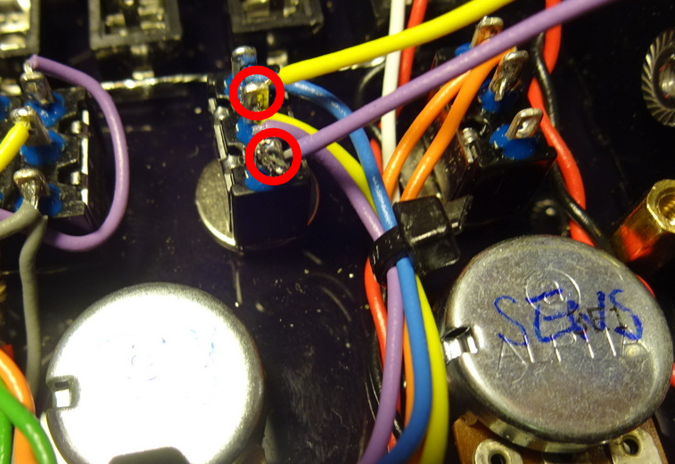

# PCLONE2 Mods

Here are some mods I have used on the PCLONE2. I am not an expert on analog electronics so these were mainly found by educated guesswork, trial and error. I am always grateful for new ideas or ways these mods might be improved.

## Pitch CV

This is a very simple mod where we apply the CV directly to the point where the LFO modulates the VCO pitch. We use a resistor (I used 100k) so the CV is mixed with the signal from the LFO and voltage from the pitch control/sweep circuit. This is NOT a tuned CV (no 1V/octave or anything!) and you may find that you need to use CV's within a narrow part of the full voltage range for the pitch to be affected usefully. However, for just a resistor and a bit of wire, this is a nice mod. I may try to refine it at a later time (in particular to expand the useful voltage range)

Solder a 100k resistor to the top pin of an unused CV socket. Solder a wire to the other end of the resistor

Connect the other end of the wire to the left tab of the DEPTH pot. Done!

## Decay CV

Calling this a "Decay CV" might be overstating it a bit, but this is a quick mod that can give some nice rhythmic variations when used in a sequence. Basically the CV is used directly to charge the capacitor (C8) that controls the VCA decay and the pitch sweep. We use a diode to prevent any current being sunk by the CV connection when the voltage is lower than the output of the trigger circuit. This relies on your sequencer having a fairly low impedance CV output and you should experiment with different pulse lengths and voltage levels, and also with interactions with gate pulses to the main trigger input.

Solder a piece of wire to the anode (stripe) of a 1N4148 small signal diode

Solder the other side of the diode to the top pin of an unused CV socket

Connect the other end of the wire to the hole above the SENS and DECAY terminals

Solder it from the back and trim the solder joint. Done!

## VCO Waveform Mix CV

This mod lets you mix the VCO square and triangle waveforms together when a gate voltage is applied. The square wave is louder and harsher than the triangle wave and in short pulses, when VCO wave switch is set to triangle wave, can give an effect like a burst of noise on top of the mellow triangle wave. While not quite a snare sound, it is a useful and fun mod!

This is a slightly more complex mod, requiring an additional transistor and making use of the protoyping area on the circuit board. Here is the extra circuit we'll build. The idea is that the square wave output from the VCO is used to switch the transistor. When no CV is present there is nothing to pull up the output voltage, so no output signal is present. However when the collector of the transistor is pulled up to a sufficient voltage level by the CV input, switching the transistor on (by a pulse from the square wave) will pull the output voltage up through the transistor. When the transistor is not switched, the 4.7k resistor pulls the output down. Therefore a signal is present at the output only when a sufficient CV is present. 

Start by soldering a 4.7k resistor to the prototyping area as shown

Solder a 2N3904 transistor as shown (making sure the case is the right way round!). The legs go in column 5 rows G,H,I. 

Add a 1N4148 diode between I2 and I4, with the anode facing away from the transistor

Add a 10k resistor between locations H3 and H4

The circuit layout should look like so 

Attach wires to the middle and bottom pins of the VCO wave form switch

Attach another wire to the top pin of an unused CV socket and bundle the three wires together (e.g. with a loose plait)

Attach the wires to the rear of the PCB as shown

Connect the wire from bottom of VCO wave form switch to point H1. Connect the wire from middle pin of switch to point I1. Connect the wire from the socket to G6

