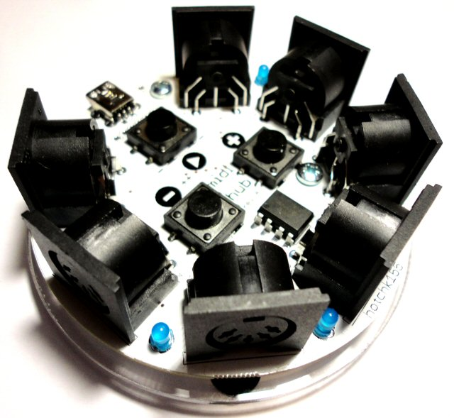

# PRODUCTS 

The product pages are under construction, so please bear with us as we get them up to scratch!

## You can purchase these products from our <a href="https://www.tindie.com/stores/hotchk155/">Tindie Store</a>

<table>

<tr>
<td></td>
<td>&nbsp;&nbsp;</td>
<td valign="top"><a href="arpie/index.html">ARPIE KIT</a> - A palm-sized MIDI arpeggiator based around open source hardware and firmware</td>
</tr>

<tr><td>&nbsp;&nbsp;</td></tr>

<tr>
<td></td>
<td>&nbsp;&nbsp;</td>
<td valign="top"><a href="lestrum/index.html">LE STRUM KIT</a> - An unique MIDI controller featuring chord mapping and strumming. Like a cross between a Stylophone and an Omnichord!</td>
</tr>

<tr><td>&nbsp;&nbsp;</td></tr>

<tr>
<td></td>
<td>&nbsp;&nbsp;</td>
<td valign="top"><a href="midihub/index.html">MIDIHUB++</a> A compact, USB-powered, MIDI clock generator and midi thru module with six outputs and a MIDI thru input. Sold fully built and tested.</td>
</tr>

<tr><td>&nbsp;&nbsp;</td></tr>

<tr>
<td></td>
<td>&nbsp;&nbsp;</td>
<td valign="top"><a href="midisplit/index.html">MIDI SPLITTER KIT</a> Build a USB-powered, one input, six output, zero latency midi signal splitter. All-hardware signal path.</td>
</tr>

<tr><td>&nbsp;&nbsp;</td></tr>

<tr>
<td></td>
<td>&nbsp;&nbsp;</td>
<td valign="top"><a href="switcher/index.html">MIDI SWITCHER KIT</a> control low voltage DC loads such as lamps/solenoids/motors from a MIDI keyboard or sequencer. Eight low-side switching channels. Highly configurable over MIDI.</td>
</tr>

<tr><td>&nbsp;&nbsp;</td></tr>

<tr>
<td></td>
<td>&nbsp;&nbsp;</td>
<td valign="top"><a href="switcher/index.html">RELAY SWITCHER KIT</a> MIDI Switcher module with eight high power relay outputs. Highly configurable over MIDI.</td>
</tr>

<tr><td>&nbsp;&nbsp;</td></tr>

<tr>
<td></td>
<td>&nbsp;&nbsp;</td>
<td valign="top"><a href="game/index.html">SIXTY FOUR PIXELS GAME KIT</a> Play a selection of awesome games on a hand-held game console you built yourself (or write your own games using Arduino tools). All in glorious bi-colour!</td>
</tr>

<tr><td>&nbsp;&nbsp;</td></tr>

<tr>
<td></td>
<td>&nbsp;&nbsp;</td>
<td valign="top"><a href="bldc/index.html">BRUSHLESS MOTOR DRIVE MODULE</a> Ideal for driving hard disk drive motors (Y-coil only.. see details). Perfect for including in your own project. Sold fully built and tested.</td>
</tr>

<tr><td>&nbsp;&nbsp;</td></tr>

<tr>
<td></td>
<td>&nbsp;&nbsp;</td>
<td valign="top"><a href="midistylo/index.html">STYLOPHONE MIDI CONVERSION KIT</a> Convert a reissue Stylophone into a MIDI controller with multiple performance options, including a tilt sensor and extra buttons. Not a project for the faint-hearted!</td>
</tr>

</table>
