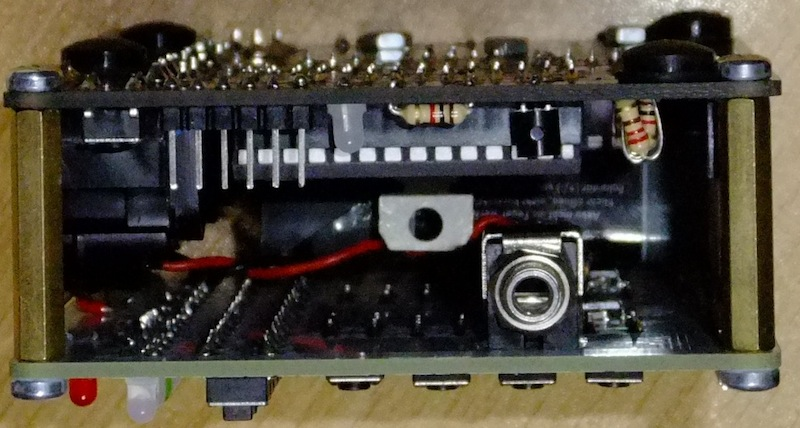
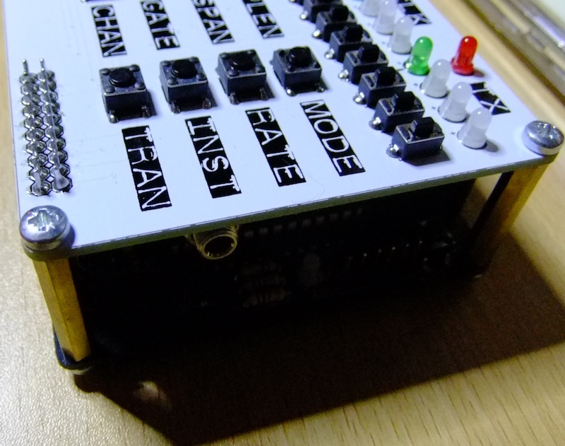
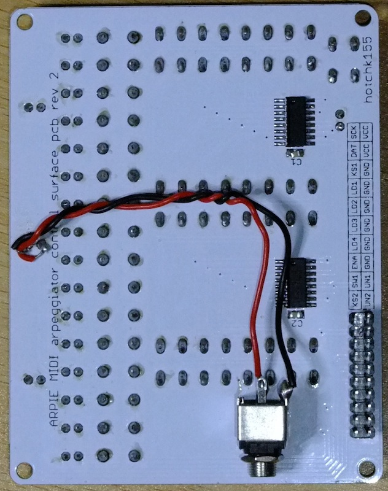

Let me know any good hacks, mods or tips you come up with and I will feature then here
# Daves Clock Output Mod
Thanks to Dave in Ireland! from [http://www.muffwiggler.com/forum/viewtopic.php?p=1202016](http://www.muffwiggler.com/forum/viewtopic.php?p=1202016)
> I used the Clock LED to add an output jack that sends out the clock to my Eurorack modular! The voltage needs to be amplified a little but it works excellently :)

> I was thinking of how to get timing info in to the modular and I'm REALLY happy with the results!!! Didn't want gate info as I wanted to be in sync with midi clock from the unit (I'm using it stand-alone at the moment) so there was a flashing 'Clock' LED and I had at it  

> Signal needs to be amplified a little, it is from an LED after all but going in to my BiMix and applying a few volts, it plays PERFECTLY with my RCD. Triggers happily. Without amplifying it, the Arpie can open the LPG on the QMMG but I have a load of BiMixes as I love em! 
 
 
 

# Simon's 3D Printed Case
From Simon Reimers
> by the way just printed (PLA-transparent) out this...
 
 