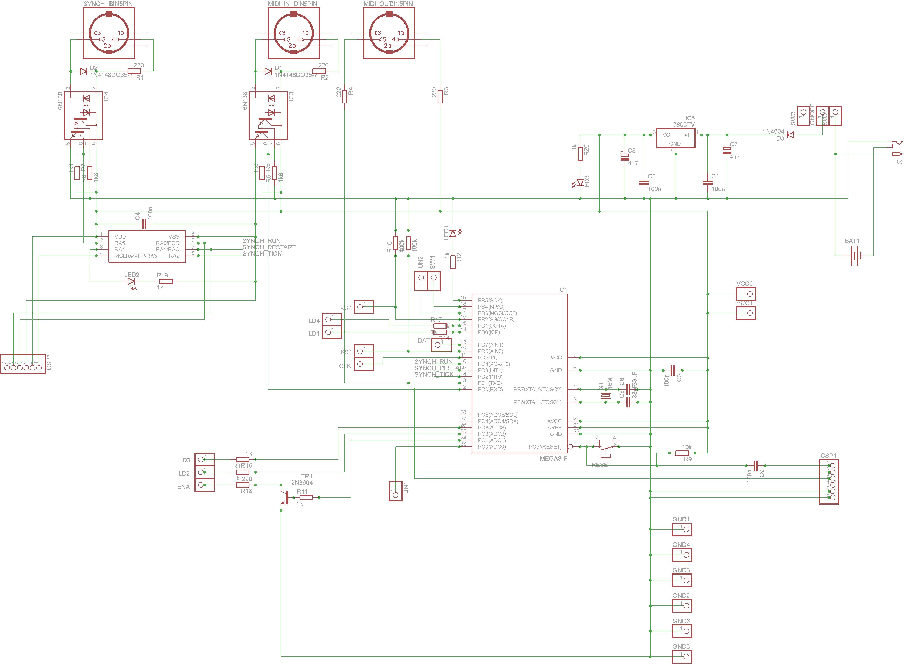
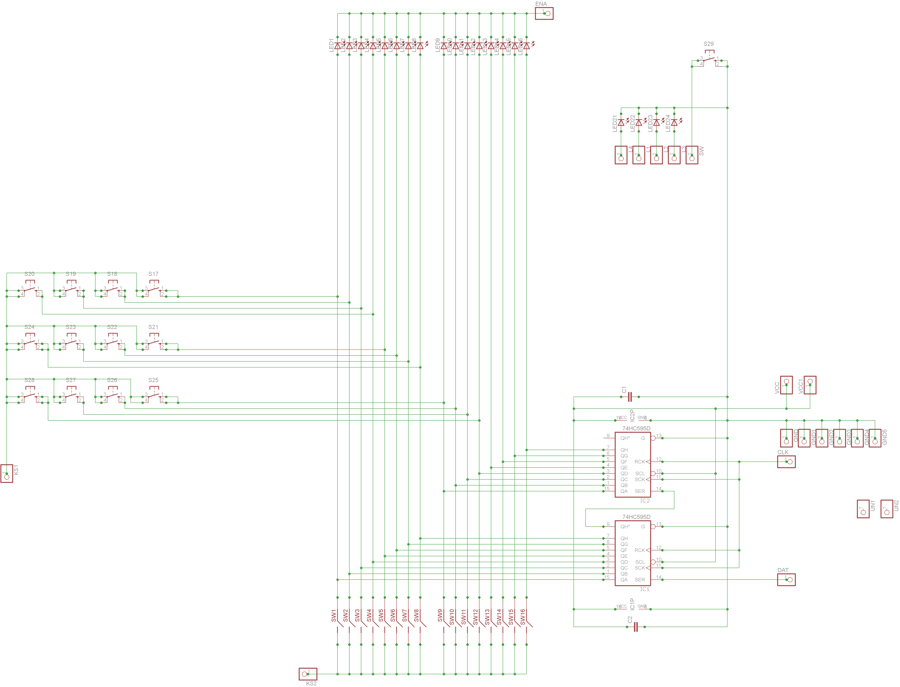
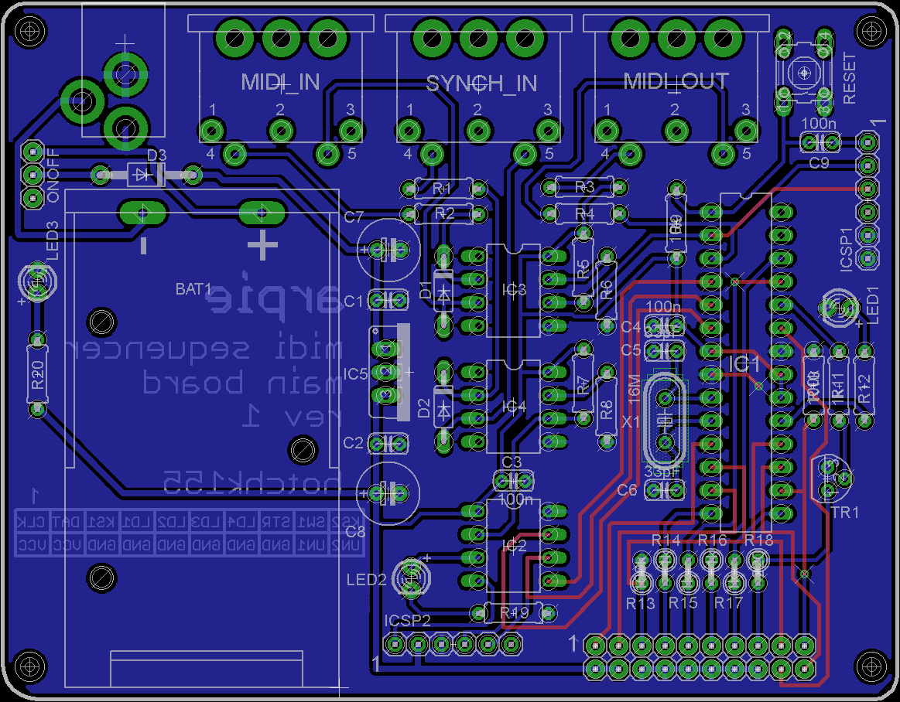
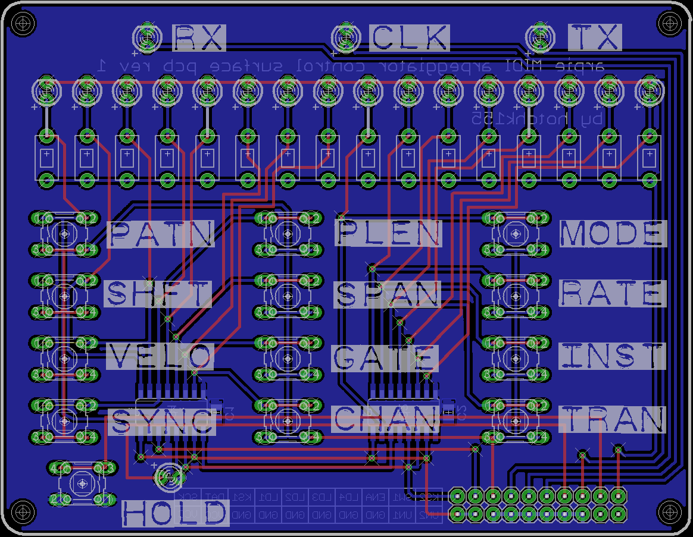

### ARPIE Parts List

* R1,R2, R3, R4, R18 - 220R carbon film resistor
* R11, R12, R14, R15, R16, R17, R19, R20 - 1k carbon film resistor
* R5, R6, R7, R8 - 1k5 carbon film resistor
* R9, R10, R13 - 10k carbon film resistor		
* C5, C6 - 33pF ceramic capacitor 2.5mm pitch
* C1, C2, C3, C4, C9 - 100nF ceramic capacitor 2.5mm pitch
* C7, C8 - 4u7 electrolytic capacitor
* D1, D2 - 1N4148 small signal diode
* D3 - 1N4001 rectifier diode
* TR1 - 2N3904 general purpose NPN switching transistor
* IC1 - ATMEGA328P-PU microcontroller (with firmware)
* IC2 - PIC12F1822 microcontroller (with firmware)
* IC3, IC4 - 6N138 (or 6N139) high speed optocoupler
* IC5 - 7805 +5V regulator TO-220
* X1 - 16MHz low profile crystal
* 2 off 74HC595D shift register SOIC16 (Pre-soldered to control surface PCB in standard kit)
* 2 off 100nF ceramic cap 0805(Pre-soldered to control surface PCB in standard kit)
* 3 off 8-pin DIL socket
* 1 off 28-pin DIL socket
* 1 off 2x10 0.1" DIL Female connector
* 1 off 2x10 0.1" DIL Male connector long pins (~27mm)
* 1 off 1x6 0.1" SIL Male header
* 1 off 2.1mm DC socket PCB mount
* 1 off Miniature slide switch
* 3 off 5 PIN DIN socket PCB mount (check footprint)
* 1 off PP3 battery holder PCB mount (check footprint)
* 16 off 6x3mm tactile switch
* 14 off 6x6mm tactlie switch
* 16 off high brighness 3mm LED blue
* 4 off standard 3mm LED Red
* 3 off standard 3mm LED Green
* 4 off Self adhesive rubber feet
* 4 off M3x25mm Brass Hex Pillar
* 8 off M3x6mm machine screw
* 3 off M2.5x8mm machine screw
* 3 off M2.5 nut
* 1 off Control surface PCB
* 1 off Main PCB

### Header Pins Labels
* KS2 - Data Switches Return*
* SW1 - Hold button (Single switch, grounded when pushed, use pullup)
* ENA - LED enable*
* LD4 - HOLD LED (Single LEDS: input active HIGH, use series resistor)
* LD3 - TX LED
* LD2 - CLK LED
* LD1 - RX LED
* KS1 - Menu Switches Return*
* DAT - Shift data*
* SCK - Shift clock*
* UN2 - Unassigned Digital Pin 11/PWM (PB3) use for your own hacks!
* UN1 - Unassigned Digital Pin 14/Analog pin A0 (PC0) use for your own hacks!
* GND - Ground
* VCC - +5V

(*) KS1/KS2/ENA/DAT/SCK 
Keys and LEDs are scanned by two 74HC595 shift registers. A single HIGH bit is clocked in (DAT/SCK) then clocked along all 16 shift register outputs in turn. For any output position ENA is pulled low to illuminate the associated LED and KS1 returns HIGH (pulldown needed) if associated menu button is down and KS2 returns HIGH (pulldown needed) if associated menu button is pressed. SCK is connected to both shift and store clock pins of both registers so a clock cycle is needed before the input pulse appears at the first output. 

### Schematics
* Please check the github repo for EAGLE design files

### Board Layouts
* Please check the github repo for EAGLE design files

