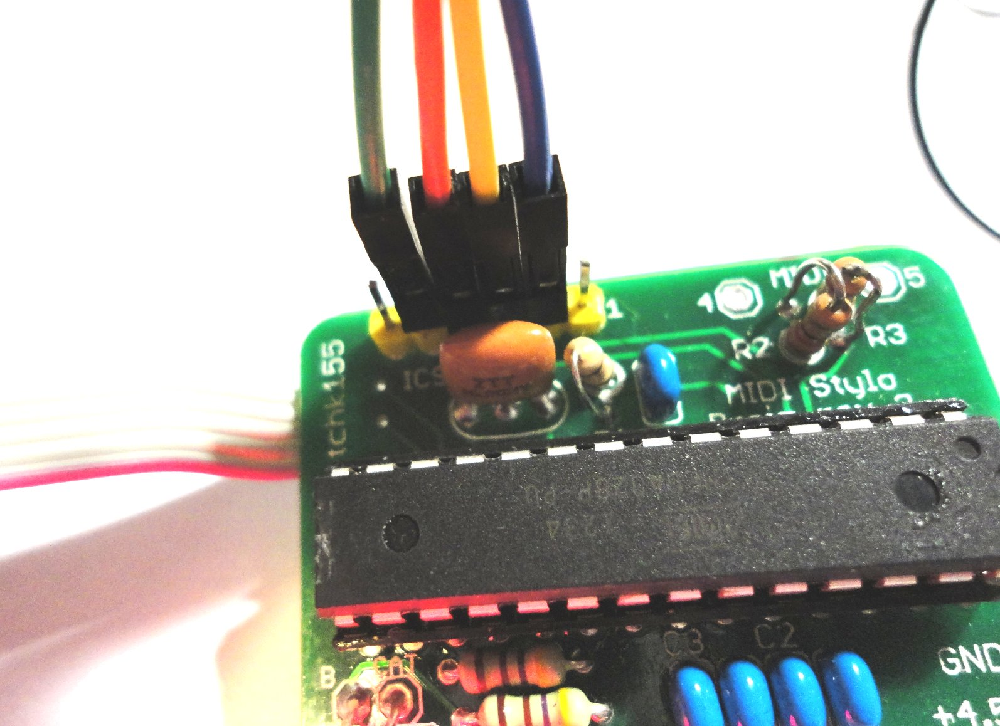
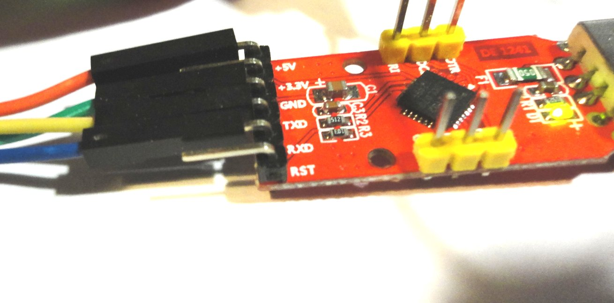
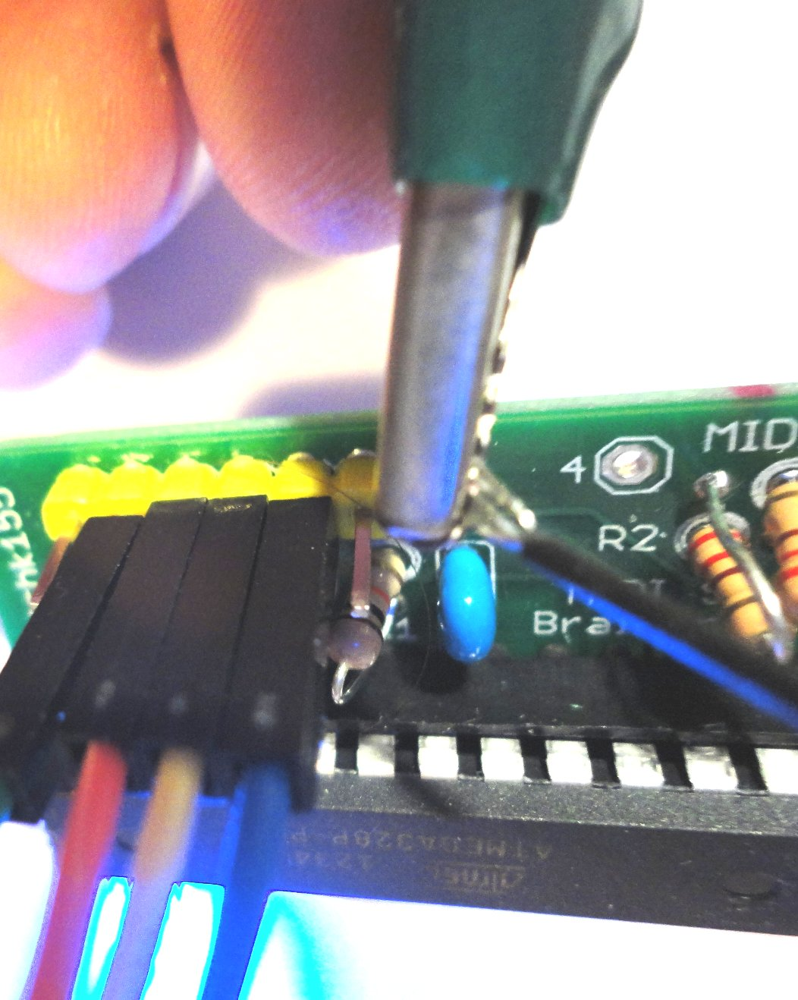

The Atmega328 microcontroller chip on the Brain board comes loaded with the Arduino bootloader. This allows firmware to be uploaded using a standard "FTDI-type" USB to TTL serial programming lead.

If you already have an FTDI FT232 cable with RTS signal on pin 1, you can simply upload firmware from the Arduino environment and the cable will auto-reset the board. 

The instructions below relate to the Silicon Labs CP2102 adaptor which I optionally provide with the kit. This programmer does not auto reset the board so there are some special steps needed to manually restart the board when the upload starts.

Before connecting the programmer you will need to download the drivers from the following URL
[http://www.silabs.com/products/mcu/Pages/USBtoUARTBridgeVCPDrivers.aspx](http://www.silabs.com/products/mcu/Pages/USBtoUARTBridgeVCPDrivers.aspx) 
 
The programmer connects to the 6 pin programming header on the Brain board using a four pin lead (made up of individual 1 pin cables). These connect to pins 2,3,4,5 on the board header (pin 1 is marked).
 
Connect pins as follows:
 
* Ground (GND on programmer, pin 5 on PCB header)
* Serial Receive (RXD on programmer, pin 2 on PCB header)
* Serial Transmit (TXD on programmer, pin 3 on PCB header)
* Power (5V on programmer, pin 4 on PCB header) can be connected with wire but is not actually connected on the board. The board must be powered separately during uploads via the 4.5V and GND connections. This is to prevent voltage mismatch problems when the board is connected to the 4.5V battery supply.
 
 
 
Once the programmer is connected to the board, use the Arduino environment with Board Type "Arduino Duemilanova w/ATMega 328" to upload to the board. The programmer does not auto reset the board, and there is not a manual reset button, so the trick is to apply power to the board at the start of the upload. Alternatively you can quickly ground pin 1 (reset) at the start of the upload.
 