If you are working from a kit, please review the [Parts List](https://github.com/hotchk155/AVRGame/wiki/Parts%20list) and image to ensure you have all the neccessary components. 

This project involves soldering components on both sides of the board. Be careful you are working on the right side of the board at each step! This is the TOP of the board
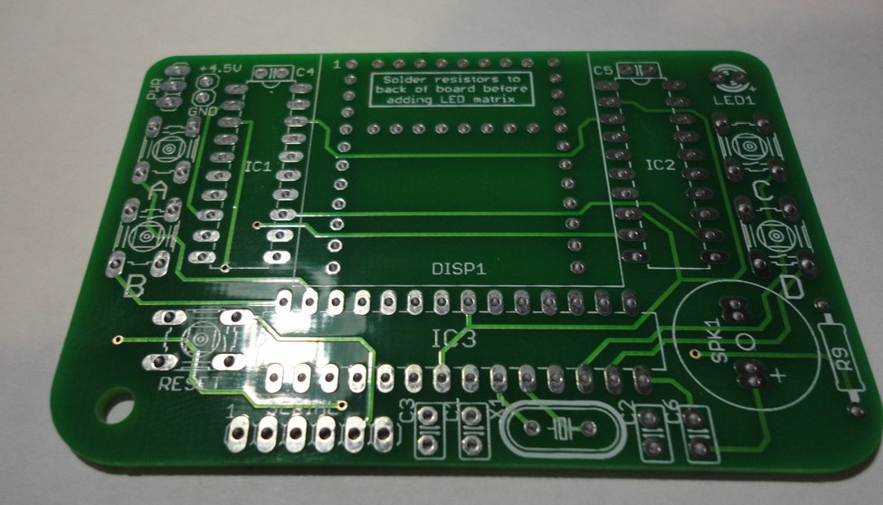

Start by soldering the 220 ohm resistors to the **back of the board*** 
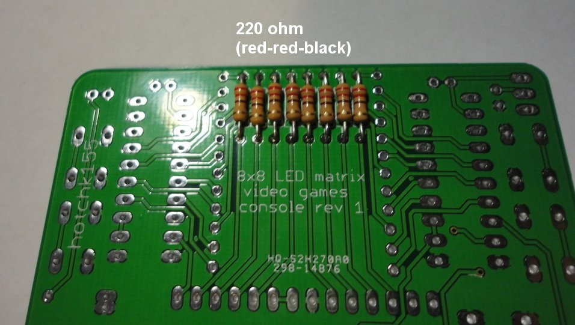

Turn the board back over and trim the resistor legs 
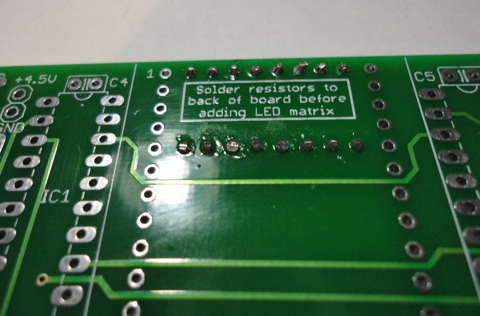

Add other low height components but do not add the IC sockets yet. Note LED has polarity to observe 
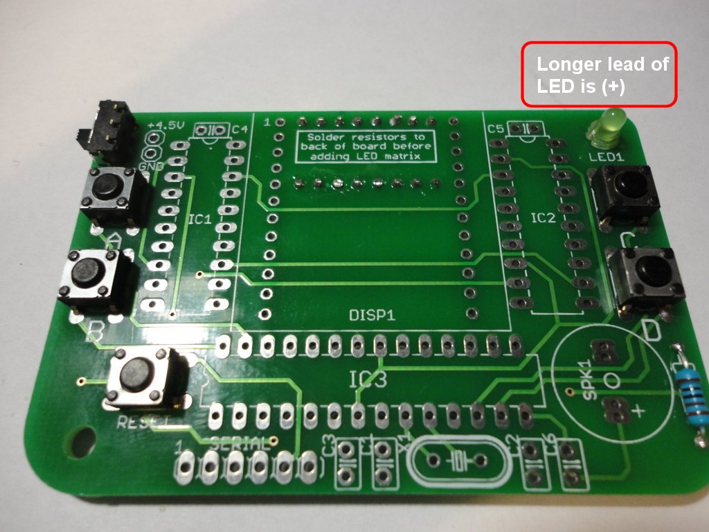

Fit the LED matrix being very careful to orient it correctly (it will be *very* difficult to remove if soldered incorrectly). The top-left pin of the matrix should be indicated with a label. I recommend adding the LED matrix before the IC sockets, since the IC sockets will otherwise obscure your view fitting the matrix 
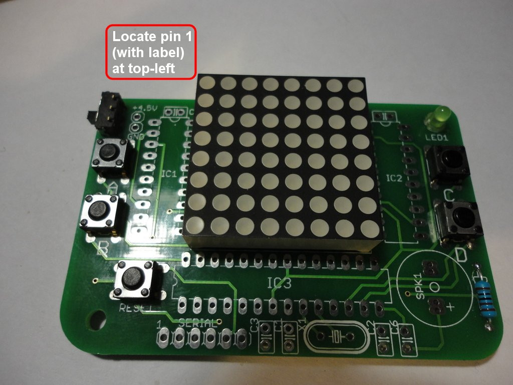

Now add the IC sockets, speaker (note polarity), crystal, caps and header strip. Note that there are two different types of capacitors. Please see check the codes (33 or 104) against the photograph below. 
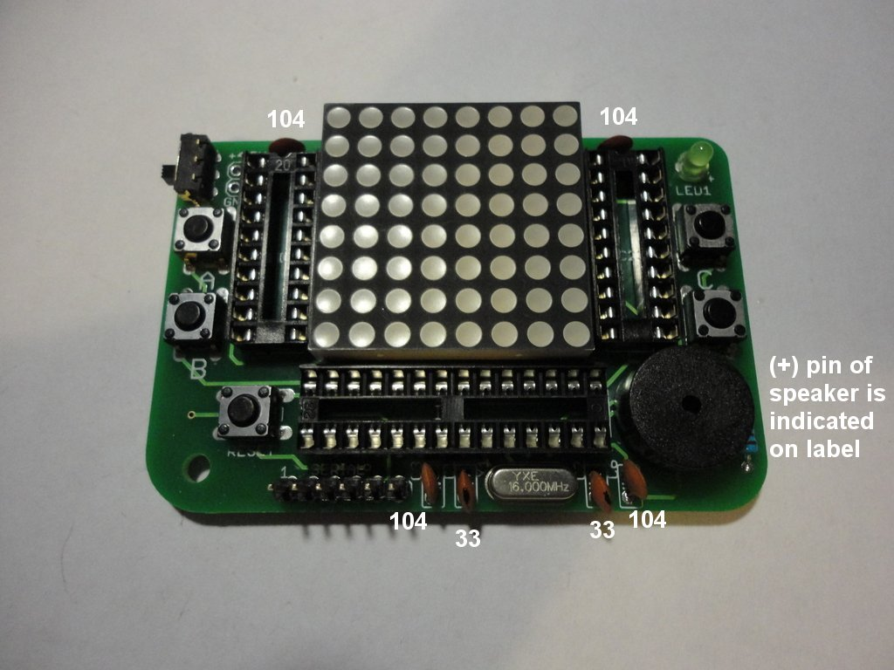

Fit the IC's, being careful about orientation. Use the notches (indicated) in the cases to locate pin 1 
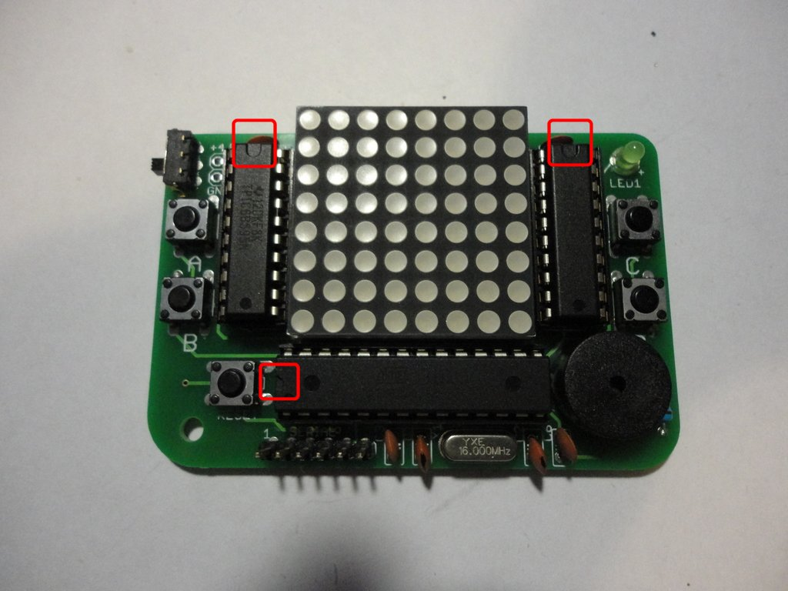

Turn board over and trim all the component legs as short as possible and add strips of adhesive foam tape to hold the battery holder 
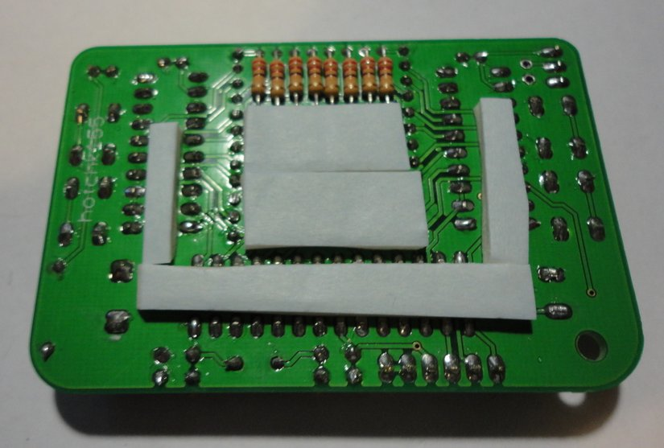

Stick the battery holder down and trim the leads nice and short 
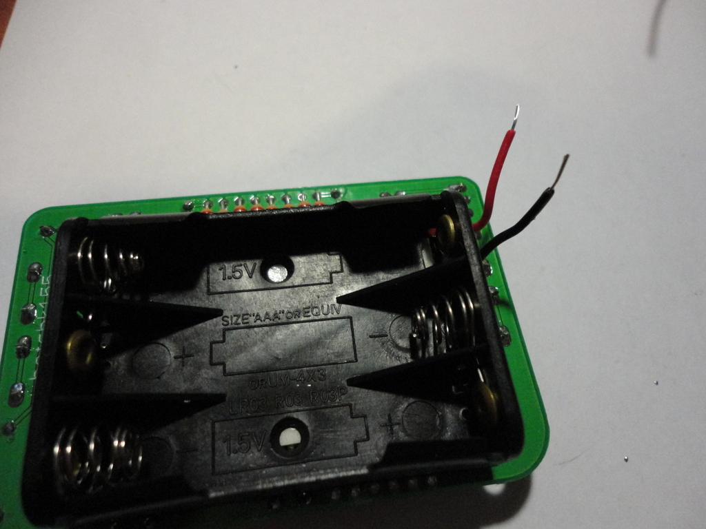

Wire the battery holder to the board and solder it from the other side 
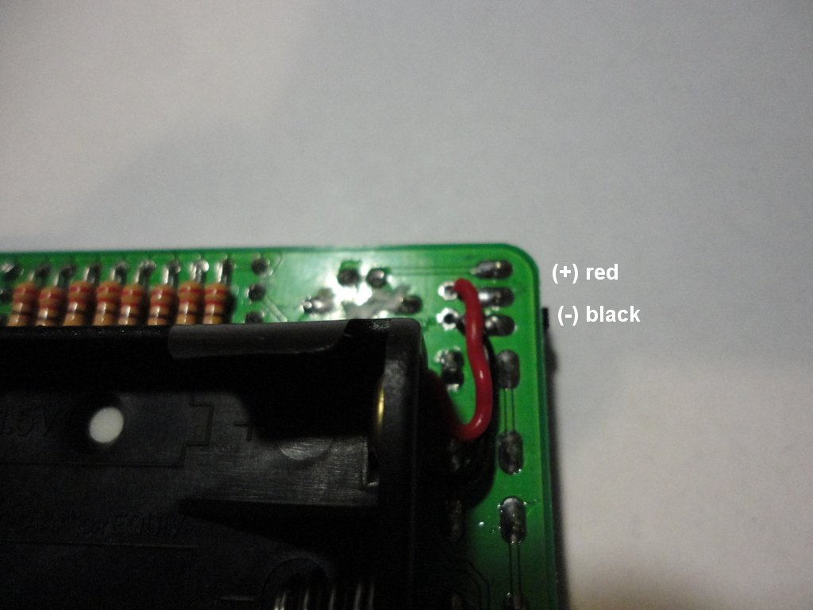

Fit the batteries 
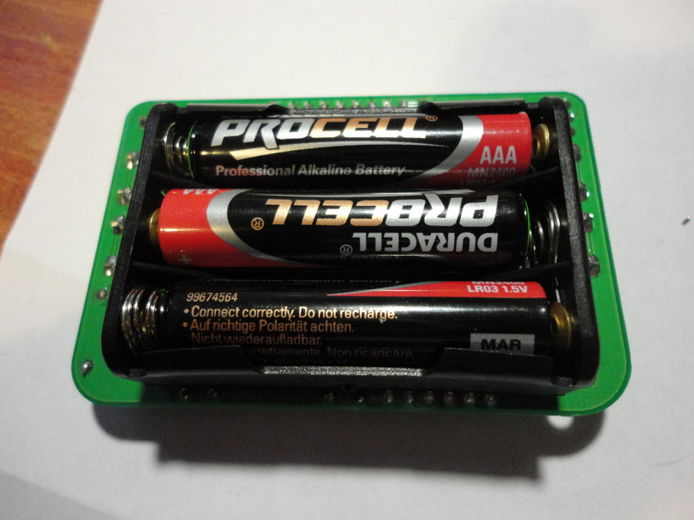