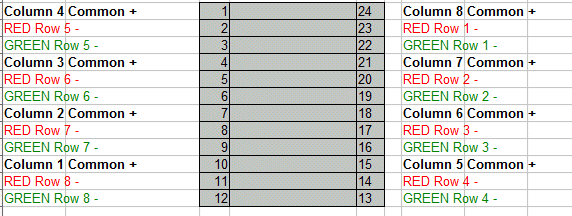
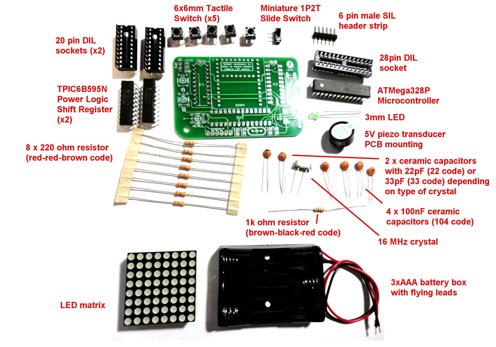

* IC1, IC2 	TPIC6B595N power logic shift register
* IC3 		ATMEGA328P 28DIP microcontroller **with Arduino bootloader**
* R1-R8 		220R resistor
* R9		1K resistor
* C1, C2 		22pF ceramic (may be 33pF depending on crystal rating)
* C3, C4, C5, C6	100nF ceramic
* X1 		16MHz crystal
* PWR		Miniature slide switch
* LED1		3MM standard LED
* SPK1		5V Piezo transducer
* A,B,C,D,RESET 	6mm x 6mm tactile switch
* SERIAL		6 pin male header 0.1" pitch
* DISP1 		8x8 bi colour LED matrix with pinout shown below (typical bi-colour matrix available from eBay etc)
* 3xAAA battery box and batteries
* Strong double sided foam strips to fix battery box to reverse of PCB
* 5V USB2TTL lead (e.g. FTDI) recommended for programming (alternative is to place AVR chip in Arduino board when programming it)

Required pin out for LED matrix 

Standard kit image 
