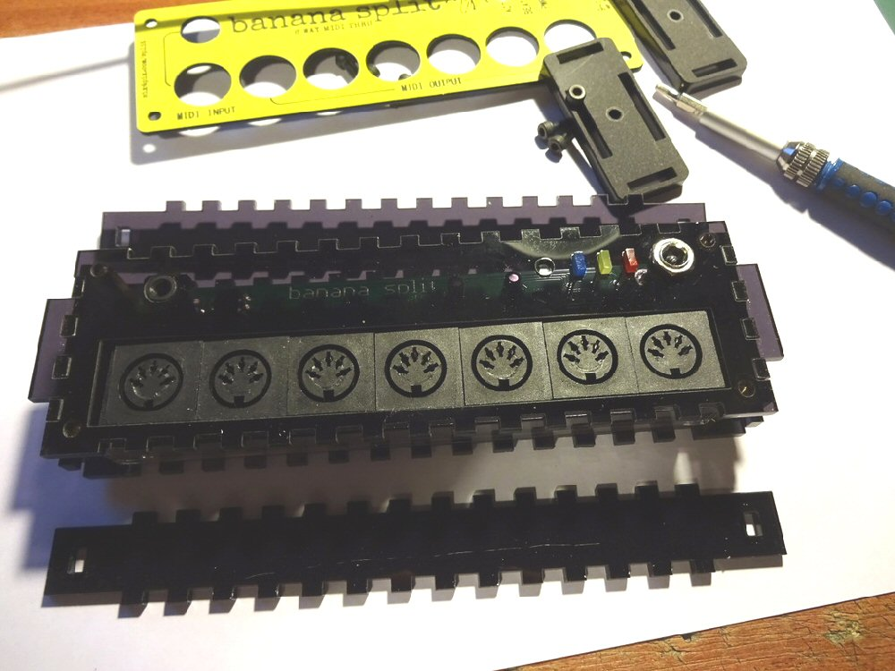
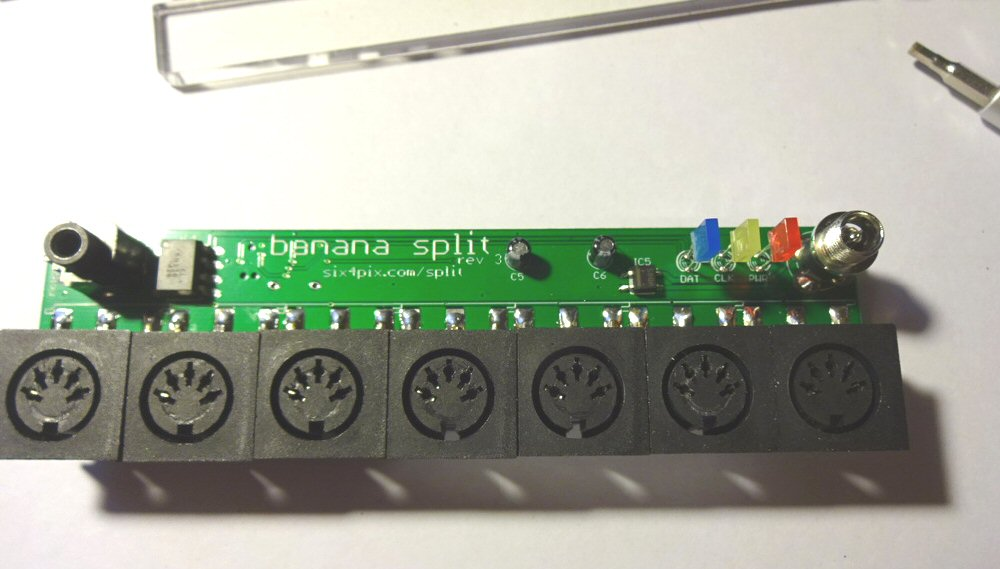
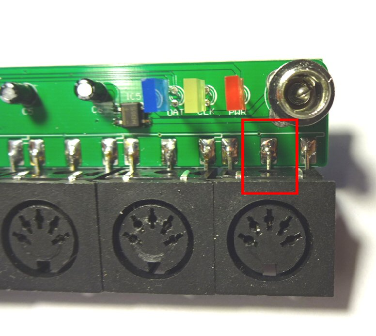
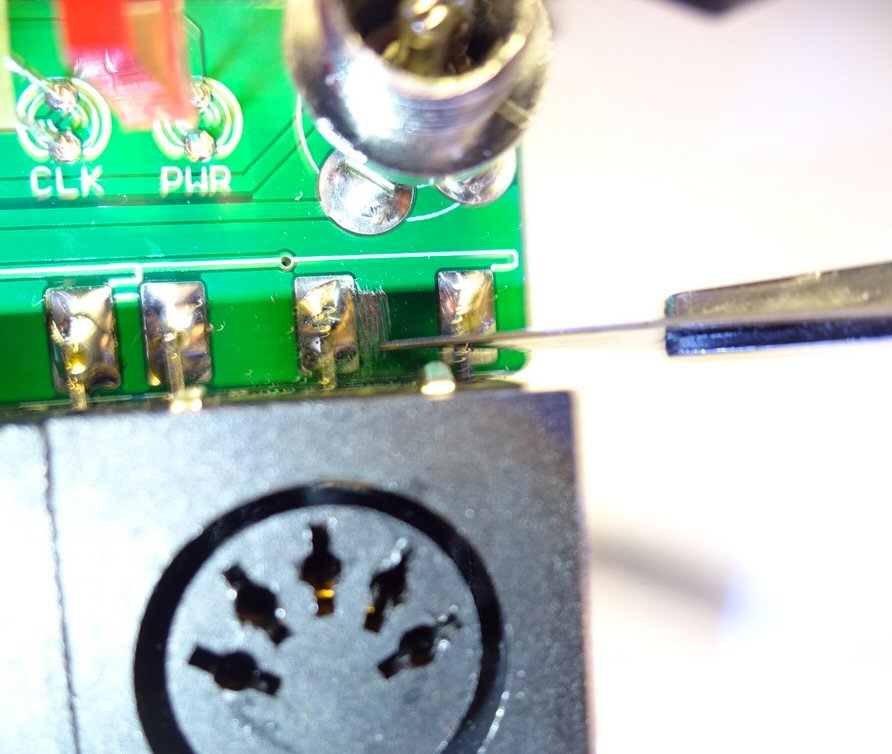
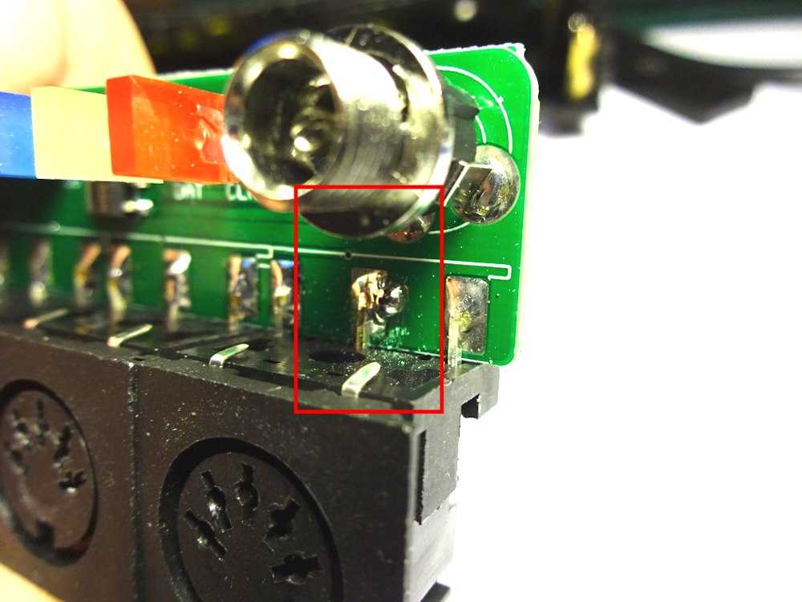
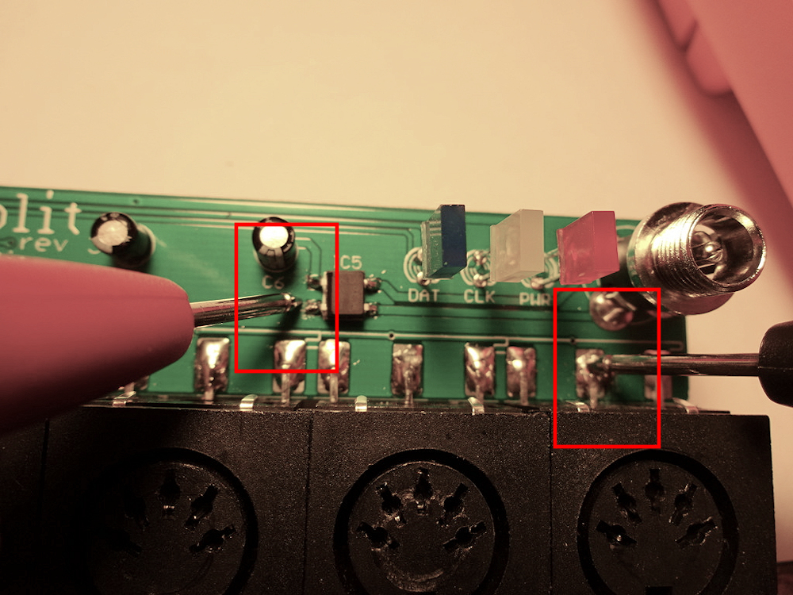
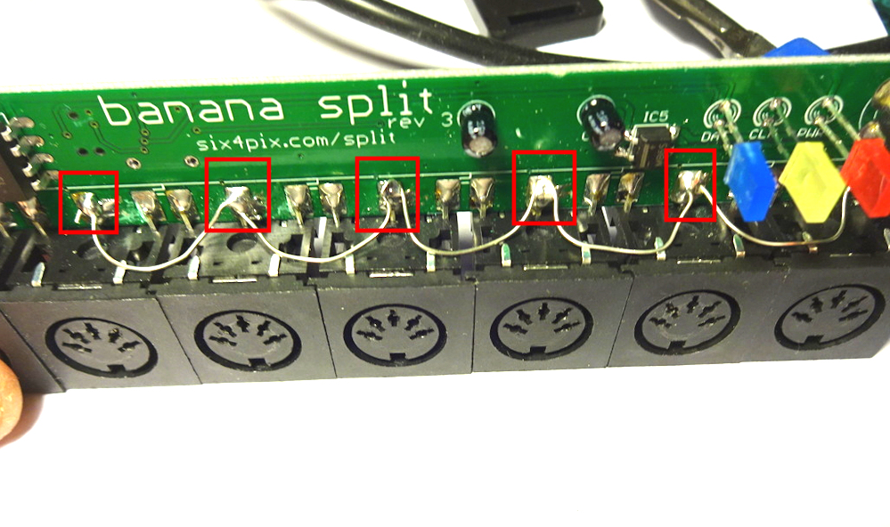
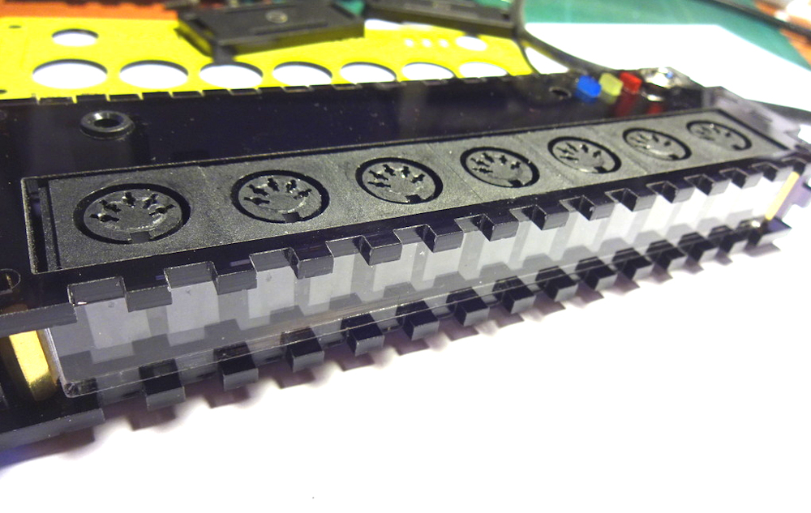

# MIDI POWER MOD

## What Is MIDI Power?

MIDI power (at least for devices that are "bus-powered" over a standard MIDI cable) is a bit of a misnomer since the sending device is not actually sending "power" to the cable. What is actually happening is that the receiving device is taking advantage of the voltage difference between the MIDI signal lines and the GROUND of the MIDI cable. It is actually stealing power from the MIDI signal, so the amount of power that can be taken this way is very limited.

Since a receiver of MIDI is supposed to be electrically isolated from the sender (The MIDI standard specifies optical isolation at the receiver), devices that are powered over MIDI are kind of breaking the MIDI standard a bit. However as long as they draw only a small amount of current they usually get away with it, no harm done.

## Does Banana Split Support MIDI Power?

**Banana splits sold from the start of 2017 are able to provide MIDI bus power** (This version has  a small picture of a banana on the back of the PCB which you might be able to see through the bottom of the case)

Older versions of the Banana Split thru-box DO NOT provide power over MIDI. This is because the GROUND pins of the outputs are not connected. 

However I will show how here they can be connected so that Banana Split can provide MIDI power to other bus-powered devices. **This mod will require a soldering iron**

Note: Banana Split CANNOT itself be powered over MIDI - it requires an external power supply. There is no mod for this, since I don't believe it would be possible to reliably send a MIDI signal to six receiving devices using the power from a single incoming MIDI signal.

## Extract the PCB

To mod the Banana Split, we first need to extract the PCB... 

Use a 2.5mm hex driver bit or allen key to unscrew the four bolts holding on the front panel and remove the panel

Remove the bolts on the ends of the case and pull off the end plates

Remove the face plate (with PCB attached) from the base and side pieces

Unscrew the nut around the power socket to release the PCB

## Ground the Right-most Output Socket

We'll start by grounding output #6 (the one closest to the power socket). This one has a ground plane next to it, so it is the easiest to mod.

Use a craft knife to carefully scrape off a patch of solder mask beside the middle pin (on the top of the PCB). You should expose a patch of copper metal foil about 2mm x 2mm. Be careful not to scrape the copper right off (it is quite thin)

Use a blob of solder to bridge between the pin and the exposed copper ground plane. Make sure the solder has properly adhered to the copper. 

If possible use a multimeter to check the resistance between the middle pin and the (-) pin of the diode bridge (see photo). The resistance should be close to 0 ohms (something like 0.1 ohms)

## Ground the Other Sockets if Needed

If you only need one socket with MIDI power, you are finished. Just remember it is only output #6 that supplies power...

However if you want all six sockets to provide power you'll need to join them to socket #6 using wire, as shown below. If you are using non-insulated wire (which saves a lot of wire stripping) just make sure it cannot touch any components or pins on the PCB.

**Make sure not to ground the INPUT socket (the far left socket). You should only be connecting the middle pins of the six OUTPUT sockets together**

Is there any harm to grounding all the sockets if you are not sure you'll need them? No, not really - it just may not be worth it if you can get by with just one socket providing power. Its up to you.

## Re-assemble the Banana Split

When putting it back together don't forget the clear plastic beam that is placed along the bottom edge of the sockets (see picture). The plastic should fit behind the lower frames of the sockets and prevents the sockets flexing inwards when pushed during cable insertion.

Also please, please **do not** over tighten the screws which hold on the yellow fascia. The fascia can be cracked if screws are too tight.

