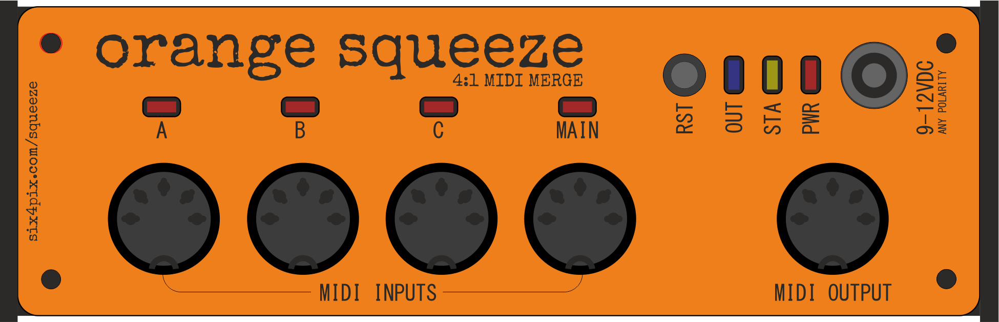

# ORANGE SQUEEZE

**Orange Squeeze is a MIDI merge device with four MIDI inputs and one MIDI output** 

Broadly speaking, the MIDI present at the output is the combinations of all the MIDI received at the inputs. 

## MIDI Inputs

Orange Squeeze has one "master" input and three "slave" inputs (labelled A, B, C). Generally speaking, these inputs all work in the same way, however there are a couple of ways in which the "master" input operates slightly differently to the "slave" inputs. These will be described below.

Before we go further, please be aware that MIDI is a fairly low-bandwidth connection and has a top limit of 31,250 bits (or a little over 3000 bytes) per second. The output has the same capacity as each of the inputs, so if all four inputs are running at full speed there would be many time times more data coming into the Orange Squeeze than can be sent on to the output, so some data will be lost.

Since most MIDI messages are 2-3 bytes in size this means that we have a top limit something like 1000 - 1500 messages per second. This may sound like a lot, but if you are merging four streams of MIDI that include a lot of CC's, NRPNs and so on, it is possible that you might reach that limit before you realize.

Orange Squeeze can buffer data that is waiting to be sent, so short periods of "maxing out" might be OK, but do keep in mind there is a maximum volume of data that can be handled!

## Input Filtering

Orange Squeeze imposes minimal filtering on the input, which opens up some creative possibilities for craziness (like what happens if you merge notes from two different sequences on the same MIDI channel? what if you merge information from two pitch bend controls? etc.)

However with great power comes great responsibility! it is up to you to make sure that you configure your sending devices appropriately so you don't end up with unwanted MIDI mayhem. In particular, make sure you keep all your MIDI data on different channels if you don't want it to clash.

There are a couple of things that Orange Squeeze does need to enforce, however

- Only one MIDI clock can be present on the output
- A sysex message must have exclusive use of the output (cannot be mixed with other messages)

These points are described in the next sections

## Realtime Messages

Orange Squeeze has special handling for the following MIDI real-time messages:

- Clock Tick
- Transport Messages (Start/Stop/Continue)
- Active Sensing
- Reset

Orange Squeeze will only accept MIDI clock tick messages through the Main input. Clock tick messages from any of the inputs A, B, C are ignored. This ensures that only one clock is present on the output and allows low latency handling of clock messages. Make sure that you connect your master clock source to the Main input!

Any other real-time message can be received through any of the four inputs, however messages that are received via the Main input have special low-latency handling where they can jump straight to the front of the transmit queue and be transmitted at the output with the minimum delay possible. 

Real-time messages received via the Main input are not blocked by Sysex data transmission.

Note that although clock messages (i.e. BPM sync) are blocked from inputs A, B and C, transport messages (Start/Stop/Continue) still pass through, so you can control the playback from any input.

## System Exclusive Messages

Orange Squeeze has special handling for System Exclusive (SysEx) messages

These messages can be large but cannot be merged with any other type of MIDI message (with the exception of real-time messages) This means that while a SysEx message is being received from one of the inputs, no other inputs can be serviced and any data that comes into them must back up and wait for the SysEx to finish. 

The one exception to this rule is real-time messages that come in through the Main input. These can be sent immediately, even when a SysEx is being passed from an input A, B, C

## LED Indications

There are fur red LEDs, one for each MIDI input. 

- These LEDs blink in response to MIDI input activity
- If the LED is lit solidly this and the yellow status LED is on, this indicates that the input buffer is oveflowing due to too much MIDI data at that input.
- When the device is first switched on, each input LED gives a single blink. This indicates that the input is working, and that slave inputs are communicating successfully with the master. If there is no blink at power on, this might indicate a problem with the input.

The BLUE led blinks when there is output activity. The brightness of the LED indicates the level of activity. When the LED is lit solidly, this indicates that backlogging is occurring at the output. This may result in backlogging at one or more inputs that might cause data to be dropped (indicated by the yellow LED)

The YELLOW LED indicates that a data overflow is occurring. This may indicate that one or more of the inputs is receiving more MIDI data than can be serviced by the master, or that that total combined MIDI data throughput is more than can be transmitted on the output. 

If you see the yellow LED lighting, you need to reduce the amount of MIDI you are trying to merge via the Orange Squeeze!