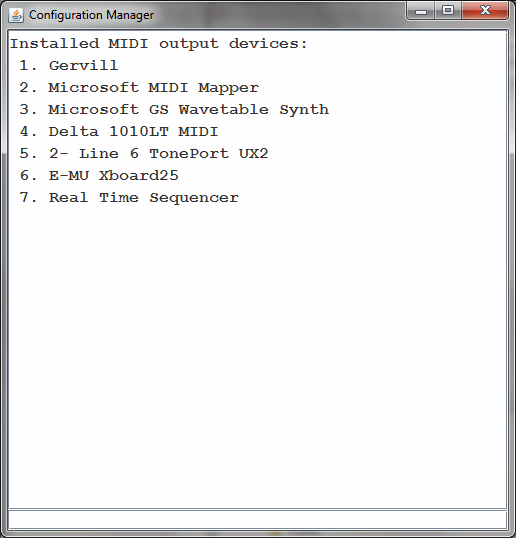
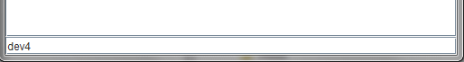
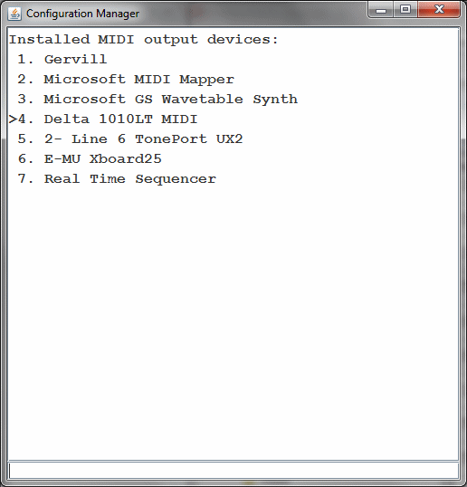
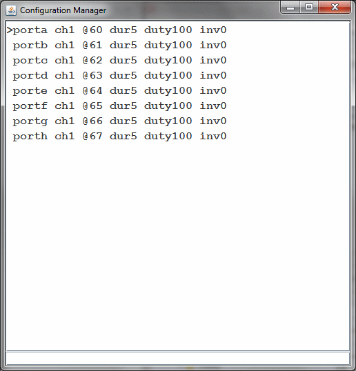

# Changing Settings

## Overview

Each of the eight switching ports have multiple parameters that can be configured over MIDI. A simple Java application is available to allow a user-edited configuration file to be loaded on to the board. The new configuration can be stored in EEPROM so it is available as the default configuration each time the board is powered on.

**Please note** the board needs to be put into a special programming mode (by holding the MODE button for 1-2 seconds) to allow reconfiguration. This is a safety feature to prevent inadvetent change of the configuration. When not in this mode all reconfiguration messages are ignored.

A modified configuration must be **saved** (by pressing the MODE button again, or via a MIDI message) or it will be lost when power is removed.

## Trigger Notes

The MIDI channel/note combinations that trigger each port are configurable.

Ports can be configured so that they are ON for as long as their corresponding MIDI trigger note is held, or for a fixed period of time, even if the MIDI note is released before that time period completes.

The trigger note and channel is set by a <a href="#nrpn">MIDI NRPN message</a>. You can use the <a href="#jnote">Java configurator</a> to send the messages.

## Velocity Modulation

There are two methods by which "velocity sensitivity" can be achieved:

- The triggered output ON time can be configured to be "modulated" by the velocity of the trigger note. For solenoid percussion the striking force can easily be controlled this way (the times are usually of the order of tens of milliseconds)

- **Transistor-based switcher only** The "duty cycle" of the ON pulse can be modulated. When using this method, the output actually switches on and off very rapidly during the ON period, and the percentage ratio of the "on" versus "off" time is what we call the duty cycle. This directly controls the amount of power delivered to the load over the ON time and works well with light bulbs and motors. The note velocity can be used to modulate the duty cycle of the output ON pulse.

Velocity modulation is set by a <a href="#nrpn">MIDI NRPN message</a>. You can use the <a href="#jmod">Java configurator</a> to send the messages.

## CC Modulation

Instead of note velocity, we can use a MIDI "continuous controller" as the modulator (for example the Modulation Wheel) or we can use the Pitch Bend controller. Modulation sources can be set independently per port and separately for pulse duration and duty cycle on each port.

The Java application is described in detail below. Alternatively the MIDI messages that reconfigure the board can be sent from your own application or controller.

CC modulation is set by a <a href="#nrpn">MIDI NRPN message</a>. You can use the <a href="#jmod">Java configurator</a> to send the messages.

## LED Indications

The activity (ACT) LED indicates the status of the board as follows...

- When there is activity on the MIDI input, the LED flickers. This is regardless of whether the MIDI message is processed by the MIDI-Switcher or ignored.

- MIDI-Switcher is placed into programming mode by pressing and holding the MODE button. In programming mode, the LED **pulses briefly once every 2 seconds (approx)**. Programming mode remains in effect until the board is powered down.

- In Programming mode, the device configuration can be changed by special MIDI messages (usually from the configuration applet). When a change has been made to the device configuration, but not yet saved, the LED **pulses approx twice a second**. This continues until the changed configuration is saved to EEPROM, which can be performed via MIDI, or by pressing the MODE button again.

- On power-up the device reads settings from EEPROM. A checksum test is used to ensure integrity of the configuration. If the check fails at power-up, the LED **blinks 10 times** and the default settings are saved to EEPROM and made active. It is normal to see this the very first time you power on the device, when the EEPROM is uninitialised but if this is happening unexpectedly on power-on this could indicate a problem.

## USING THE JAVA APPLICATION

The configuration application is distributed as a runnable JAR file, which requires Java to be installed on your computer.

When the program first loads, you need to select the MIDI output device that you are using to communicate with the MIDI Switcher board. 

The program lists all available devices on your system. Locate the correct device and enter (in the input area at the bottom of the screen) the command **dev<x>** (replacing <x> with the appropriate number for your device). 

For example to use device 4, enter **dev4**

Make sure the device is not already in use by other programs.

Having entered the dev command, the device should be displayed with a ">" symbol

Enter porta to access the port configuration screen

The ">" symbol now shows that **porta** is the selected port, to which entered commands apply. You can change the selection between ports using commands **porta**, **portb** etc. As a shortcut you can enter **/a** or **/b** instead.

Configure the current port by entering commands like the following:

<a name="jnote">
- **ch2** - Change the trigger MIDI channel for the selected port to channel 2. This is the MIDI channel that this port listens on for its trigger note.

- **@30** - Change the trigger note of the selected port to MIDI note 30

- **dur30** - Set the ON pulse duration to 30 milliseconds for selected port. Enter 0 for the duration to indicate that the duration is for as long as the MIDI note is held.

- **duty50** - Set the ON pulse duty to 50% for selected port. Use 100 to have the port use a contiuous ON pulse when triggered. Use 0 to disable the output.

- **inv1** - Set selected port output to be inverted (active low). This means the output is ON when not triggered and OFF when triggered.

<a name="jmod">
Specify duration modulation sources as shown below. "Duration modulation" is how we can use the note velocity, or another MIDI controller, to change the output pulse length (good for changing the "hit" velocity of a solenoid)

- **dur~v** - modulate ON pulse duration using note velocity
- **dur~1** - modulate ON pulse duration using controller #1 (Mod wheel)
- **dur~p** - modulate ON pulse duration using pitch bend
- **dur~** - remove modulation

Similarly we can modulate the duty cycle modulation using

- **duty~v** - modulate ON pulse duty using note velocity
- **duty~1** - modulate ON pulse duty  using controller #1 (Mod wheel)
- **duty~p** - modulate ON pulse duty  using pitch bend
- **duty~** - remove modulation

Any of the above commands can be applied to **all ports simultaneously** by prefixing a command with the asterisk symbol. For example ***ch3** sets all eight ports to trigger from MIDI channel 3

Multiple commands can be entered at the same time as long as they are separated by white space (including newlines). This allows the entire configuration to be copied to the clipboard and saved as a text file to be edited/pasted back into the command line at a later time. In this way you can keep entire configuration "patches" as blocks of text.

If a given command is not understood, it will remain on the command line and a beep will sound. If multiple commands are entered, they will be processed until the first unrecognised command. The successful commands will be removed from the command line.

Commands are sent to MIDI as they are entered. If you need to resend (for example the MIDI Switcher board was not connected) you can resend the configuration for a specific channel by entering ! as a command. To resend all channels enter *!

The MIDI-Switcher uses the new parameters as they are received, but does not save them to EEPROM (so they will be lost when powered down). If you wish to save the new set of parameters to EEPROM so they are used as the new power-on defaults you can send the command ^ (caret). Alternatively the MODE button on the board can be pressed to save the new settings.

Note that the initial information shown in the window reflects the **default** settings for the ports and not neccessarily the current settings that are active on the board. There is no communication back from the board, so the application does not know the current settings. This is why it is useful to copy a finalised configuration to the clipboard and paste it somewhere safe!

## MIDI IMPLEMENTATION
MIDI-Switcher is reconfigured over MIDI using Non-Registered Parameter Number (NRPN) Messages, which it receives on MIDI channel 1. This is one of the ways that MIDI allows device-specific data can be exchanged with a MIDI device.

**To avoid inadvertant changes to configuration, MIDI-Switcher  can only receive these NRPN messages when it is placed in "configuration" mode by holding the MODE button down.** 

Each parameter is uploaded by means of a set of MIDI messages that first provide the target parameter number, then the data to load into the parameter. Each message is 3 bytes long (shown in hexadecimal notation below)

<a name="nrpn">

Message: Set Non-Registered Parameter Number: Most Significant Byte (MSB)

<table class="data"><tr><td>0xB0</td><td>&nbsp;</td><td>0x63</td><td>&nbsp;</td><td>{Param# MSB} (see table below)</td></tr></table>

Message: Set Non-Registered Parameter Number: Least Significant Byte (LSB)

<table class="data"><tr><td>0xB0</td><td>&nbsp;</td><td>0x62</td><td>&nbsp;</td><td>{Param# LSB} (see table below)</td></tr></table>

Message: Data Entry: Most Significant Byte (MSB)

<table class="data"><tr><td>0xB0</td><td>&nbsp;</td><td>0x06</td><td>&nbsp;</td><td>{Data / 128}</td></tr></table>

Message: Data Entry: Least Significant Byte (MSB)

<table class="data"><tr><td>0xB0</td><td>&nbsp;</td><td>0x26</td><td>&nbsp;</td><td>{Data % 128}</td></tr></table>

Data Entry for a given parameter must occur in the order MSB, then LSB. When the MSB message is received, the LSB is cleared. 

<table class="data">
<tr><td>NRPN (MSB)</td><td>NRPN (LSB)</td><td>DATA&nbsp;VALUE (MSB * 128 + LSB)</td><tr>
<tr><td>Port&nbsp;number 1-8</td><td>1</td><td>MIDI Trigger Channel 0-15</td></td></tr>
<tr><td>"</td><td>2</td><td>MIDI Trigger Note 0-127</td></tr>
<tr><td>&nbsp;</td><tr>

<tr><td>"</td><td>3</td><td>1-16384 = Fixed Trigger Duration in milliseconds. 
0 = Trigger for as long as trigger note is held</td></tr>
<tr><td>&nbsp;</td><tr>

<tr><td>"</td><td>4</td><td>Duration modulator 
Specifies a modulation source that scales trigger duration  
0-127 = MIDI Continuous controller on trigger channel (use 1 for modulation wheel) 
128 = No modulation; always apply full duration 
129 = Use the trigger note velocity to modulate the trigger duration 
130 = use pitchbend to modulate the trigger duration (no bend = 50% of maximum duration)</td></tr>
<tr><td>&nbsp;</td><tr>

<tr><td>"</td><td>5</td><td>0-100 = Trigger duty cycle percentage. The carrier is approx 80Hz.</td></tr>
<tr><td>&nbsp;</td><tr>

<tr><td>"</td><td>6</td><td>Duty cycle modulator 
Specifies a modulation source that scales the duty cycle up to the maximum set 
0-127 = MIDI Continuous controller on trigger channel (use 1 for modulation wheel) 
128 = No modulation; always apply the maximum duty cycle value 
129 = Use the trigger note velocity to modulate the duty cycle 
130 = use pitchbend to modulate the duty cycle (no bend = half of maximum value)</td></tr>
<tr><td>&nbsp;</td><tr>

<tr><td>"</td><td>7</td><td>Invert output  
0 = Normal 
1 = Switch output off when triggered 
<tr><td>&nbsp;</td><tr>

<tr><td>100</td><td>1</td><td>Write configuration to EEPROM. This can also be performed by pressing the mode button on the board after uploading modifications to the configuration</td></tr>
<tr><td>&nbsp;</td><tr>
</table>
