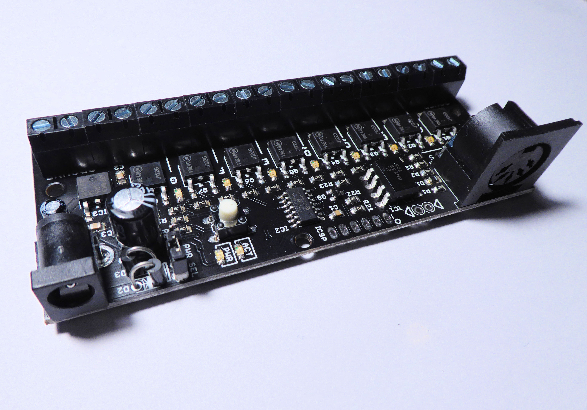
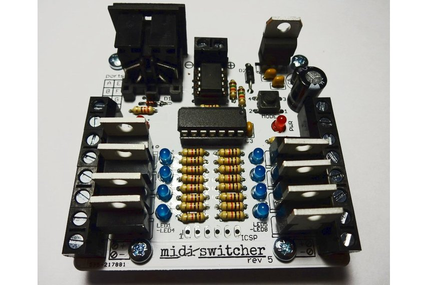
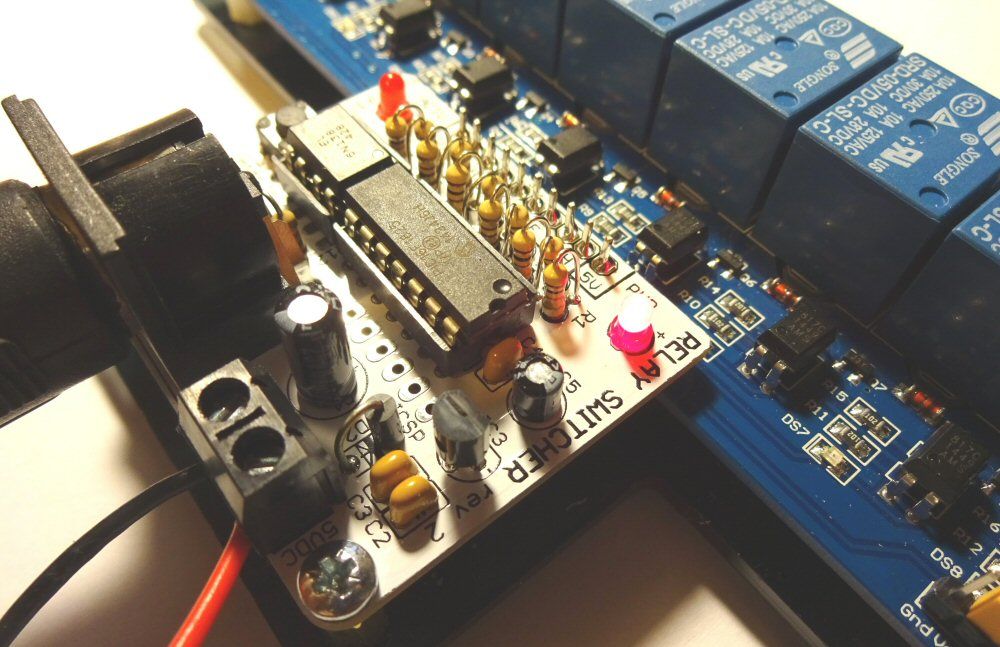

# MIDI Switcher

Set your MIDI free!! MIDI switcher allows you to switch real-world devices using MIDI. It is ideal for building electric percussion or for augmenting MIDI performances using lamps, motors etc. The only limit is your imagination (well.. and certain voltage and current constraints)

<h2>Mini Module</h2>
MIDI Switcher is currentlty sold as a pre-built module and is configured via MIDI System Exclusive (Sysex) files which are created using a web page
 
Download the <a href="MIDI Switcher - User Guide.pdf">User Guide</a> 
Click to access the <a href="patch.asp">The Configuration Page</a> 

<h2>Older MIDI Switchers</h2>

There are two older flavours of MIDI Switcher available, shown below (<a href="choice.html">How to decide</a>):

<table>
<tr>
<td>
<h2>Transistor Based</h2>
 
<a href="tkit.html">Kit Contents</a> 
<a href="tbuild.html">Build Instructions</a> 
<a href="tmanual.html">User Manual</a> 
</td>

<td>
<h2>Relay Based</h2>
 
<a href="rkit.html">Kit Contents</a> 
<a href="rbuild.html">Build Instructions</a> 
<a href="rmanual.html">User Manual</a> 
</td>
</tr>
</table>

The following applies to both modules

<table>
<tr>
<td>
<a href="config.html">Configuration</a> 
<a href="faq.html">FAQ</a> 
<a href="https://github.com/hotchk155/MIDI-Switcher/blob/master/application/midi-switcher-config.jar?raw=true">Download the Java Configuration App</a> 
<a href="https://github.com/hotchk155/MIDI-Switcher">Source Repository</a> 
</td>
</tr>
</table>

<table>
<tr>
<td width="88"></td>
<td>This work is licensed under CC-BY-NC-SA terms. If you would like a commercial license please contact us.</td>
<tr>
</table>
 
 
