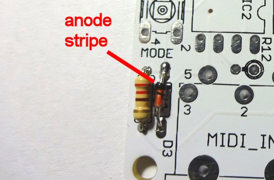

---
layout: default
--- 

# Build It!

When soldering a PCB, it generally helps to solder lower height components first. This stops the taller components getting in the way while we are working, and it lets us hold components in place for soldering by turning the board upside down on a flat surface and letting gravity be our third hand!

We will start with the base PCB (Printed Circuit Board), as shown below 
 

Lets solder resistor R13. This is a 220 ohm resistor which has a colour code of RED-RED-BROWN. Start by bending the legs of the resistor as shown 
 

Pass the legs through the holes in the board for resistor R13 (Resistors do not have a specific polarity and can be soldered "either way round").
 

Push the resistor flush to the board and bend the legs out slightly to hold it in place while you turn the board over to solder them
 

**If you are new to soldering, please take a few minutes to check my soldering tips [HERE](http://127.0.0.1:4000/info/soldering.html)**

Solder the legs into place 
 

Snip the legs nice and short
 

Add diode D3, being careful to solder it the correct way around as shown (the stripe is also shown on the symbol for the diode on the board). **Do not heat the diode for too long when soldering - they are more sensitive to heat than resistors**
 

Add the three small 100nF ceramic capacitors C1, C2, C3. These are not polarised and can be soldered either way around
 

Now we will solder the two LEDs. Each LED must be soldered the correct way around. You can identify the Anode (+) and Cathode (-) based on the length of the LED leads as shown below.
 

The symbols on the board indicate which way round to insert each LED
 

 

Now we'll add the two IC sockets. Each socket, together with the symbol on the PCB for it, has a "notch" shown. This tells us which way round to solder the sockets and how to insert the IC into them
 

IC sockets can be fiddly to solder. A good tip is to insert the socket in the board, then turn the board upside down so that the socket is held in place by the weight of the board. Solder two outer corner pins so that the socket does not fall out of the board, then turn it over and check the socket is flush against the board (reheat the two pins and push it down further if needed). Finally solder the remaining pins.
 

Add the switch, making sure it is flush to the board

Now we will add the remaining resistors. These stand up on the board to save space, and due to lack of space most of the resistors are not labelled on the board. The following diagram shows the resistor values by location.
 

Start with the eight 100 ohm resistors. Bend these over as shown
 

Solder them one at a time starting from R2 and working downwards. The resistors should alternately face one way then the other (this helps stop their leads touching). The markings on the board show which way round to solder each resistors. The board should now look like this
 

Insert the remaining resistors:

* R1, R11 - 1K (BROWN-BLACK-RED)
* R12, R10(above R11) - 1.5K Ohms (BROWN-GREEN-RED)

 

Insert the rectifier diode D2 as shown. Make sure the silver anode stripe is located as shown.
 

Insert the voltage regulator as shown. The body of the regulator has a flat face which should match up with the shape printed on the circuit board.
 

Solder the terminal block (making sure it faces outwards!) 
 

Solder the electrolytic capacitors, C1 (larger 47uF capacitor) and C5 (smaller 4.7uF capacitor), making sure you solder them the correct way around. Just like an LED the longer lead of the capacitor is the Anode (+). The Cathode (-) is also indicated by a white stripe on the can. The symbol on the PCB clearly indicates the Anode hole.
 

Solder the MIDI socket. Make sure that resistor R12 is not touching the legs of the socket.
 

Connect the board to the contact strip of the relay board

**Note** If you intend to <a href="rmanual.html#isolate">isolate</a> the Relay-Switcher power supply from the relay driver power supply you should completely remove the GND pin of the relay board before soldering.
 

Solder the Relay Switcher board to the relay board
 
