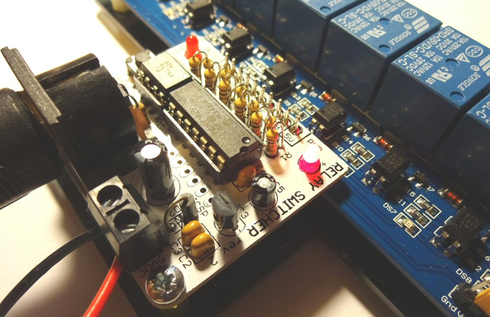

# RELAY SWITCHER

This information is for the relay-based MIDI switcher shown below. If you have the transistor-based switcher, use <a href="tmanual.html">this information</a> instead.

## INTRODUCTION

The relay-based MIDI-Switcher is an electronic device which uses incoming MIDI note information to activate its eight output ports.

These ports are switched between ground (on) and high impedence (off) and are designed to operate the inputs of a "standard" eight relay module. 

The relay outputs can be used to activate solenoids, motors, light bulbs etc. For example solenoids could be used as robotic percussion instruments that could be driven from a MIDI sequencer or DAW program.

This manual assumes you have a the relay module attached to the Relay-Switcher board, and references to the output connections refer to the relay outputs.

## CONNECTING DEVICES

Each of the relays works as a two way (SPDT) electric switch. The relay operates by mechanically operating the switch terminals.

Each relay has three output terminals, the centre terminal is the "Common" connection and it is either connected electrically to the terminal on the left or the right of it.

- When the relay is not activated, the centre terminal is internally connected to the right hand terminal.

- When the relay is activated, the centre terminal is internally connected to the left hand terminal.

Because relays use mechanical switches, they:

- Are electrically isolated from their driver circuits, so they could be used to replace any control switch, such as a channel switch pedal on a guitar amp etc. 

- Don't care about the polarity/direction of the current they are switching, so can handle alternating currents.

- Are able to handle higher voltages and currents than most transistors. These relays are rated for switches mains electricity, **but there are deadly risks associated with working with mains electricity - see below**.

## CONNECTING POWER

The Relay-Switcher must operate with a 5 Volts DC Power Supply. If you use a higher voltage, the relay driver board may be damaged.

The power supply is connected to the terminal block beside the MIDI connection. Make sure you connect the supply with the correct polarity. Refer to the labels on the PCB.

The supply must be able to provide enough current to operate the relay coils. For this eight-channel relay module, the supply should be able to provide 500mA or more at 5VDC.

## MIDI CONNECTION

Relay-Switcher has a single MIDI-IN connection utilising MIDI standard 5-Pin DIN socket. Most MIDI equipment has such a connection, but with a computer you may require a MIDI interface with the appropriate connector. A cheap and effective solution is a USB to MIDI cable which connects to a computer USB port and provides standard MIDI input and output cables terminated in 5-Pin DIN plugs.

Remember each MIDI cable works in one direction only... Relay-Switcher requires a MIDI input only, so you connect it to the MIDI OUT of your controlling device. There is no communication back from Relay-Switcher to the controller. Keep this in mind when you are reconfiguring the device. Keep a backup of your customised configurations (as described later). You can't download them again!

## GETTING STARTED
Once you are powered up, try sending some MIDI... the default settings programmed in the Microcontroller are as follows

<table class="data">
<tr><td>Port</td><td>Note</td><td>Port</td><td>Note</td></tr>
<tr><td>PORT A</td><td>C3 (60)</td><td>PORT E</td><td>E3 (64)</td></tr>
<tr><td>PORT B</td><td>C#3 (61)</td><td>PORT F</td><td>F3 (65)</td></tr>
<tr><td>PORT C</td><td>D3 (62)</td><td>PORT G</td><td>F#3 (66)</td></tr>
<tr><td>PORT D</td><td>D#3 (63)</td><td>PORT H</td><td>G3 (67)</td></tr>
</table>

The default receive channel is **MIDI Channel 1** for all ports and **20 milliseconds duration**. Modulation of duty and duration is disabled by default.

## CUSTOMISING THE CONFIGURATON
The switcher is highly customisable. Please see <a href="config.html">this guide</a> for information on how to change the settings in your MIDI switcher

## MAINS??

The relays on the board are mains-rated and the ability to switch mains may be a factor in choosing this board.

However **there are DEADLY risks associated with mains and any work you do with mains must be at your own risk. I strongly advise against using this module to switch main electricity unless you are qualified, experienced and competent to work with mains wiring**

Always make sure you have an easily accessible method to isolate the mains supply in an emergency.

<a name="isolation">

## Supply Isolation

**Read this section if you want to switch high voltage mains with this device**

If you intend to switch hazardous voltages (e.g. mains electricity) it is important to understand the level of electrical isolation between the load you are switching, and the MIDI hardware (e.g. sequencer or laptop) sending the MIDI data. 

- The relay contacts themselves provide the primary level of isolation between the load circuit and the driver circuit.

- The MIDI input is optically isolated per the MIDI standard. This means that equipment connected to the MIDI input of the Relay-Switcher board does not share any electrical circuit with Relay-Switcher board itself.

You may be comfortable with this level of isolation. However there is an additional level of isolation available by separating the 5VDC power supplies used for the Relay-Switcher board and the relay drivers.

Usually the relay coils share a common 5VDC power supply with the Relay Switcher board itself. The circuits are joined in two places 

- The ground pin (GD) on the Relay-Switcher is connected to the ground plane on the driver side of the relay board.

- The jumper in the corner of the board links the 5VDC supply rails of the two circuits

This single supply mode is fine if non-hazardous voltages are being switched, since the primary isolation is the relays themselves.

However if you wish to take advantage of this extra level of isolation, you will need to 

- Remove the ground pin on the relay module header so that it is completely isolated from the GD connection on the Relay-Switcher board.

- Remove the jumper and connect an additional 5VDC in its place. Usually the jumper is in place as follows
 
[ ] Gnd 
[#] Vcc			} linked by 
[#] JDVcc		} jumper 
 
To take advantage of the additional isolation provided by the optical isolators on the relay board you must remove the jumper and attach a 5VDC supply to the header.
 
[ ] Gnd			-> 5VDC GROUND 
[ ] Vcc			 
[ ] JDVcc		-> 5VDC SUPPLY 
 
A second 5V DC supply is required. The 5VDC supply feeding the relay board should provide at least 500mA. The supply to the Relay-Switcher module can be lower current (but at least 150mA)
