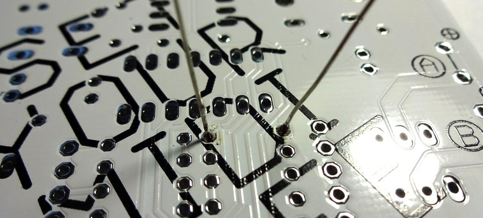
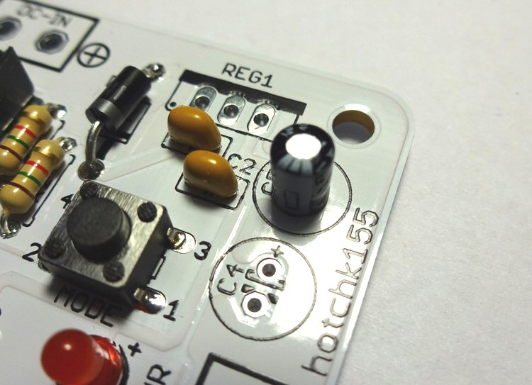

---
layout: default
--- 

# Build It!

When soldering a PCB, it generally helps to solder lower height components first. This stops the taller components getting in the way while we are working, and it lets us hold components in place for soldering by turning the board upside down on a flat surface and letting gravity be our third hand!

We will start with the base PCB (Printed Circuit Board), as shown below 
 
Lets solder resistor R6. This is a 1K resistor which has a colour code of brown-black-red. In your kit, the tape holding the 1K resistors is labelled with the resistor value. Start by separating a single resistor from the tape and bending the legs as shown 
 

Pass the legs through the holes in the board for resistor R6 (Resistors do not have a specific polarity and can be soldered "either way round").
 

Push the resistor flush to the board and bend the legs out slightly to hold it in place while you turn the board over to solder them
 

**If you are new to soldering, please take a few minutes to check my soldering tips [HERE](http://127.0.0.1:4000/info/soldering.html)**

Solder the legs into place 
 

Snip the legs nice and short
 

Now lets continue in the same way to solder 1K resistors R7 through R21. 
 

Finish off soldering the remaining resistors:

* R1 - 220 Ohms (RED-RED-BROWN)
* R2, R3 - 1.5K Ohms (BROWN-GREEN-RED)
* R4, R5 - 1K (BROWN-BLACK-RED)

The board should now look like this

 

Add diode D1, being careful to solder it the correct way around as shown (the stripe is also shown on the symbol for the diode on the board). **Do not heat the diode for too long when soldering - they are more sensitive to heat than resistors**
 

Add diode D2, being careful to solder it the correct way around.
 

Add the three small 100nF ceramic capacitors C1, C2, C3. These are not polarised and can be soldered either way around
 

Now we will solder the LEDs. Use the two standard RED LEDS for ACT and PWR. Use the high brightness BLUE LEDs for LED1 through LED8. Each LED must be soldered the correct way around. You can identify the Anode (+) and Cathode (-) based on the length of the leads as shown below.
 

The symbols on the board indicate which way round to insert each LED
 

The board should now look something like this
 

Add the switch, making sure it is flush to the board
 

Now we'll add the IC sockets. Each socket, together with the symbol on the PCB for it, has a "notch" shown. This tells us which way round to solder the sockets and insert the IC into them
 

Insert the socket into position so the notch lines up with the notch on the symbol.
 

Solder the smaller 4.7uF electrolytic capacitor, C5, making sure you solder it the correct way around. Just like an LED the longer lead of the capacitor is the Anode (+). The Cathode (-) is also indicated by a white stripe on the can. The symbol on the PCB clearly indicates the Anode hole.
 

Now we will add the terminal blocks. These "stack", clipping together via little lugs and grooves. 
 

It will be easier to clip them together before soldering them to the board. Stack eight of the terminal blocks into two strips of four, as shown.
 

Solder the terminal strips, making sure the connection port faces the outside of the board...
 

Now add the larger (47uF) capacitor C4, again checking the polarity is correct.
 

Add the power terminal block and insert the IC's into their sockets. With the ICs it can sometimes help to press them sideways against a flat surface to slightly bend the row of legs inwards, making them an easier fit to the socket. Be gentle with them and insert them the correct way around. 
 

Add the MIDI socket, making sure it is flat against the board
 

Now we need to add the voltage regulator and transistors. **These look similar, so make really sure you know which are which**. The transistors are labelled "TIP120" and the voltage regulator will be labelled something like "7805" (there may be additional letters depending on the specific model). Different manufacturers devices may looks slightly different to the ones pictured here - but it is the label on the device that is important, not the precise shape of it!
 

The voltage regulator (7805) fits with the tab toward the back of the board.
 

The eight transistors fit beside the blue LEDs. Note that the transistors on the left side all have their tabs toward the back of the board but the transistors on the right are the other way around (they have their tabs to the front of the board). This is also printed on the board.

**This orientation is very important, and removing the transistors will be very difficult if you make a mistake, so please be very careful to get their orientation correct!**

 

Finally use the machine screws to add the brass standoff "feet", and we're done!!
