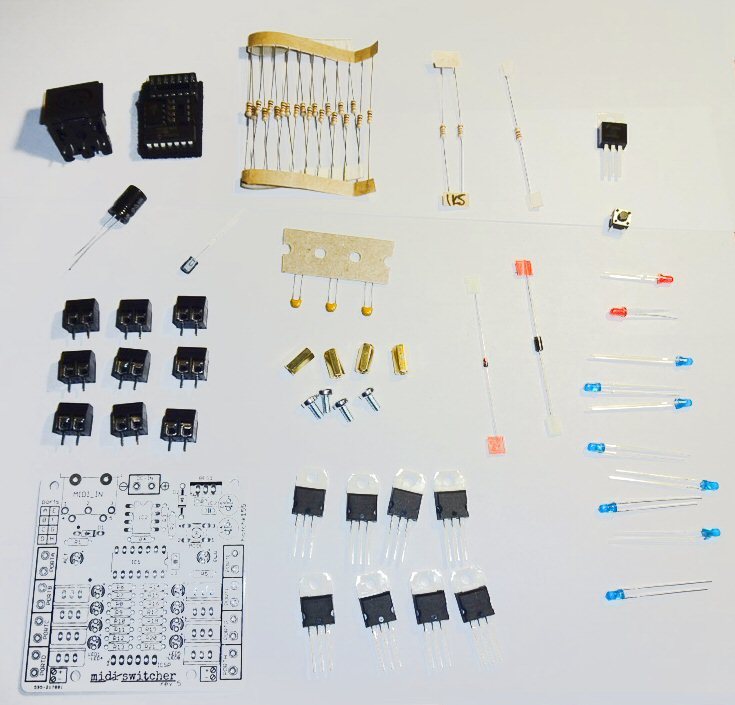

# Kit Contents

## Bill of Materials

* C1,C2,C3 - 100nF CERAMIC CAPACITOR (X3)
* C4 - 47UF 63V ELECTROLYTIC CAPACITOR
* C5 - 4U7 16V ELECTROLYTIC CAPACITOR
* D1 - 1N4148 SIGNAL DIODE
* D2 - 1N4001 RECTIFIER DIODE
* R1 - 220R RESISTOR 
* R2,R3 - 1.5K RESISTOR (X2)
* R4-R21- 1K RESISTOR (X18)
* LED1-8, PWR, ACT - 3MM LED (x10)
* REG1 - 7805 +5V VOLTAGE REGULATOR TO220
* IC1 - PIC16F1825 MICROCONTROLLER (WITH FIRMWARE)
* IC2 - 6N138 OPTOCOUPLER
* TIP120 DARLINGTON TRANSISTOR TO220 (x8) 
* MODE - 6MM TACTILE SWITCH
* ICSP - 6 PIN SIL HEADER
* 8 PIN IC SOCKET
* 14 PIN IC SOCKET
* 5 PIN DIN CONNECTOR FEMALE
* 2 WAY STACKING TERMINAL BLOCK 5MM PITCH (X9)
* M3 x 8MM MACHINE SCREWS (x4)
* M3 x 10MM HEX STANDOFF PILLAR (x4)
* PRINTED CIRCUIT BOARD
 
 
