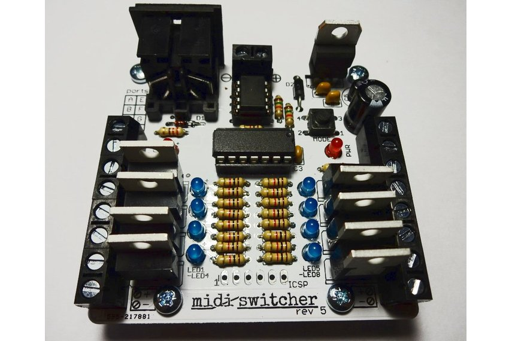

# SOLID STATE SWITCHER

This information is for the transistor-based MIDI switcher shown below. If you have the relay based switcher, using <a href="rmanual.html">this information</a> instead.

## INTRODUCTION

The solid-state (transistor based) MIDI-Switcher is an electronic device which uses incoming MIDI note information to activate its eight output ports.

These ports are **electronic switches** which can be used to activate small solenoids, motors, light bulbs, relays etc. For example solenoids could be used as robotic percussion instruments that could be driven from a MIDI sequencer or DAW program.

## CONNECTING DEVICES

Each port operates as a **low side switch** with a maximum current handling capacity of 5 Amps. Each port provides a connector block with two screw terminals:

- One screw terminal (the one closes to the rear of the board) is **permanently connected to the positive connection of the power supply**.
- The other screw terminal is **electronically switched to ground** (the "negative" power supply connection) when the corresponding MIDI note is played into the board.

A legend on the top of the board, and labels on the underside of the board, also provide this information.

Many types of load that you might connect to the MIDI switcher (e.g. solenoids, relays, filament bulbs) are not fussy about polarity and can be connected to MIDI-Switcher's ports either way around. However, always be sure to check if your device has a specific polarity and connect it appropriately.

## CONNECTING POWER

Since we are working with relatively high current loads, your choice of power supply is important.

Power the board from a **DC power supply of between 7 and 24 volts**. Connect the power supply to the screw terminal connection at the back of the board making sure the polarity of the power supply is correct. **If you connect the power supply with incorrect polarity you may destroy the board!** 

When selecting a power supply to use with the MIDI-Switcher, you will need to ensure that it has a current rating (Amps) that is sufficient for the devices you wish to switch. This depends on what those devices are, and whether they are constant loads (like motors or bulbs) or transient ones (like solenoids used with percussion)

Likewise, you will need a supply of an appropriate voltage to your load. 12 volts is typically a good choice for small solenoids and vehicle bulbs. For eight small 12 volt solenoids being used for percussion, a supply of 2 Amps rating will probably work. Higher current ratings are better, giving more headroom. 

**ABSOLUTELY NEVER ATTEMPT TO CONNECT MAINS ELECTRICITY DIRECTLY TO THIS BOARD!!!!**

## MIDI CONNECTION

MIDI-Switcher has a single MIDI-IN connection utilising MIDI standard 5-Pin DIN socket. Most MIDI equipment has such a connection, but with a computer you may require a MIDI interface with the appropriate connector. A cheap and effective solution is a USB to MIDI cable which connects to a computer USB port and provides standard MIDI input and output cables terminated in 5-Pin DIN plugs.

Remember each MIDI cable works in one direction only... The MIDI-Switcher requires a MIDI input only, so you connect it to the MIDI OUT of your controlling device. There is no communication back from the MIDI-Switcher to the controller. Keep this in mind when you are reconfiguring the device. Keep a backup of your customised configurations (as described later). You can't download them again!

## EXAMPLE CONNECTIONS

The diagram below shows how 8 solenoids are connected. Most solenoids don't have a polarity and are likely to have two wires of the same colour. In that case you can connect them to the port in either direction. However, always ensure the power supply polarity is correct.. that DOES matter!

## GETTING STARTED
Once you are powered up, try sending some MIDI... the default settings programmed in the Microcontroller are as follows

<table class="data">
<tr><td>Port</td><td>Note</td><td>Port</td><td>Note</td></tr>
<tr><td>PORT A</td><td>C3 (60)</td><td>PORT E</td><td>E3 (64)</td></tr>
<tr><td>PORT B</td><td>C#3 (61)</td><td>PORT F</td><td>F3 (65)</td></tr>
<tr><td>PORT C</td><td>D3 (62)</td><td>PORT G</td><td>F#3 (66)</td></tr>
<tr><td>PORT D</td><td>D#3 (63)</td><td>PORT H</td><td>G3 (67)</td></tr>
</table>

The default receive channel is **MIDI Channel 1** for all ports. Output is set at **100% duty** (i.e. constantly ON when triggered) and **20 milliseconds duration**. Modulation of duty and duration is disabled by default.

## CUSTOMISING THE CONFIGURATON
The switcher is highly customisable. Please see <a href="config.html">this guide</a> for information on how to change the settings in your MIDI switcher

## OTHER INFO
Do not exceeed the current rating of your DC power supply. Ensure that the supply is not becoming excessively hot.

While each channel of MIDI-Switcher can switch a 5 Amp load, this would usually be for a short period of time (such as when actuating a solenoid). The board is not designed to large handle large continuous currents through multiple ports. You could use external relays to increase the continuous current capacity if you like - the channels of the MIDI Switcher board could then be used to actuate the relay coils rather than switch the load directly.

Be aware that some of the components can become quite warm or even hot during normal use; The voltage regulator (mounted vertically at the rear right side of the board) and the two transistor array ICs (close to each row of terminal blocks) will warm up. If these parts are getting excessively hot you may be overloading the board - allow it to cool and reduce the loading. **Be very careful when handling hot components - in exceptional situations they can become hot enough to burn your fingers**.

When running inductive loads such as solenoids it is sometimes possible to feel the "flyback" voltage spike as a small electric shock when you touch the terminal block. While this is harmless, it can come as a nasty suprise, so keep fingers away from the connections when solenoids are operating!

If desired, you could connect the "high side" (positive) terminals of your loads to second power supply separate from the supply used for the board (but sharing a common ground). This configuration could be used to switch loads requiring higher voltages than the 24 Volt maximum for the board supply. The TIP120 transistors can handle up to 60 Volts in this configuration.

**ABSOLUTELY NEVER ATTEMPT TO CONNECT MAINS ELECTRICITY DIRECTLY TO THIS BOARD!!!!**