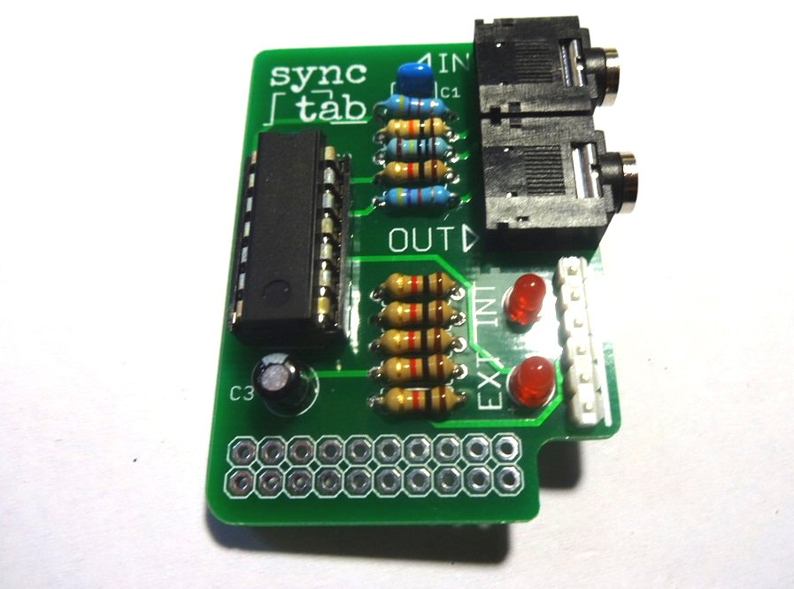

# Build Instructions

If you are working from a kit, please review the [Parts List](kit.html) and image to ensure you have all the neccessary components. 

Solder R1 and R5, the two 4K7 resistors (YELLOW-VIOLET-RED)

Solder R2, the 10K resistor (BROWN-BLACK-ORANGE) and R3, the 1M resistor BROWN-BLACK-GREEN)

Now solder the six 1K resistors, R4, R6, R7, R8, R9, R10  (BROWN-BLACK-RED) 

Add the small ceramic capacitors (C1 and C2)

Solder the IC socket - make sure the notch on the socket is aligned with the notch on the outline printed on the PCB (at the top on the photograph). The best way to solder the socket is to insert it and turn the board over, holding the socket against the board. Use a flat surface to hold the socket against the board while you solder two opposite corner pins. Now check the socket is flush against the board before soldering the remaining pins.

Add the electrolytic capacitor C3. Make sure you put the longer leg (the anode) through the hole marked with a (+) on the PCB. The white stripe on the body of the capacitor should be located at the top as shown in the photo.

Add the LEDs. Make sure you put the longer leg of each (the anode) through the hole marked with a (+) on the PCB. Also try not to heat the LEDs for too long with the soldering iron as they can be damaged by excessive heat.

Now add the jack sockets, making sure they are flat against the board and all pins are correctly located in their holes.

Next add the pin header. The plastic collar has been pushed to one end of the pins, so the full length of each pin can potrude below the board. This means you must solder the pin header from underneat. It helps to use an object such as a pair of wire snips etc, to hold the header in place while you solder. Start with soldering just the two end pins, so you can check it is straight before soldering the others

Make sure the header is flat against the board and ensure the solder joints do not short together on the underside of the board

Put the IC in its socket, making sure the notch is lined up with the notch on the socket (to the top in this photo)

Now we can fit the synctab to the ARPIE. Remove the control surface and plug the controltab into the hack header. The correct location is shown below. Once the board is fitted, you can replace the control surface by passing the connector pins through the holes in the hack header. DO NOT SOLDER THEM - the pads on the lower edge of the synctab are not connected, they are just there to get additional mechanical support from the connector pins. You can remove the synchtab any time you like.

Check the <a href="manual.html">instructions</a> to see how to use synchtab.

