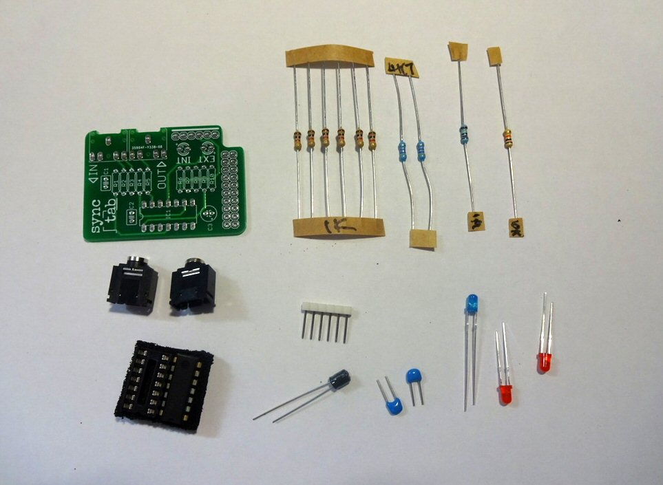

# Kit Contents

The synchtab kit contains the following parts:

- R1, R5 4K7 Resistor 5% 0.25W
- R2 10K Resistor 5% 0.25W
- R3 1M Resistor 5% 0.25W
- R4, R6, R7, R8, R9, R10 1K Resistor 5% 0.25W
- C1, C2 100NF Ceramic Capacitor
- C3 4.7uF Electrolytic Capacitor
- 2 x 3.5mm PCB Mount Jack Socket
- 1 x 74HC14N Schmitt Trigger Inverter
- 1 x DIP14 IC Socket
- 2 x 3mm LED
- 1 x 6 Way SIL Pin Header
- 1 x Printed Circuit Board