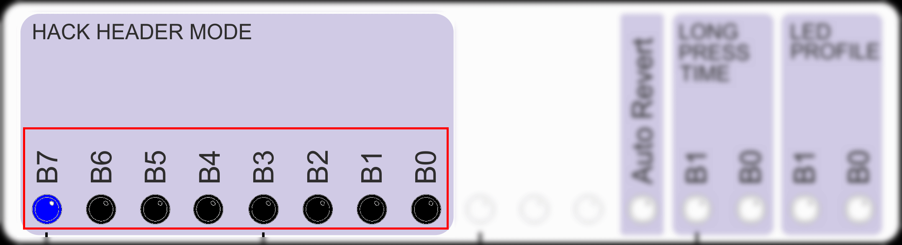

# Using synchtab

## Before You Start
synchtab requires your ARPIE to have the following:

- The "hack header" socket which was added to mainboard version 3 and above
- Firmware version 4 or later

The firmware can be <a href="../arpie/update.html">upgraded</a> for free. However if you have an older ARPIE without the hack header socket you have a bit more of a problem. It IS possible to connect synchtab to an older ARPIE by soldering on some extra wires, but the result will not quite so neat. Let me know if you need information on this - I may also add it to FAQ.

## The Basics
When you connect synchtab, you need to tell the ARPIE to use it. This is done by changing the "hack header" settings (see the appropriate section in the <a href="..\arpie\manual.html#hh">ARPIE manual)

To use the Synctab you need "Pulse Clock Mode". If you hold the PLEN button to access the second function you can select this mode by setting the LEDs to the following (so of the first 8 LEDs, only the first one is on)
 

 
There are two 3.5mm jack sockets (mono wired) on synchtab:

- The socket furthest to the rear of the ARPIE is the CLOCK IN socket where ARPIE can receive clock signals from other devices and "slave" to them.
- The socket closest to the front of the ARPIE is the CLOCK OUT socket where ARPIE can send clock signals to other devices and act as the clock "master". the CLOCK OUT socket also passes the signal from CLOCK IN.

When you connect or remove a device from the CLOCK IN port, you must reset the ARPIE for it to pick up the change. This is because ARPIE checks whether a device attached at start-up time rather than continually. If you don't reset ARPIE after connecting or removing cables from CLOCK IN the synctab won't work properly!

When a pulse clock signal is connected to the CLOCK IN port, ARPIE will use it to synchronise it's internal beat clock. The SYNC setting on the ARPIE must be for an INTERNAL source rather than external MIDI clock. This is important to remember - if you are on EXT (MIDI) SYNC the synctab input is not being used.

When there is a cable connected to the CLOCK IN port, the CLOCK IN and CLOCK OUT ports are electrically connected together and the synctab output electronics are bypassed. ARPIE will use the CLOCK IN signal if configured to do so, and if it has been reset if needed.

When there is no cable connected to CLOCK IN, ARPIE's internal clock is sent to CLOCK OUT, so ARPIE can act as a pulse clock master to control other equipment. 

## LED Indications
There are two LED indicators on the synchtab, which sit just behind the pin header. Either of these will blink in time with the clock pulses and act as a useful diagnostic indicator if you are not sure if a clock is present. 

- The INTERNAL CLOCK LED is the one closest to the jack sockets - this LED blinks in time with ARPIE's internal clock when there is no cable connected to CLOCK IN.

- The EXTERNAL CLOCK LED is the one closest to the front of the ARPIE - this LED blinks in time with an external clock signal present at CLOCK IN.

The LEDs indicate actual electrical activity rather than the mode of the ARPIE firmware, so even if the LEDs are blinking correctly, remember you still need to reset ARPIE after attaching or detaching cables at CLOCK IN.

## Clock Characteristics
The specifications of the pulse clock (in and out) are:

- One pulse per quarter note (step)
- Indicated with a positive going 5V pulse (approx 10-15ms long for output, input pulses can be longer)

The current firmware does not allow customisation of the clock pulses from the menu. To change the pulse clock characteristics, such as timing and polarity, require the firmware code to be modified and recompiled.

## MIDI SYNCH Bridging
ARPIE can be synched in one of the following modes:

- Internal Synch using its own beat clock
- Internal beat clock, locked to external pulse clock via synchtab 
- External MIDI clock via MIDI IN or EXT SYNC MIDI sockets

In any of these modes it is possible to send MIDI clock to the MIDI OUT socket using the SYNCH SEND option, this means you can use ARPIE + synchtab to bridge an incoming master pulse clock to outgoing MIDI synch.

Likewise the pulse clock output can be send for any synch mode, so you can use ARPIE + synchtab to bridge incoming MIDI synch to outgoing pulse clock

## How does it work?
The ARPIE firmware program deals with generating and consuming the pulse clock and sending it to the header, so strictly speaking the synchtab is not even needed! 

However you will of course need jack sockets, so the most fundamental function of the synchtab is to provide those. synchtab also includes a "Schmitt Trigger" buffer chip - these are used to clean up electrical signals by having an output which turns ON when the input crosses a voltage threshold level, but only turns OFF again when a different threshold is crossed. The gap between these thresholds helps stops signals jittering about and gives nice clean, definite, pulse edges. 

synctab uses the Schmitt trigger chip to clean up the CLOCK IN signal. The same chip is used to electrically buffer the CLOCK OUT (helping to shield the ARPIE processor from problems such as short circuits etc) and drive the two LEDs.
